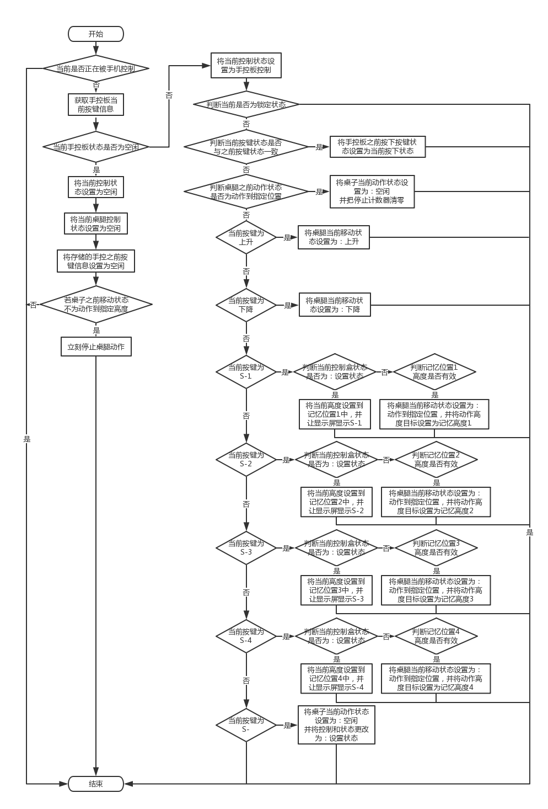
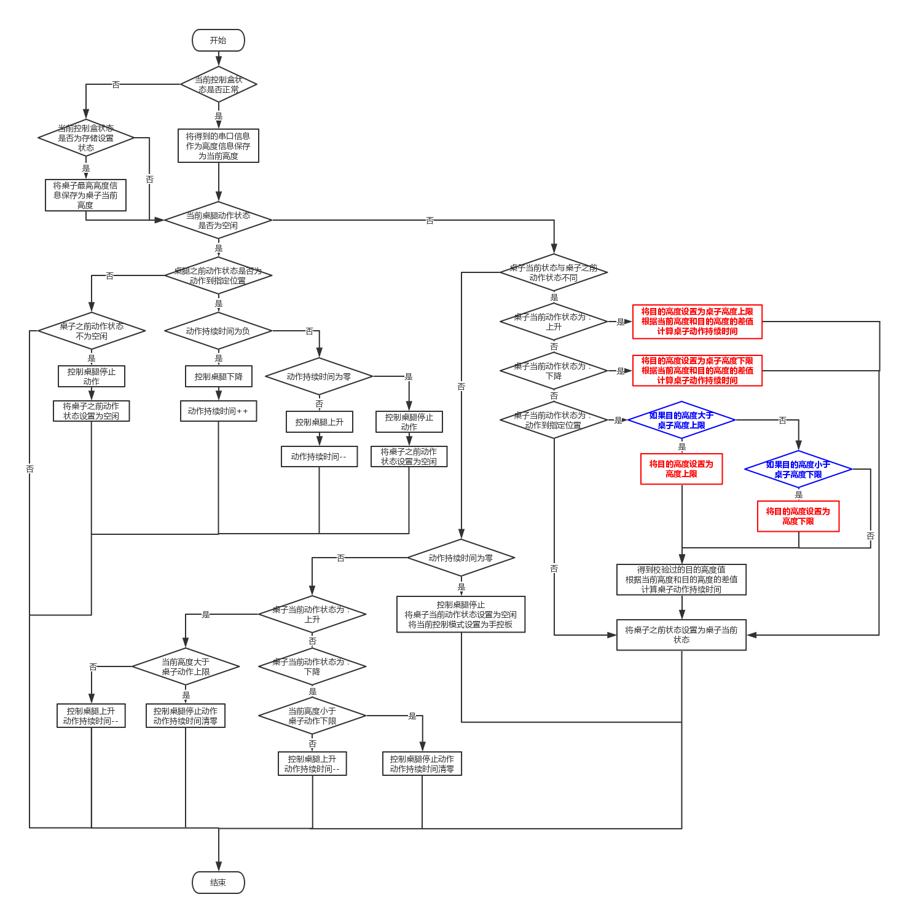
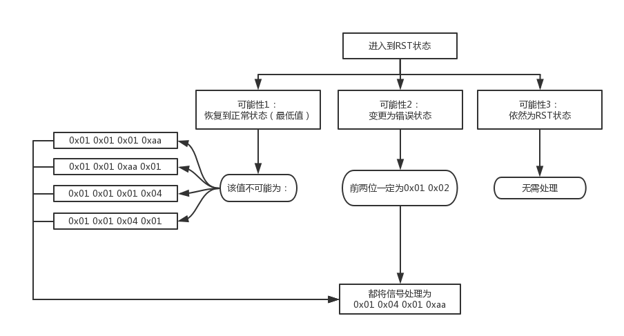

​	

# 目录

[TOC]

# 产品版本说明

| **产品版本** | **发布时间**   | **产品说明**           |
| -------- | ---------- | ------------------ |
| OW-02    | 2017-03-04 | 实现蓝牙数据传输功能以及对外设的控制 |

# 参考资料

| **资料名称**                  | **作者**           |
| :------------------------ | ---------------- |
| TI cc2540 协议栈             | Texas Instrument |
| JCB35N升降桌控制器 SCI通讯协议手控器部分 | 捷昌               |

 

# 文档目的

记录产品开发过程，总结产品开发经验，归档方便以后查阅。

# 声明

此文档仅用作内部交流用，不可外传。

# 正文

## 一、软件需求

### 1.功能需求

​	1.1 手控板通过智能模块连接到控制盒后可以正常地实现升降、动作到记忆位置、设置记忆位置等功能。

​	1.2 手机通过蓝牙连接到智能模块后可以正常地实现桌腿的升降、动作到记忆位置、设置记忆位置、锁定手控板等与桌腿相关的指令。手机通过蓝牙可以获得芯片记录的站坐姿态数据、上电时间戳、硬件信息、以及当前高度信息/错误提示信息。

### 2.具体功能

#### 2.1 芯片与捷昌控制盒

​	2.1.1 在桌腿正常状态下，芯片从控制盒得到桌腿当前的高度信息，并且根据高度信息判断用户当前的使用姿态。

​	2.1.2 在桌腿非正常状态下，芯片从控制盒得到桌腿当前的错误信息。

​	2.1.3 芯片从手控板获得当前按下的按键信息，并根据按下的按键实现相应功能（上升、下降、停止等等……）。

​	2.1.4 芯片可以阻断手控板的按键信息传到控制盒（用于实现锁定手控板）。

#### 2.2 芯片与手机

​	2.2.1 在桌腿正常状态下，芯片将得到的桌腿高度信息与通过计算获得的用户当前姿态以一定的格式一并发送到手机端。手机端也可以直接从芯片端读取桌腿的高度信息。

​	2.1.2 在桌腿非正常状态下，芯片将桌腿具体的错误提示信息经过处理后以一定的格式发送到手机端。手机端也可以直接从芯片端读取桌腿的错误提示信息。

​	2.1.3 手机可以以一定的格式发送控制指令到芯片端，使得芯片端在接收到指令后可以控制桌腿的上升、下降、停止动作等等……

​	2.1.4 手机可以以一定的格式发送控制指令到芯片端，使得芯片端可以发送用户的站坐信息数据到手机端。

​	2.1.5 手机可以以一定的格式发送数据到芯片端，使得芯片端可以更改桌腿动作的预设高度。手机端也可以直接从芯片端读取桌腿动作的预设高度。

​	2.1.6 手机可以以一定的格式发送数据到芯片端，使得芯片端可以更改判断用户站坐姿态的阈值。手机端也可以直接从芯片端读取判断用户站坐姿态的阈值。

​	2.1.7 手机可以以一定的格式发送数据到芯片端，使得芯片端可以更改桌腿动作的上下限。手机端也可以直接从芯片端读取桌腿的动作的上下限。

​	2.1.8 手机可以以一定的格式发送数据到芯片端，使得芯片端可以更改手控板的锁定状态（可以延时锁定也可以立即锁定）。手机端也可以直接从芯片端读取手控板当前的锁定状态（解锁、锁定、延时锁定）。

​	2.1.9 手机可以以一定的格式发送数据到芯片端，使得芯片端可以更改芯片内部存储的设备信息。手机端也可以直接从芯片端读取芯片内部存储的设备信息。

## 二、需求实现

### 1.实现逻辑

#### 1.1 蓝牙收发实现逻辑

##### 1.1.1 从手机端获取数据逻辑

###### 原理

​	芯片端应用层从GATT层获取数据并进入数据接收的回调函数。

​	在GATT层即可分析出手机端发送的数据是通过哪一个特征值传入的，芯片端应用层即可根据特定的特征值进入特定的回调函数，并且将收到的数据通过GATT层的函数放入到已定义的相应大小的内存中。

###### 需要从手机端获取的数据

- 硬件信息：

  ​	包括桌腿类型、硬件设备类型以及版本号。这些数据可以帮助判断桌腿和控制盒的类型，方便针对不同的桌腿和控制盒类型来套用不同的桌腿控制算法。

  ​	这些数据应该写入到芯片端的非已逝性存储器中，如果中途断电，这些数据也不应丢失，这样的好处是对于同一个用户，如果断电再上电时没有APP连接，芯片可以直接调取上次所存储的桌腿及控制盒相关的信息以防由于硬件存储信息与真实设备不同时所造成的意外情况；这样做的缺陷是，如果用户换了不同类型的桌腿和控制盒，但使用的是同一个智能模块，这时就会出现硬件存储信息与真实设备不同的情况，此时，可以通过手机端设置来进行校准。

  ​	如果从未设置过这些信息，芯片端应存有默认的数值。

- 预设高度：

  ​	包含4个预设的高度数据，这个预设高度要与捷昌手控板上的预设高度存储值相对应。手机端可以任意修改其中的某一个或几个预设高度数据，如果手机端所设置的预设高度超过了设备所可以动作的上/下限，那么芯片端应自动将超过限制的预设值设置为设备所可以动作的上/下限。

  ​	这4个预设高度应存储在芯片端的非已逝性存储器当中，这样做的目的是，使得用户所设置的预设高度不会因为桌子断电而丢失。

  ​	如果从未设置过这些信息，芯片端应存有默认的数值。

- 站坐姿态判断阈值：

  ​	包括一个用于判断用户是站姿还是坐姿的高度阈值，因为判断一个用户是站还是坐需要根据用户的具体情况来定，所以需要手机端可以实时修改这个阈值。

  ​	这个高度值应存储在芯片端的非已逝性存储器当中，以防用户的高度判断阈值因为桌子断电而丢失。

  ​	如果从未设置过这些信息，芯片端应存有默认的数值。

- 桌子动作上下限

  ​	包括桌子动作的上限以及桌子动作的下限，这个数值可以限制手控板以及手机对桌腿的控制。使桌腿的动作范围控制在保证用户的正常使用的状态下。

  ​	这个高度值应存储在芯片端的非已逝性存储器当中，以防用户所设置过的上下限高度数值因为桌子断电而丢失。

  ​	如果从未设置过这些信息，芯片端应存有默认的数值。

- 控制指令：

  ​	包含一个控制指令，该指令可以让芯片控制桌腿上升、下降、停止、动作到预设高度（4个）以及让芯片发送用户的站坐统计数据。

  ​	当收到该指令时，判断如果指令不为“停止”，则开启一个500ms的定时器，在500ms之内如果再次收到该指令则重新计时500ms，否则定时器超时后直接将桌腿当前动作强行停止。

- 锁定状态及延时锁定时间：

  ​	包含一个锁定状态和需要延时锁定的时间数据，当手机端所发送的设定数据状态为非锁定状态时，无论延时锁定时间为多少，芯片端全部忽略并且设置芯片端为非解锁状态。当手机端所发送的设定数据状态为锁定状态且延时锁定时间为0时，芯片端立刻设置为锁定状态，无论是手控板还是手机端都无法再对桌腿进行控制。当手机端所发送的设定数据状态为锁定状态且延时锁时间不为0时，芯片端对延时时间进行倒计时，当时间未到0时，芯片端状态为解锁状态，而当时间倒计时到0时，芯片状态即设置为锁定状态。

  ​	桌子的锁定状态值应当存储在非易逝存储器当中，以防当用户断电后，桌子的锁定状态丢失。而无论什么情况下，如果桌子不处于永久性非解锁状态，断电重新上电后，都应该处于锁定状态，需要由手机端重新解锁。

  ​	如果从未设置过这些信息，芯片端应存有默认的数值。

##### 1.1.2 芯片端发送数据逻辑

###### 原理

​	芯片应用层将所需要发送的数据和所需要的特征值通过GATT层发送出去。

​	GATT层可以根据提供的特征值参数调用相应的GATT参数设置函数，并且可以将所需要发送的数据作为参数传入到该设置函数中，这样即可将数据发送到手机端。

###### 需要发送到手机端的数据

- 硬件信息：

  ​	包括桌腿类型、硬件设备类型以及版本号。这些数据可以帮助判断桌腿和控制盒的类型，方便针对不同的桌腿和控制盒类型来套用不同的桌腿控制算法。

  ​	在硬件信息被修改及初始化时都应该将数据发送到手机端。

- 预设高度：

  ​	包含4个预设的高度数据，这个预设高度要与捷昌手控板上的预设高度存储值相对应。手机端可以任意修改其中的某一个或几个预设高度数据，如果手机端所设置的预设高度超过了设备所可以动作的上/下限，那么芯片端应自动将超过限制的预设值设置为设备所可以动作的上/下限。

  ​	在预设高度被修改及初始化时都应该将数据发送到手机端。

- 站坐姿判断阈值：

  ​	包括一个用于判断用户是站姿还是坐姿的高度阈值，因为判断一个用户是站还是坐需要根据用户的具体情况来定，所以需要手机端可以实时修改这个阈值。

  ​	在站坐姿判断阈值被修改及初始化时都应该将数据发送到手机端。

- 桌子动作上下限

  ​	包括桌子动作的上限以及桌子动作的下限，这个数值可以限制手控板以及手机对桌腿的控制。使桌腿的动作范围控制在保证用户的正常使用的状态下。	

  ​	在桌子动作上下限被修改及初始化时都应该将数据发送到APP端。

- 高度及状态：

  ​	包含桌子的状态（正常、错误、记忆位置），用户的站/坐姿态，高度信息、错误信息以及存储信息。

  ​	这个数据应在信息改变时及初始化时发送给手机端，且在连续变化时最小发送间隔为500ms。

- 锁定状态及延时锁时间：

  ​	包含一个锁定状态和需要延时锁定的时间数据。

  ​	这个数据应该在初始化、锁定状态改变以及每倒计时数据发生变化时发送到手机端。

- 开机时间戳：

  ​	包含一个从上电开始到运行状态的时间数据。

  ​	这个数据应该在每一次时间数据发生变化时发送到手机端。

#### 1.2 手控板获取按键信息逻辑

###### 原理

​	捷昌的手控板在按键每一次变化的时候都会发出不同的电平信号，这些电平信号代表不同的信息。

###### 相关按键信息

- 按下上升按键：

  ​	立即使桌腿上升，松开时立刻停止桌腿动作。

- 按下下降按键：

  ​	立即使桌腿下降，松开时立刻停止桌腿动作。

- 按下S-1按键：

  ​	立即使桌腿动作到记忆位置1位置，松开时不会停止桌腿动作，直到桌腿动作到指定位置后或者在动作过程中按下其它按键才会停止动作。

- 按下S-2按键：

  ​	立即使桌腿动作到记忆位置2位置，松开时不会停止桌腿动作，直到桌腿动作到指定位置后或者在动作过程中按下其它按键才会停止动作。

- 按下S-3按键：

  ​	立即使桌腿动作到记忆位置3位置，松开时不会停止桌腿动作，直到桌腿动作到指定位置后或者在动作过程中按下其它按键才会停止动作。


- 按下S-4按键：

  ​	立即使桌腿动作到记忆位置4位置，松开时不会停止桌腿动作，直到桌腿动作到指定位置后或者在动作过程中按下其它按键才会停止动作。

- 按下S-按键：

  ​	立即在显示屏上显示S-，代表当前进入了设置状态，并保持6秒，在6秒之中如果按下S-1到S-4四个按键中任意一个按键都会显示S-“x”并且将当前的高度存入相应的记忆位置。如果在显示屏显示S-的6秒之内按下上升或者下降即会打断当前的设置状态。

###### 信息获取逻辑

​	芯片端获取按键信息的方法是轮询，每隔50ms检测一次手控板当前的按键信号，并根据得到的信号执行相应动作。

 	**图2-1 单次轮询按键信息处理流程图：**

​	该逻辑流程每50ms执行一次，直到程序周期结束。

​	**（*注：在轮询逻辑中所改变的状态也会在其他逻辑状态下使用，桌子当前动作状态、桌子之前动作状态、高度目标、桌子停止计数等）**

#### 1.3 芯片控制桌腿逻辑

###### 原理

- 控制原理

  ​	芯片端的输出端口模拟捷昌的手控板电平信号给桌腿控制盒发送指令以达到控制桌腿的目的。

- 上下限实现原理

  ​	在接收到上升/下降指令后，立刻计算当前高度到高度最大值/最小值的差值，然后根据差值计算连续动作的持续时间，一旦超过计算的时间则立即停止动作，且无法继续朝限值方向操作。

  ​	重新接收到指令后，即重新计算停止时间。

- 动作到指定高度实现原理

  ​	在接收到动作到指定高度指令后，立刻将指定高度与高度最大值/最小值进行比较，如果超限的话，则将高度最大值/最小值设置为当前的指定高度，然后根据当前高度与指定高度的差值计算出连续动作的持续时间，一旦超过计算的时间则立即停止动作，且无法继续朝限值方向操作；而如果没有超限，则计算当前高度到指定高度的差值，根据差值计算出连续动作的持续时间，一旦超过计算时间则立即停止动作。


###### 控制状态

- 上升
- 下降
- 动作到指定位置
- 停止

###### 控制模式

- 控制模式说明

  ​控制桌腿动作可以通过两种通道，其一为手控板、其二为手机端的控制指令。无论是第一种还是第二种通道，当收到让桌腿的动作指令后，都改变芯片端的一个状态基，而在芯片控制的过程中，周期性地检测这个状态基的具体状态。当状态基的状态发生改变时，根据具体情况向控制盒发送控制指令。在执行控制时只有一个通道能够有效，两个通道的优先级相同，当一个通道被占用控制控制盒时，另一个通道在大多数情况无法打断当前通道的指令；除非当前通道的指令为动作到指定位置，在此情况下，任何通道的任何指令都可以打断当前的指令。

  在状态基发生改变时，可以根据状态基状态得到控制状态，根据不同的控制状态设定一个预先停止桌子动作的函数，以便实现动作上下限以及动作到指定高度的功能。

- 不同通道的控制方式示意图

  **图2-2 不同通道控制方式图 **


- 在控制桌腿升降时，由于控制盒以及桌腿的类型不同，所以对于每一种类型的设备都需要准备一套控制升降的算法。

- 现有的控制盒类型：

  - 英制双节腿
  - 公制双节腿
  - 英制三节腿
  - 公制三节腿

- 针对不同控制盒，计算桌腿应当动作的持续时间(多次实验计算结果)：

  $注：V_{pesk} 为桌腿当前动作速度 ，T_{last}为控制动作的持续时间，T_{calibration}为校准后控制动作的持续时间，H_{max}为桌子最高高度，\\H_{destinate}为目的高度，H_{critical}为临界值范围，H_{min}为桌子最低高度，H_{differ}为桌子当前高度到目标高度的差值，H_{current}为桌子\\当前高度。$
  $$
  [Arg_1, Arg_2, Arg_3]=
  \begin{cases}
      [2,2,-6] &&\mbox{如果桌腿为双节腿且动作为上升}\\
     \\ [2,2,3] &&\mbox{如果桌腿为双节腿且动作为下降}\\
     \\ [2,-30,7] &&\mbox{如果桌腿为三节腿且动作为上升}\\
     \\ [2,-25,-7] &&\mbox{如果桌腿为三节腿且动作为下降}\\
     \end{cases}
  $$

  ​										**公式2-1**

  ​
  $$
  Arg_4=
   \begin{cases}
      1 &&\mbox{$H_{destinate}-H_{min}\geq H_{critical}\\或H_{max}-H_{destinate}\leq H_{critical}$}\\
     \\0 &&\mbox{$H_{destinate}-H_{min}<H_{critical}\\或H_{max}-H_{destinate}>H_{critical}$}
     \end{cases}
  $$

  $$
  Arg_5=
   \begin{cases}
      0 &&\mbox{$H_{destinate}-H_{min}\geq H_{critical}\\或H_{max}-H_{destinate}\leq H_{critical}$}\\
     \\1 &&\mbox{$H_{destinate}-H_{min}<H_{critical}\\或H_{max}-H_{destinate}>H_{critical}$}
     \end{cases}
  $$

  ​										**公式2-2**

  ​
  $$
  T_{last}=
   \begin{cases}
      H_{differ} \times Arg_1 + H_{differ} \div Arg_2 + Arg_3 &\mbox{$H_{destinate}\leq H_{max}-H_{critical}\\或H_{destinate}\geq H_{min}+H_{critical}$}\\
     \\(H_{differ} \times Arg_1 + H_{differ} \div Arg_2+Arg_3)\times Arg_4+\\(H_{differ}-(H_{destinate}-(H_{max}-H_{critical})))\times Arg_5\times 3 +\\((H_{destinate}-(H_{max}-H_{critical}))-H_{differ})\times Arg_4\times 3 &\mbox{$H_{destinate}>H_{max}-H_{critical}$}\\
     \\(H_{differ} \times Arg_1 + H_{differ} \div Arg_2+Arg_3)\times Arg_4+\\(H_{differ}-(H_{destinate}-(H_{min}+H_{critical})))\times Arg_5\times 3+\\((H_{destinate}-(H_{min}+H_{critical}))-H_{differ})\times Arg_4\times 3 &\mbox{$H_{destinate}<H_{min}+H_{critical}$}
     \end{cases}
  $$

  ​										**公式2-3**

  ​

  ​	为了保证动作过程的准确性，还需要每200ms进行动作持续时间的校准，在校准过程中，因为桌腿不为静止状态，所以还需要加入速度参量才可以准确计算校准过后的动作持续时间。

  ​	所以有：
  $$
  [Arg_6, Arg_7]=
  \begin{cases}
      [3,9] &&\mbox{如果桌腿为双节腿且动作为上升}\\
     \\ [3,10] &&\mbox{如果桌腿为双节腿且动作为下降}\\
     \\ [5,13] &&\mbox{如果桌腿为三节腿且动作为上升}\\
     \\ [5,14] &&\mbox{如果桌腿为三节腿且动作为下降}\\
     \end{cases}
  $$

  $$
  T_{calibration}=T_{last}-V_{pesk}\div Arg_6 \times Arg_7
  $$

  ​										**公式2-4**

  ​

  ​	**（*注：在控制盒为英制时，所有的高度值皆需要转化成为公制以后再进行以上计算。）**


- 桌腿控制流程图

  **图2-3 桌腿控制流程示意图：**


#### 1.4 看门狗逻辑

- 目的

  ​	加入看门狗是为了防止程序跑飞，进入非正常状态且无法自己恢复。

- 看门狗添加逻辑

  ​	在程序初始化阶段加入看门狗，看门狗超时时间为1000ms，之后每500ms喂一次狗，如果1000ms内，没有走到500ms内的喂狗程序，看门狗会自动重启芯片以确保程序1000ms内不会跑飞。

### 2.通讯协议

#### 2.1 蓝牙收/发通信协议

- 蓝牙数据收/发协议

  **表2-1 蓝牙数据收/发协议表**


- 关于各个特征值数据的解释：

  - FFF0：硬件信息（存入snv）

    ​	手机端通过读取特征值FFF0可以得到当前设备的硬件信息，这些硬件信息全部都写在非易失性存储器中。断电后，硬件信息依然保存在设备中。由于现有版本的设备无法识别桌腿的类型，所以加入写的属性可以通过APP来设定该设备的桌腿类型。

    ​	硬件信息包括：桌腿类型（包括控制盒类型）、设备类型（Cube\Bar）、具体版本信息（两个字节组成）。

  

  - FFF1：高度及状态

    ​	手机端可以直接通过读取该特征值的数据来得到当前桌子的信息，包括：高度值、桌子信息、人体姿态信息、以及桌子错误信息。而高度值 = 高度高位x256 + 高度地位（十进制）。具体的错误信息以及人体姿态信息见下表。

    **表2-2 错误信息及人体姿态信息表**

   

  - FFF2：站坐姿态判断阈值（存入snv中）

    ​	该特征值用于更改设备的站坐判断阈值，应用于某些特殊的场合，比如身高比较特殊的用户以及不同单位制的控制盒。

    ​	*注：该值也可以从设备读到APP中。*

  - FFF3：桌子动作上下限（存入snv中）

    ​	该特征值可以设置/读取桌子动作的上限/下限。格式为：动作阈值上限H 动作阈值上限L 动作阈值下限H 动作阈值下限L。

    ​	其中真实高度数据 = 数据H * 256 + 数据L 。 

    ​	*在设置桌子动作上下限时，如果数据值为0，则忽略该数据的设置。*

  - FFF4：控制指令

    - 控制指令分为多种指令：
      - 基础指令：上升、下降、停止
      - 到达预设高度指令：预设0、预设1、预设2、预设3
      - 进阶指令：获取健康数据、等等……

    - 指令表格如下：

      ​		**表2-3 指令信息表**

      

      - FFF5：存入/读取预设高度（4个 也存入snv中）

        ​	预设高度一共4个，通过该特征值可以修改预设高度，也可以读取预设高度，在写入预设高度时，如果设置的高度值为0，则忽略该预设高度的设置。

        ​	格式为：预设高度0H 预设高度0L 预设高度1H 预设高度1L 预设高度2H 预设高度2L 预设高度3H 预设高度3L

        ​	其中：预设高度值 = 数据H * 256 + 数据L

      - FFF6：锁定状态+延时锁时间（锁定状态存入snv中而延时锁时间不存）

        ​	该特征值用于读取剩余非解锁状态时间及状态/设置当前锁状态。设置的时间为从当前时间算起，剩余的非解锁时间。

        ​	格式为：锁定状态 时间0 时间1 时间2 时间3

        ​	如果设置的锁定状态为0x01的条件下将时间戳设置为0x00 0x00 0x00 0x00的话，那么桌子就会立即进入锁定状态，在锁定状态为0x01的条件下，如果设置时间戳为非零的话，那么桌子进入延时锁定状态，剩余解锁时间为设置的时间戳的值。

        ​	如果设置的锁定状态为0x00的话，那么无论后面的时间戳设置时什么，桌子都会进入到永久解锁状态。

      - FFF7：获得开机时间戳

        ​	该特征值用于得到硬件自上电到当前时间的时间戳。内部数据每一秒更新一次，APP只需要读取该特征值内的数据即可得知硬件当前的上电时间戳。

      - FFF8：健康数据（201组）

        ​	该特征值用于发送健康数据，健康数据最多可以在底层存储201个包，每个包有一个包计数数据和三组数据，每组数据5个字节（姿态 时间 时间 时间 时间）。现阶段它存储在已逝性存储器中，断电后便会消失。未来或许可以存储在非易失性存储器中。

        ​	在控制指令中写入0x20时，FFF8开始发送健康数据，每30ms发送一个包，一共201个包。

#### 2.2 捷昌控制盒数据协议

-    数据发送方式

     ​	根据检测，以及“捷昌控制器SCI通讯协议”得知，捷倡控制盒至手控板的数据发送方式为异步数据传输方式，且一次性发送4个字节。

     ​	根据示波器检测结果，可知，单组数据发送需要约5ms，两组数据发送间隔约23ms，通过这一点可以正确地获得捷倡数据的帧头和有效数据。

     ​			**图2-4 捷昌接收数据波形图**

     

- 数据发送格式

     - 标准的信息格式定义如下 

     

     - 串口参数： 

       波特率——9600 

       数据位——8 位 

       停止位——1 位 

       奇偶校验——无 

     - SCI 具体定义如下： 


## 三、具体代码讲解

### 1.协议栈修改

​	本应用程序基于TI cc2540 BLE stack 1.4.2协议栈，参考TI的simpleBLEPeripheral Profile。

#### 1.1 GATT层修改

- 涉及修改的文件有：

  - simpleGATTprofile.h
  - simpleGATTprofile.c

- simpleGATTprofile.h下的修改：

  以下参数的修改全部根据<表2-1>

  - 定义各个特征值的参数

  ```c
  // Profile Parameters
  #define SIMPLEPROFILE_CHAR0                   0  // RW uint8 - Profile Characteristic 0 value 
  #define SIMPLEPROFILE_CHAR1                   1  // RW uint8 - Profile Characteristic 1 value
  #define SIMPLEPROFILE_CHAR2                   2  // RW uint8 - Profile Characteristic 2 value
  #define SIMPLEPROFILE_CHAR3                   3  // RW uint8 - Profile Characteristic 3 value
  #define SIMPLEPROFILE_CHAR4                   4  // RW uint8 - Profile Characteristic 4 value
  #define SIMPLEPROFILE_CHAR5                   5  // RW uint8 - Profile Characteristic 5 value
  #define SIMPLEPROFILE_CHAR6                   6  // RW uint8 - Profile Characteristic 6 value
  #define SIMPLEPROFILE_CHAR7                   7  // RW uint8 - Profile Characteristic 7 value
  #define SIMPLEPROFILE_CHAR8                   8  // RW uint8 - Profile Characteristic 8 value
  ```

  - 定义各个特征值的UUID

  ```c
  #define SIMPLEPROFILE_CHAR0_UUID            0xFFF0
  #define SIMPLEPROFILE_CHAR1_UUID            0xFFF1
  #define SIMPLEPROFILE_CHAR2_UUID            0xFFF2
  #define SIMPLEPROFILE_CHAR3_UUID            0xFFF3
  #define SIMPLEPROFILE_CHAR4_UUID            0xFFF4
  #define SIMPLEPROFILE_CHAR5_UUID            0xFFF5
  #define SIMPLEPROFILE_CHAR6_UUID            0xFFF6
  #define SIMPLEPROFILE_CHAR7_UUID            0xFFF7
  #define SIMPLEPROFILE_CHAR8_UUID            0xFFF8
  ```

  - 定义各个特征值的数据长度

  ```c
  #define SIMPLEPROFILE_CHAR0_LEN           4
  #define SIMPLEPROFILE_CHAR1_LEN           8
  #define SIMPLEPROFILE_CHAR2_LEN           2
  #define SIMPLEPROFILE_CHAR3_LEN           4
  #define SIMPLEPROFILE_CHAR5_LEN           4
  #define SIMPLEPROFILE_CHAR6_LEN           5
  #define SIMPLEPROFILE_CHAR7_LEN           4
  #define SIMPLEPROFILE_CHAR8_LEN           16
  ```

- 在simpleGATTprofile.c下做如下修改：

  以下参数的修改全部根据<表2-1>

  - 修改全部传输层数组大小
    - 传输层特征值数据中包括用户描述、特征值声明、特征值属性以及特征值配置。
    - 根据<表2-1>可知，一共9组特征值数据，其中2组拥有广播属性，需要特征值配置数据，其它6组只需用户描述、特征值声明以及特征值属性数据，所以该Service下至少应该有$2\times4+7\times3=29$ 组数据。加上Service数据一共30组数据。

  ```c
  /*********************************************************************
   * CONSTANTS
   */

  #define SERVAPP_NUM_ATTR_SUPPORTED        30
  ```

  - 将16位UUID值分为2个高低8位的数据
    - 无需修改Service UUID的分值语句，只需添加所需要的特征值。

  ```c
  // Characteristic 0 UUID: 0xFFF0
  CONST uint8 simpleProfilechar0UUID[ATT_BT_UUID_SIZE] =
  { 
    LO_UINT16(SIMPLEPROFILE_CHAR0_UUID), HI_UINT16(SIMPLEPROFILE_CHAR0_UUID)
  };

  // Characteristic 1 UUID: 0xFFF1
  CONST uint8 simpleProfilechar1UUID[ATT_BT_UUID_SIZE] =
  { 
    LO_UINT16(SIMPLEPROFILE_CHAR1_UUID), HI_UINT16(SIMPLEPROFILE_CHAR1_UUID)
  };

  // Characteristic 2 UUID: 0xFFF2
  CONST uint8 simpleProfilechar2UUID[ATT_BT_UUID_SIZE] =
  { 
    LO_UINT16(SIMPLEPROFILE_CHAR2_UUID), HI_UINT16(SIMPLEPROFILE_CHAR2_UUID)
  };

  // Characteristic 3 UUID: 0xFFF3
  CONST uint8 simpleProfilechar3UUID[ATT_BT_UUID_SIZE] =
  { 
    LO_UINT16(SIMPLEPROFILE_CHAR3_UUID), HI_UINT16(SIMPLEPROFILE_CHAR3_UUID)
  };

  // Characteristic 4 UUID: 0xFFF4
  CONST uint8 simpleProfilechar4UUID[ATT_BT_UUID_SIZE] =
  { 
    LO_UINT16(SIMPLEPROFILE_CHAR4_UUID), HI_UINT16(SIMPLEPROFILE_CHAR4_UUID)
  };

  // Characteristic 5 UUID: 0xFFF5
  CONST uint8 simpleProfilechar5UUID[ATT_BT_UUID_SIZE] =
  { 
    LO_UINT16(SIMPLEPROFILE_CHAR5_UUID), HI_UINT16(SIMPLEPROFILE_CHAR5_UUID)
  };

  // Characteristic 6 UUID: 0xFFF6
  CONST uint8 simpleProfilechar6UUID[ATT_BT_UUID_SIZE] =
  { 
    LO_UINT16(SIMPLEPROFILE_CHAR6_UUID), HI_UINT16(SIMPLEPROFILE_CHAR6_UUID)
  };

  // Characteristic 7 UUID: 0xFFF7
  CONST uint8 simpleProfilechar7UUID[ATT_BT_UUID_SIZE] =
  { 
    LO_UINT16(SIMPLEPROFILE_CHAR7_UUID), HI_UINT16(SIMPLEPROFILE_CHAR7_UUID)
  };

  // Characteristic 8 UUID: 0xFFF8
  CONST uint8 simpleProfilechar8UUID[ATT_BT_UUID_SIZE] =
  { 
    LO_UINT16(SIMPLEPROFILE_CHAR8_UUID), HI_UINT16(SIMPLEPROFILE_CHAR8_UUID)
  };
  ```

  - 初始化各个特征值的默认值以及描述、属性等

    - 根据<表2-1>的描述修改以下数据

      - 特征值0属性为**可读可写**

        特征值0初始值为**{ 0, 0, 0, 0 }**

        特征值0描述为：**Hardware Information** (硬件信息)

      - 特征值1属性为**可读可写**

        特征值1初始值为**{ 0, 0, 0, 0, 0, 0, 0, 0 }**

        特征值1描述为：**Preset Height** (预设高度)

      - 特征值2属性为**可读可写**

        特征值2初始值为**{ 0, 0 }**

        特征值2描述为：**Posture Judgement** (姿态判断)

      - 特征值3属性为**可读可写**

        特征值3初始值为**{ 0, 0, 0, 0 }**

        特征值3描述为：**Action Range** (桌子动作上下限)

      - 特征值4属性为**仅仅可写**

        特征值4初始值为**0**

        特征值4描述为：**Control Command** (控制指令)

      - 特征值5属性为**读及通知**

        特征值5初始值为**{ 0, 0, 0, 0 }**

        特征值5描述为：**Pesk Status** (桌子状态信息)

      - 特征值6属性为**可读可写**

        特征值6初始值为**{ 0, 0, 0, 0, 0 }**

        特征值6描述为：**Lock Status** (锁定状态信息)

      - 特征值7属性为**仅仅可读 **

        特征值7初始值为**{ 0, 0, 0, 0 }**

        特征值7描述为：**Powerup Timestamp** (上电时间戳信息)

      - 特征值8属性为**仅仅通知 **

        特征值8初始值为**{ 0, 0, 0, 0, 0, 0, 0, 0, 0, 0, 0, 0, 0, 0, 0, 0  }**

        特征值8描述为：**Health Data** (健康数据)

  ```c
  /*********************************************************************
   * Profile Attributes - variables
   */

  // Simple Profile Service attribute
  static CONST gattAttrType_t simpleProfileService = { ATT_BT_UUID_SIZE, simpleProfileServUUID };

  // Simple Profile Characteristic 0 Properties
  static uint8 simpleProfileChar0Props = GATT_PROP_READ | GATT_PROP_WRITE;

  // Characteristic 0 Value
  static uint8 simpleProfileChar0[SIMPLEPROFILE_CHAR0_LEN] = { 0, 0, 0, 0 };

  // Simple Profile Characteristic 0 User Description
  static uint8 simpleProfileChar0UserDesp[21] = "Hardware Information\0";

  // Simple Profile Characteristic 1 Properties
  static uint8 simpleProfileChar1Props = GATT_PROP_READ | GATT_PROP_WRITE;

  // Characteristic 1 Value
  static uint8 simpleProfileChar1[SIMPLEPROFILE_CHAR1_LEN] = { 0, 0, 0, 0, 0, 0, 0, 0 };

  // Simple Profile Characteristic 1 User Description
  static uint8 simpleProfileChar1UserDesp[14] = "Preset Height\0";

  // Simple Profile Characteristic 2 Properties
  static uint8 simpleProfileChar2Props = GATT_PROP_READ | GATT_PROP_WRITE;

  // Characteristic 2 Value
  static uint8 simpleProfileChar2[SIMPLEPROFILE_CHAR2_LEN] = { 0, 0 };

  // Simple Profile Characteristic 2 User Description
  static uint8 simpleProfileChar2UserDesp[18] = "Posture Judgement\0";

  // Simple Profile Characteristic 3 Properties
  static uint8 simpleProfileChar3Props = GATT_PROP_READ | GATT_PROP_WRITE;

  // Characteristic 3 Value
  static uint8 simpleProfileChar3[SIMPLEPROFILE_CHAR3_LEN] = { 0, 0, 0, 0 };
                   
  // Simple Profile Characteristic 3 User Description
  static uint8 simpleProfileChar3UserDesp[13] = "Action Range\0";

  // Simple Profile Characteristic 4 Properties
  static uint8 simpleProfileChar4Props = GATT_PROP_WRITE;

  // Characteristic 4 Value
  static uint8 simpleProfileChar4 = 0;

  // Simple Profile Characteristic 4 User Description
  static uint8 simpleProfileChar4UserDesp[16] = "Control Command\0";

  // Simple Profile Characteristic 5 Properties
  static uint8 simpleProfileChar5Props = GATT_PROP_NOTIFY | GATT_PROP_READ;

  // Characteristic 5 Value
  static uint8 simpleProfileChar5[SIMPLEPROFILE_CHAR5_LEN] = { 0, 0, 0, 0 };

  // Simple Profile Characteristic 5 Configuration Each client has its own
  // instantiation of the Client Characteristic Configuration. Reads of the
  // Client Characteristic Configuration only shows the configuration for
  // that client and writes only affect the configuration of that client.
  static gattCharCfg_t simpleProfileChar5Config[GATT_MAX_NUM_CONN];

  // Simple Profile Characteristic 5 User Description
  static uint8 simpleProfileChar5UserDesp[12] = "Pesk Status\0";

  // Simple Profile Characteristic 6 Properties
  static uint8 simpleProfileChar6Props = GATT_PROP_READ | GATT_PROP_WRITE;

  // Characteristic 6 Value
  static uint8 simpleProfileChar6[SIMPLEPROFILE_CHAR6_LEN] = { 0, 0, 0, 0, 0 };

  // Simple Profile Characteristic 6 User Description
  static uint8 simpleProfileChar6UserDesp[12] = "Lock Status\0";

  // Simple Profile Characteristic 7 Properties
  static uint8 simpleProfileChar7Props = GATT_PROP_READ;

  // Characteristic 7 Value
  static uint8 simpleProfileChar7[SIMPLEPROFILE_CHAR7_LEN] = { 0, 0, 0, 0 };

  // Simple Profile Characteristic 7 User Description
  static uint8 simpleProfileChar7UserDesp[19] = "Powerup Timestamp\0";

  // Simple Profile Characteristic 8 Properties
  static uint8 simpleProfileChar8Props = GATT_PROP_NOTIFY;

  // Characteristic 8 Value
  static uint8 simpleProfileChar8[SIMPLEPROFILE_CHAR8_LEN] = { 0, 0, 0, 0, 0, 0, 0, 0, 0, 0, 0, 0, 0, 0, 0, 0 };

  // Simple Profile Characteristic 8 Configuration Each client has its own
  // instantiation of the Client Characteristic Configuration. Reads of the
  // Client Characteristic Configuration only shows the configuration for
  // that client and writes only affect the configuration of that client.
  static gattCharCfg_t simpleProfileChar8Config[GATT_MAX_NUM_CONN];

  // Simple Profile Characteristic 8 User Description
  static uint8 simpleProfileChar8UserDesp[12] = "Health Data\0";
  ```

  -  修改特征值表格
     特征值表格内的一组数据的格式应为：

     ```c
     /**
     * GATT Attribute format.
     */
     typedef struct attAttribute_t
     {
      gattAttrType_t type; //!< Attribute type (2 or 16 octet UUIDs)
      uint8 permissions;   //!< Attribute permissions
      uint16 handle;       //!< Attribute handle - assigned internally by attribute server
      uint8* const pValue; //!< Attribute value - encoding of the octet array is defined in 
                           //!< the applicable profile. The maximum length of an attribute 
                           //!< value shall be 512 octets.
     } gattAttribute_t;
     ```

     这些特征值表格内的一组数据中包含了该特征值描述的类型、GATT层权限、句柄、和数据。

  - Service相关数据

         特征值表格的第1组数据是关于Service的描述。

- Characteristic 0相关数据


特征值表格的第2组数据是关于Characteristic 0声明的描述。

特征值表格的第3组数据是关于Characteristic 0数据的描述。

特征值表格的第4组数据是关于Characteristic 0用户显示的描述。

- Characteristic 1相关数据

特征值表格的第5组数据是关于Characteristic 1声明的描述。

特征值表格的第6组数据是关于Characteristic 1数据的描述。

特征值表格的第7组数据是关于Characteristic 1用户显示的描述。

- Characteristic 2相关数据

特征值表格的第8组数据是关于Characteristic 2声明的描述。

特征值表格的第9组数据是关于Characteristic 2数据的描述。

特征值表格的第10组数据是关于Characteristic 2用户显示的描述。

- Characteristic 3相关数据

特征值表格的第11组数据是关于Characteristic 3声明的描述。

特征值表格的第12组数据是关于Characteristic 3数据的描述。

特征值表格的第13组数据是关于Characteristic 3用户显示的描述。

- Characteristic 4相关数据

特征值表格的第14组数据是关于Characteristic 4声明的描述。

特征值表格的第15组数据是关于Characteristic 4数据的描述。

特征值表格的第16组数据是关于Characteristic 4用户显示的描述。

- Characteristic 5相关数据

特征值表格的第17组数据是关于Characteristic 5声明的描述。

特征值表格的第18组数据是关于Characteristic 5数据的描述。

特征值表格的第19组数据是关于Characteristic 5配置的描述。

特征值表格的第20组数据是关于Characteristic 5用户显示的描述。

- Characteristic 6相关数据

特征值表格的第21组数据是关于Characteristic 6声明的描述。

特征值表格的第22组数据是关于Characteristic 6数据的描述。

特征值表格的第23组数据是关于Characteristic 6用户显示的描述。

- Characteristic 7相关数据

特征值表格的第24组数据是关于Characteristic 7声明的描述。

特征值表格的第25组数据是关于Characteristic 7数据的描述。

特征值表格的第26组数据是关于Characteristic 7用户显示的描述。

- Characteristic 8相关数据

特征值表格的第27组数据是关于Characteristic 8声明的描述。

特征值表格的第28组数据是关于Characteristic 8数据的描述。

特征值表格的第29组数据是关于Characteristic 8配置的描述。

特征值表格的第30组数据是关于Characteristic 8用户显示的描述。

```c
  /*********************************************************************
  * Profile Attributes - Table
  */

  static gattAttribute_t simpleProfileAttrTbl[SERVAPP_NUM_ATTR_SUPPORTED] = 
  {
    // Simple Profile Service
    { 
      { ATT_BT_UUID_SIZE, primaryServiceUUID }, /* type */
      GATT_PERMIT_READ,                         /* permissions */
      0,                                        /* handle */
      (uint8 *)&simpleProfileService            /* pValue */
    },

      // Characteristic 0 Declaration
      { 
        { ATT_BT_UUID_SIZE, characterUUID },
        GATT_PERMIT_READ, 
        0,
        &simpleProfileChar0Props 
      },
        
        // Characteristic Value 0
        { 
          { ATT_BT_UUID_SIZE, simpleProfilechar0UUID },
          GATT_PERMIT_READ | GATT_PERMIT_WRITE, 
          0, 
          simpleProfileChar0
        },
        
        // Characteristic 0 User Description
        { 
          { ATT_BT_UUID_SIZE, charUserDescUUID },
          GATT_PERMIT_READ, 
          0, 
          simpleProfileChar0UserDesp 
        },
        
      // Characteristic 1 Declaration
      { 
        { ATT_BT_UUID_SIZE, characterUUID },
        GATT_PERMIT_READ, 
        0,
        &simpleProfileChar1Props 
      },
        
        // Characteristic Value 1
        { 
          { ATT_BT_UUID_SIZE, simpleProfilechar1UUID },
          GATT_PERMIT_READ | GATT_PERMIT_WRITE, 
          0, 
          simpleProfileChar1 
        },
        
        // Characteristic 1 User Description
        { 
          { ATT_BT_UUID_SIZE, charUserDescUUID },
          GATT_PERMIT_READ, 
          0, 
          simpleProfileChar1UserDesp 
        },           
        
        // Characteristic 2 Declaration
      { 
        { ATT_BT_UUID_SIZE, characterUUID },
        GATT_PERMIT_READ, 
        0,
        &simpleProfileChar2Props 
      },
        
        // Characteristic Value 2
        { 
          { ATT_BT_UUID_SIZE, simpleProfilechar2UUID },
          GATT_PERMIT_READ | GATT_PERMIT_WRITE,
          0, 
          simpleProfileChar2
        },
        
        // Characteristic 2 User Description
        { 
          { ATT_BT_UUID_SIZE, charUserDescUUID },
          GATT_PERMIT_READ, 
          0, 
          simpleProfileChar2UserDesp 
        },
        
        // Characteristic 3 Declaration
      { 
        { ATT_BT_UUID_SIZE, characterUUID },
        GATT_PERMIT_READ, 
        0,
        &simpleProfileChar3Props 
      },
        
        // Characteristic Value 3
        { 
          { ATT_BT_UUID_SIZE, simpleProfilechar3UUID },
          GATT_PERMIT_READ | GATT_PERMIT_WRITE,
          0, 
          simpleProfileChar3
        },
        
        // Characteristic 3 User Description
        { 
          { ATT_BT_UUID_SIZE, charUserDescUUID },
          GATT_PERMIT_READ, 
          0, 
          simpleProfileChar3UserDesp 
        },
        
      // Characteristic 4 Declaration
      { 
        { ATT_BT_UUID_SIZE, characterUUID },
        GATT_PERMIT_READ, 
        0,
        &simpleProfileChar4Props 
      },
        
        // Characteristic Value 4
        { 
          { ATT_BT_UUID_SIZE, simpleProfilechar4UUID },
          GATT_PERMIT_WRITE, 
          0, 
          &simpleProfileChar4
        },
        
        // Characteristic 4 User Description
        { 
          { ATT_BT_UUID_SIZE, charUserDescUUID },
          GATT_PERMIT_READ, 
          0, 
          simpleProfileChar4UserDesp 
        },      

  // Characteristic 5 Declaration
      { 
        { ATT_BT_UUID_SIZE, characterUUID },
        GATT_PERMIT_READ, 
        0,
        &simpleProfileChar5Props 
      },
        
        // Characteristic Value 5
        { 
          { ATT_BT_UUID_SIZE, simpleProfilechar5UUID },
          GATT_PERMIT_READ, 
          0, 
          simpleProfileChar5 
        },
        
        // Characteristic 5 configuration
        { 
          { ATT_BT_UUID_SIZE, clientCharCfgUUID },
          GATT_PERMIT_READ | GATT_PERMIT_WRITE, 
          0, 
          (uint8 *)simpleProfileChar5Config 
        },
        
        // Characteristic 5 User Description
        { 
          { ATT_BT_UUID_SIZE, charUserDescUUID },
          GATT_PERMIT_READ, 
          0, 
          simpleProfileChar5UserDesp 
        },
        
        // Characteristic 6 Declaration
      { 
        { ATT_BT_UUID_SIZE, characterUUID },
        GATT_PERMIT_READ, 
        0,
        &simpleProfileChar6Props 
      },
        
        // Characteristic Value 6
        { 
          { ATT_BT_UUID_SIZE, simpleProfilechar6UUID },
          GATT_PERMIT_READ | GATT_PERMIT_WRITE,
          0, 
          simpleProfileChar6 
        },
        
        // Characteristic 6 User Description
        { 
          { ATT_BT_UUID_SIZE, charUserDescUUID },
          GATT_PERMIT_READ, 
          0, 
          simpleProfileChar6UserDesp 
        },
        
      // Characteristic 7 Declaration
      { 
        { ATT_BT_UUID_SIZE, characterUUID },
        GATT_PERMIT_READ, 
        0,
        &simpleProfileChar7Props 
      },
        
        // Characteristic Value 7
        { 
          { ATT_BT_UUID_SIZE, simpleProfilechar7UUID },
          GATT_PERMIT_READ,
          0, 
          simpleProfileChar7 
        },
        
        // Characteristic 7User Description
        { 
          { ATT_BT_UUID_SIZE, charUserDescUUID },
          GATT_PERMIT_READ, 
          0, 
          simpleProfileChar7UserDesp 
        },

  // Characteristic 8 Declaration
      { 
        { ATT_BT_UUID_SIZE, characterUUID },
        GATT_PERMIT_READ, 
        0,
        &simpleProfileChar8Props 
      },
        
        // Characteristic Value 8
        { 
          { ATT_BT_UUID_SIZE, simpleProfilechar8UUID },
          0, 
          0, 
          simpleProfileChar8 
        },
        
        // Characteristic 8 configuration
        { 
          { ATT_BT_UUID_SIZE, clientCharCfgUUID },
          GATT_PERMIT_READ | GATT_PERMIT_WRITE, 
          0, 
          (uint8 *)simpleProfileChar8Config 
        },


        // Characteristic 8 User Description
        { 
          { ATT_BT_UUID_SIZE, charUserDescUUID },
          GATT_PERMIT_READ, 
          0, 
          simpleProfileChar8UserDesp 
        },
  };
```

-   修改特征值数据发送函数

    ​	特征值数据发送函数，根据特征值参数ID确定数据通过哪一个特征值发送（如果无效则返回INVALID

    PARAMETER），根据特征值数据长度判断用户所发送的数据长度是否有效（是否超出或者不够，如果无效则返回bleInvalidRange），根据所发送数据实现数据的传输。

    ​	*需要注意的是，如果数据为多个数据，则在赋值时需要用到osal_memcpy函数进行赋值。*

```c
  /*********************************************************************
   * @fn      SimpleProfile_SetParameter
   *
   * @brief   Set a Simple Profile parameter.
   *
   * @param   param - Profile parameter ID
   * @param   len - length of data to right
   * @param   value - pointer to data to write.  This is dependent on
   *          the parameter ID and WILL be cast to the appropriate 
   *          data type (example: data type of uint16 will be cast to 
   *          uint16 pointer).
   *
   * @return  bStatus_t
   */
  bStatus_t SimpleProfile_SetParameter( uint8 param, uint8 len, void *value )
  {
    bStatus_t ret = SUCCESS;
    switch ( param )
    {
      case SIMPLEPROFILE_CHAR0:
        if ( len == SIMPLEPROFILE_CHAR0_LEN ) 
        {
          VOID osal_memcpy( simpleProfileChar0, value, SIMPLEPROFILE_CHAR0_LEN );
        }
        else
        {
          ret = bleInvalidRange;
        }
        break;

      case SIMPLEPROFILE_CHAR1:
        if ( len == SIMPLEPROFILE_CHAR1_LEN ) 
        {
          VOID osal_memcpy( simpleProfileChar1, value, SIMPLEPROFILE_CHAR1_LEN );
        }
        else
        {
          ret = bleInvalidRange;
        }
        break;

      case SIMPLEPROFILE_CHAR2:
        if ( len == SIMPLEPROFILE_CHAR2_LEN ) 
        {
          VOID osal_memcpy( simpleProfileChar2, value, SIMPLEPROFILE_CHAR2_LEN );
        }
        else
        {
          ret = bleInvalidRange;
        }
        break;

      case SIMPLEPROFILE_CHAR3:
        if ( len == SIMPLEPROFILE_CHAR3_LEN ) 
        {
          VOID osal_memcpy( simpleProfileChar3, value, SIMPLEPROFILE_CHAR3_LEN );
        }
        else
        {
          ret = bleInvalidRange;
        }
        break;

      case SIMPLEPROFILE_CHAR4:
        if ( len == 1 ) 
        {
          simpleProfileChar4 = *((uint8*)value);
        }
        else
        {
          ret = bleInvalidRange;
        }
        break;

      case SIMPLEPROFILE_CHAR5:
        if ( len == SIMPLEPROFILE_CHAR5_LEN ) 
        {
          VOID osal_memcpy( simpleProfileChar5, value, SIMPLEPROFILE_CHAR5_LEN );
          
          // See if Notification has been enabled
          GATTServApp_ProcessCharCfg( simpleProfileChar5Config, simpleProfileChar5, FALSE,
                                      simpleProfileAttrTbl, GATT_NUM_ATTRS( simpleProfileAttrTbl ),
                                      INVALID_TASK_ID );
        }
        else
        {
          ret = bleInvalidRange;
        }
        break;

      case SIMPLEPROFILE_CHAR6:
        if ( len == SIMPLEPROFILE_CHAR6_LEN ) 
        {
          VOID osal_memcpy( simpleProfileChar6, value, SIMPLEPROFILE_CHAR6_LEN );
        }
        else
        {
          ret = bleInvalidRange;
        }
        break;

      case SIMPLEPROFILE_CHAR7:
        if ( len == SIMPLEPROFILE_CHAR7_LEN ) 
        {
          VOID osal_memcpy( simpleProfileChar7, value, SIMPLEPROFILE_CHAR7_LEN );
        }
        else
        {
          ret = bleInvalidRange;
        }
        break;

      case SIMPLEPROFILE_CHAR8:
        if ( len == SIMPLEPROFILE_CHAR8_LEN ) 
        {
          VOID osal_memcpy( simpleProfileChar8, value, SIMPLEPROFILE_CHAR8_LEN );
          
          // See if Notification has been enabled
          GATTServApp_ProcessCharCfg( simpleProfileChar8Config, simpleProfileChar8, FALSE,
                                      simpleProfileAttrTbl, GATT_NUM_ATTRS( simpleProfileAttrTbl ),
                                      INVALID_TASK_ID );
        }
        else
        {
          ret = bleInvalidRange;
        }
        break;
        
      default:
        ret = INVALIDPARAMETER;
        break;
    }
    
    return ( ret );
  }
```

-   修改特征值数据接收函数

    ​	特征值数据接收函数，根据特征值参数ID确定数据通过哪一个特征值进入了接收回调（如果无效则返回INVALIDPARAMETER），根据所接收到的数据的地址实现数据的获取。

    ​	*需要注意的是，如果数据为多个数据，则在赋值时需要用到osal_memcpy函数进行赋值。*

```c
  /*********************************************************************
   * @fn      SimpleProfile_GetParameter
   *
   * @brief   Get a Simple Profile parameter.
   *
   * @param   param - Profile parameter ID
   * @param   value - pointer to data to put.  This is dependent on
   *          the parameter ID and WILL be cast to the appropriate 
   *          data type (example: data type of uint16 will be cast to 
   *          uint16 pointer).
   *
   * @return  bStatus_t
   */
  bStatus_t SimpleProfile_GetParameter( uint8 param, void *value )
  {
    bStatus_t ret = SUCCESS;
    switch ( param )
    {
      case SIMPLEPROFILE_CHAR0:
        VOID osal_memcpy( value, simpleProfileChar0, SIMPLEPROFILE_CHAR0_LEN );
        break;      

      case SIMPLEPROFILE_CHAR1:
        VOID osal_memcpy( value, simpleProfileChar1, SIMPLEPROFILE_CHAR1_LEN );
        break; 

      case SIMPLEPROFILE_CHAR2:
        VOID osal_memcpy( value, simpleProfileChar2, SIMPLEPROFILE_CHAR2_LEN );
        break;      

      case SIMPLEPROFILE_CHAR3:
        VOID osal_memcpy( value, simpleProfileChar3, SIMPLEPROFILE_CHAR3_LEN );
        break;  
        
      case SIMPLEPROFILE_CHAR4:
        *((uint8*)value) = simpleProfileChar4;
        break;

      case SIMPLEPROFILE_CHAR6:
        VOID osal_memcpy( value, simpleProfileChar6, SIMPLEPROFILE_CHAR6_LEN );
        break;

      default:
        ret = INVALIDPARAMETER;
        break;
    }
    
    return ( ret );
  }
```

- 修改特征值读取回调函数

```c
  /*********************************************************************
   * @fn          simpleProfile_ReadAttrCB
   *
   * @brief       Read an attribute.
   *
   * @param       connHandle - connection message was received on
   * @param       pAttr - pointer to attribute
   * @param       pValue - pointer to data to be read
   * @param       pLen - length of data to be read
   * @param       offset - offset of the first octet to be read
   * @param       maxLen - maximum length of data to be read
   *
   * @return      Success or Failure
   */
  static uint8 simpleProfile_ReadAttrCB( uint16 connHandle, gattAttribute_t *pAttr, 
                              uint8 *pValue, uint8 *pLen, uint16 offset, uint8 maxLen )
  {
    bStatus_t status = SUCCESS;

    // If attribute permissions require authorization to read, return error
    if ( gattPermitAuthorRead( pAttr->permissions ) )
    {
      // Insufficient authorization
      return ( ATT_ERR_INSUFFICIENT_AUTHOR );
    }
    
    // Make sure it's not a blob operation (no attributes in the profile are long)
    if ( offset > 0 )
    {
      return ( ATT_ERR_ATTR_NOT_LONG );
    }
   
    if ( pAttr->type.len == ATT_BT_UUID_SIZE )
    {
      // 16-bit UUID
      uint16 uuid = BUILD_UINT16( pAttr->type.uuid[0], pAttr->type.uuid[1]);
      switch ( uuid )
      {
        // No need for "GATT_SERVICE_UUID" or "GATT_CLIENT_CHAR_CFG_UUID" cases;
        // gattserverapp handles those reads

        // characteristics 0,1,2,3,5,6,7 have read permissions
        // characteritisc 4 does not have read permissions; therefore it is not
        //   included here
        // characteristic 8 does not have read permissions, but because it
        //   can be sent as a notification, it is included here
        case SIMPLEPROFILE_CHAR0_UUID:
          *pLen = SIMPLEPROFILE_CHAR0_LEN;
          VOID osal_memcpy( pValue, pAttr->pValue, SIMPLEPROFILE_CHAR0_LEN );
          break;
          
        case SIMPLEPROFILE_CHAR1_UUID:
          *pLen = SIMPLEPROFILE_CHAR1_LEN;
          VOID osal_memcpy( pValue, pAttr->pValue, SIMPLEPROFILE_CHAR1_LEN );
          break;

        case SIMPLEPROFILE_CHAR2_UUID:
          *pLen = SIMPLEPROFILE_CHAR2_LEN;
          VOID osal_memcpy( pValue, pAttr->pValue, SIMPLEPROFILE_CHAR2_LEN );
          break;
          
        case SIMPLEPROFILE_CHAR3_UUID:
          *pLen = SIMPLEPROFILE_CHAR3_LEN;
          VOID osal_memcpy( pValue, pAttr->pValue, SIMPLEPROFILE_CHAR3_LEN );
          break;
          
        case SIMPLEPROFILE_CHAR5_UUID:
          *pLen = SIMPLEPROFILE_CHAR5_LEN;
          VOID osal_memcpy( pValue, pAttr->pValue, SIMPLEPROFILE_CHAR5_LEN );
          break;
          
        case SIMPLEPROFILE_CHAR6_UUID:
          *pLen = SIMPLEPROFILE_CHAR6_LEN;
          VOID osal_memcpy( pValue, pAttr->pValue, SIMPLEPROFILE_CHAR6_LEN );
          break;
          
        case SIMPLEPROFILE_CHAR7_UUID:
          *pLen = SIMPLEPROFILE_CHAR7_LEN;
          VOID osal_memcpy( pValue, pAttr->pValue, SIMPLEPROFILE_CHAR7_LEN );
          break;
          
        case SIMPLEPROFILE_CHAR8_UUID:
          *pLen = SIMPLEPROFILE_CHAR8_LEN;
          VOID osal_memcpy( pValue, pAttr->pValue, SIMPLEPROFILE_CHAR8_LEN );
          break;
          
        default:
          // Should never get here! (characteristics 1 and 2 do not have read permissions)
          *pLen = 0;
          status = ATT_ERR_ATTR_NOT_FOUND;
          break;
      }
    }
    else
    {
      // 128-bit UUID
      *pLen = 0;
      status = ATT_ERR_INVALID_HANDLE;
    }

    return ( status );
  }
```

- 修改特征值写入回调函数

```c
  /*********************************************************************
   * @fn      simpleProfile_WriteAttrCB
   *
   * @brief   Validate attribute data prior to a write operation
   *
   * @param   connHandle - connection message was received on
   * @param   pAttr - pointer to attribute
   * @param   pValue - pointer to data to be written
   * @param   len - length of data
   * @param   offset - offset of the first octet to be written
   *
   * @return  Success or Failure
   */
  static bStatus_t simpleProfile_WriteAttrCB( uint16 connHandle, gattAttribute_t *pAttr,
                                   uint8 *pValue, uint8 len, uint16 offset )
  {
    bStatus_t status = SUCCESS;
    uint8 notifyApp = 0xFF;
    
    // If attribute permissions require authorization to write, return error
    if ( gattPermitAuthorWrite( pAttr->permissions ) )
    {
      // Insufficient authorization
      return ( ATT_ERR_INSUFFICIENT_AUTHOR );
    }
    
    if ( pAttr->type.len == ATT_BT_UUID_SIZE )
    {
      // 16-bit UUID
      uint16 uuid = BUILD_UINT16( pAttr->type.uuid[0], pAttr->type.uuid[1]);
      switch ( uuid )
      {
        case SIMPLEPROFILE_CHAR0_UUID:
          //Validate the value
          // Make sure it's not a blob oper
          if ( offset == 0 )
          {
            if ( len != SIMPLEPROFILE_CHAR0_LEN )
            {
              status = ATT_ERR_INVALID_VALUE_SIZE;
            }
          }
          else
          {
            status = ATT_ERR_ATTR_NOT_LONG;
          }

          //Write the value
          if ( status == SUCCESS )
          {
  	        VOID osal_memcpy( pAttr->pValue, pValue, SIMPLEPROFILE_CHAR0_LEN );
            notifyApp = SIMPLEPROFILE_CHAR0;
          }
               
          break;
          
        case SIMPLEPROFILE_CHAR1_UUID:
          //Validate the value
          // Make sure it's not a blob oper
          if ( offset == 0 )
          {
            if ( len != SIMPLEPROFILE_CHAR1_LEN )
            {
              status = ATT_ERR_INVALID_VALUE_SIZE;
            }
          }
          else
          {
            status = ATT_ERR_ATTR_NOT_LONG;
          }

          //Write the value
          if ( status == SUCCESS )
          {
  	        VOID osal_memcpy( pAttr->pValue, pValue, SIMPLEPROFILE_CHAR1_LEN );
            notifyApp = SIMPLEPROFILE_CHAR1;
          }
               
          break;
          
        case SIMPLEPROFILE_CHAR2_UUID:
          //Validate the value
          // Make sure it's not a blob oper
          if ( offset == 0 )
          {
            if ( len != SIMPLEPROFILE_CHAR2_LEN )
            {
              status = ATT_ERR_INVALID_VALUE_SIZE;
            }
          }
          else
          {
            status = ATT_ERR_ATTR_NOT_LONG;
          }

          //Write the value
          if ( status == SUCCESS )
          {
       	    VOID osal_memcpy( pAttr->pValue, pValue, SIMPLEPROFILE_CHAR2_LEN );
            notifyApp = SIMPLEPROFILE_CHAR2;
          }
               
          break;
        
        case SIMPLEPROFILE_CHAR3_UUID:
          //Validate the value
          // Make sure it's not a blob oper
          if ( offset == 0 )
          {
            if ( len != SIMPLEPROFILE_CHAR3_LEN )
            {
              status = ATT_ERR_INVALID_VALUE_SIZE;
            }
          }
          else
          {
            status = ATT_ERR_ATTR_NOT_LONG;
          }

          //Write the value
          if ( status == SUCCESS )
          {
  	        VOID osal_memcpy( pAttr->pValue, pValue, SIMPLEPROFILE_CHAR3_LEN );
            notifyApp = SIMPLEPROFILE_CHAR3;
          }
               
          break;
          
        case SIMPLEPROFILE_CHAR4_UUID:

          //Validate the value
          // Make sure it's not a blob oper
          if ( offset == 0 )
          {
            if ( len != 1 )
            {
              status = ATT_ERR_INVALID_VALUE_SIZE;
            }
          }
          else
          {
            status = ATT_ERR_ATTR_NOT_LONG;
          }
          
          //Write the value
          if ( status == SUCCESS )
          {
            uint8 *pCurValue = (uint8 *)pAttr->pValue;        
            *pCurValue = pValue[0];
            notifyApp = SIMPLEPROFILE_CHAR4;           
          }
          
          break;
          
        case SIMPLEPROFILE_CHAR5_UUID:
          //Validate the value
          // Make sure it's not a blob oper
          if ( offset == 0 )
          {
            if ( len != SIMPLEPROFILE_CHAR5_LEN )
            {
              status = ATT_ERR_INVALID_VALUE_SIZE;
            }
          }
          else
          {
            status = ATT_ERR_ATTR_NOT_LONG;
          }

          //Write the value
          if ( status == SUCCESS )
          {
  	        VOID osal_memcpy( pAttr->pValue, pValue, SIMPLEPROFILE_CHAR5_LEN );
            notifyApp = SIMPLEPROFILE_CHAR5;
          }
               
          break;
          
        case SIMPLEPROFILE_CHAR6_UUID:
          //Validate the value
          // Make sure it's not a blob oper
          if ( offset == 0 )
          {
            if ( len != SIMPLEPROFILE_CHAR6_LEN )
            {
              status = ATT_ERR_INVALID_VALUE_SIZE;
            }
          }
          else
          {
            status = ATT_ERR_ATTR_NOT_LONG;
          }

          //Write the value
          if ( status == SUCCESS )
          {
  	        VOID osal_memcpy( pAttr->pValue, pValue, SIMPLEPROFILE_CHAR6_LEN );
            notifyApp = SIMPLEPROFILE_CHAR6;
          }
               
          break;
          
        case GATT_CLIENT_CHAR_CFG_UUID:
          status = GATTServApp_ProcessCCCWriteReq( connHandle, pAttr, pValue, len,
                                                   offset, GATT_CLIENT_CFG_NOTIFY );
          break;
          
        default:
          // Should never get here! (characteristics 5,7,8 do not have write permissions)
          status = ATT_ERR_ATTR_NOT_FOUND;
          break;
      }
    }
    else
    {
      // 128-bit UUID
      status = ATT_ERR_INVALID_HANDLE;
    }

    // If a charactersitic value changed then callback function to notify application of change
    if ( (notifyApp != 0xFF ) && simpleProfile_AppCBs && simpleProfile_AppCBs->pfnSimpleProfileChange )
    {
      simpleProfile_AppCBs->pfnSimpleProfileChange( notifyApp );  
    }
    
    return ( status );
  }
```

#### 1.2 HAL层修改

-   原理

    ​	由于需要利用芯片端的串口来接收控制盒所发送的高度/信息数据，所以需要利用到TI 1.4.2协议栈HAL层下的uart模块。为了适应应用需要，所以需要更改协议栈的HAL层代码。

    ​	协议栈默认的uart数据读取模式为DMA模式（即直接内存读取），与ISR模式所不同的是，它不会占用CPU的中断资源，这种模式的好处是不会影响到CPU处理其他任务；尤其在数据传输量大、传输间隔小的情况下，这种优势更为明显。在TI的协议栈中，读取DMA数据是采用轮询的方式。

    ​	在`osal_start_system() `=> `osal_run_system()` => `Hal_ProcessPoll()` 中可以看到uart的轮询处理函数。

```c
/***************************************************************************************************
* @fn      HalUARTPoll
*
* @brief   Poll the UART.
*
* @param   none
*
* @return  none
*****************************************************************************/
void HalUARTPoll(void)
{
#if (HAL_UART_DMA && HAL_UART_SPI)  // When both are defined, port is run-time choice.
  if (HAL_UART_PORT)
  {
    HalUARTPollSPI();
  }
  else
  {
    HalUARTPollDMA();
  }
#else
#if HAL_UART_DMA
  HalUARTPollDMA();
#endif
#if HAL_UART_ISR
  HalUARTPollISR();
#endif
#if HAL_UART_SPI
  HalUARTPollSPI();
#endif
#if HAL_UART_USB
  HalUARTPollUSB();
#endif
#endif
}
```

 	由于协议栈uart的宏定义为DMA模式，所以只需了解在`HalUARTPollDMA()`函数里的过程。在`HalUARTPollDMA()`函数中，有各种事件的触发条件，根据<图2-4>所示，串口接收的数据是连续的，所以如果想要判断捷昌所发送数据的帧头帧尾及有效数据，必须要通过接收数据触发事件。

 	根据<图2-4>所示，由于捷昌的异步数据是以4个字节为一组每23ms一发，且在一组中，每字节的接收时间不超过2ms，所以可以根据2个数据接收间隔作为判断，来确定数据的帧头是哪一位。如果两个字节接收时间超过17ms即可证明接收的前一个字节为帧尾，接收的最近一个字节为帧头。

-    需要做出修改的文件

     - hal_uart_dma.c
     - npi.h

- hal_uart_dma.c中做出的修改

     ​	为了保证每次接收到的数据不超过4个字节，所以在hal_uart_dma.c文件里做如下修改：


 ```c
 #if !defined HAL_UART_DMA_RX_MAX

 #if (defined PRODUCT_TYPE_BAR2) || (defined PRODUCT_TYPE_CUBE)
 #define HAL_UART_DMA_RX_MAX        4
 #elif (defined PRODUCT_TYPES_BAR)
 #define HAL_UART_DMA_RX_MAX        128
 #endif

 #endif
 #if !defined HAL_UART_DMA_TX_MAX
 #define HAL_UART_DMA_TX_MAX        HAL_UART_DMA_RX_MAX
 #endif
 #if !defined HAL_UART_DMA_HIGH
 #define HAL_UART_DMA_HIGH         (HAL_UART_DMA_RX_MAX - 1)
 #endif
 #if !defined HAL_UART_DMA_IDLE
 #define HAL_UART_DMA_IDLE         (0 * HAL_UART_MSECS_TO_TICKS)
 #endif
 #if !defined HAL_UART_DMA_FULL
 #define HAL_UART_DMA_FULL         (HAL_UART_DMA_RX_MAX)
 #endif
 ```
-    npi.h中做出的修改

     ​	根据捷昌控制盒数据协议可知：数据波特率为9600，停止位为1位，数据位为8位，无奇偶校验，所以还需要更改底层异步端口的波特率，该值需要在npi.h文件里做出如下修改：


 ```c
 #if !defined( NPI_UART_BR )
 #define NPI_UART_BR                    HAL_UART_BR_9600
 #endif // !NPI_UART_BR
 ```
#### 1.3 NPI函数的添改

-    添加NPI清除缓存函数

     ​	添加一个NPI的清除缓存函数，以防dma缓冲区超过限值后无法回到正常状态。

- 添加这个函数需要在如下文件进行修改：

     - npi.h
     - npi.c
     - hal_uart.c
     - hal_uart_dma.c

- 在npi.h文件中做出的修改

        	在FUNCTIONS声明底下添加：


 ```c                                                                      extern uint16 NPI_ClearTransport( uint16 len );
 extern uint16 NPI_ClearTransport( uint16 len );
 ```
-    在npi.c文件中做出的修改

     ​	在FUNCTIONS声明底下添加：


 ```c
 /*******************************************************************************
 * @fn          NPI_ClearTransport
 *
 * @brief       This routine clears the data from the transport layer based on len
 *
 * input parameters
 *
 * @param       len - Number of bytes to read.
 *
 * output parameters
 *
 * @param       None.
 *
 * @return      Returns the number of bytes clear from transport.
 */
  uint16 NPI_ClearTransport( uint16 len )
  {
    return( HalUARTClear( NPI_UART_PORT, len ) );
  }
 ```

-    在hal_uart.c文件中做出的修改

     ```c
     /*****************************************************************************
      * @fn      HalUARTClear
      *
      * @brief   Clear a buffer from the UART
      *
      * @param   port - USART module designation
      *          len  - max length number of bytes to copy to 'buf'
      *
      * @return  length of buffer that was read
      *****************************************************************************/
     uint16 HalUARTClear(uint8 port, uint16 len)
     {
     #if (HAL_UART_DMA == 1)
       if (port == HAL_UART_PORT_0)  return HalUARTClearDMA(len);
     #endif
     #if (HAL_UART_DMA == 2)
       if (port == HAL_UART_PORT_1)  return HalUARTClearDMA(len);
     #endif
     #if (HAL_UART_ISR == 1)
       if (port == HAL_UART_PORT_0)  return HalUARTReadISR(buf, len);
     #endif
     #if (HAL_UART_ISR == 2)
       if (port == HAL_UART_PORT_1)  return HalUARTReadISR(buf, len);
     #endif
     #if (HAL_UART_SPI == 1)
       if (port == HAL_UART_PORT_0)  return HalUARTReadSPI(buf, len);
     #endif
     #if (HAL_UART_SPI == 2)
       if (port == HAL_UART_PORT_1)  return HalUARTReadSPI(buf, len);
     #endif

     #if HAL_UART_USB
       return HalUARTRx(buf, len);
     #else
       #if (HAL_UART_DMA == 0) && (HAL_UART_ISR == 0) && (HAL_UART_SPI == 0)
         // UART is not enabled. Do nothing.
         (void) port;   // unused argument
         (void) buf;   // unused argument
         (void) len;   // unused argument
       #endif
       return 0;
     #endif
     }
     ```

- 在hal_uart.c文件中做出的修改

     ```c
                 /*****************************************************************************
     * @fn      HalUARTClearDMA
     *
     * @brief   Clear a buffer from the UART
     *
     * @param   buf  - valid data buffer at least 'len' bytes in size
     *          len  - max length number of bytes to copy to 'buf'
     *
     * @return  length of buffer that was read
     *****************************************************************************/
     static uint16 HalUARTClearDMA( uint16 len )
     {
       uint16 cnt;

       for (cnt = 0; cnt < len; cnt++)
       {
         HAL_UART_DMA_CLR_RX_BYTE(dmaCfg.rxHead);
         HAL_UART_RX_IDX_T_INCR(dmaCfg.rxHead);
       }

       /* Update pointers after reading the bytes */
       dmaCfg.rxTail = dmaCfg.rxHead;

       if (!DMA_PM && (UxUCR & UCR_FLOW))
       {
         HAL_UART_DMA_SET_RDY_OUT();  // Re-enable the flow asap (i.e. not wait until next uart poll).    
       }

       return cnt;
     }
     ```

### 2.应用层逻辑实现

#### 前言

##### 应用层逻辑说明

​	大部分的应用层功能都在以下代码中实现，需要实现的功能按照周期性非周期性分类，将捷昌接收处理作为单独事件进行处理。


​	实现逻辑所需要编辑的文件：

- applicationBLE.h
- applicationBLE.c
- simpleBLEPeripheral.c
- simpleBLEPeripheral.h

##### 程序内部公共变量有效性验证

- 工程内部全部应用层公有变量

  - uint16类型
    - `postureChange_Threshold`
    - `pesk_Stop_Count`
    - `pesk_Current_Height`
    - `device_PeskMove_Interval`
    - `uart_DataReceivedCounter`
    - `device_Height_Destinate`
  - uint8类型
    - `pesk_Lock_Status`
    - `user_HealthData_Count`
    - `pesk_Move_CurrentStatus`
    - `pesk_Move_PreviousStatus`
    - `cmd_Previous`
  - bool类型
    - `device_SendHealthData_Enable`
    - `device_BLE_Connect_Flag`
  - 自定义类型
    - `pesk_Hardware_Info` (`hardwareInfo_t` 类型)
    - `user_HealthData[] `(`healthData_t` 类型)
    - `device_LockData` (`lockData_t` 类型)
    - `peskData` (`peskStatus_t `类型)
    - `device_Memory_Set[]` (`memorySet_t` 类型)
    - `device_Init_Info` (`deviceInfo_t` 类型)

- 公有变量有效性验证

  -    `postureChange_Threshold`

       **说明：**该数据为用户站坐姿态判断阈值，当用户的桌子高度高于这个值时，该值则代表用户当前姿态为站立，否则则为坐姿状态。

       **数据类型：**uint16

       **数据来源：** 

       ------

       *static void device_Get_Posture( uint8 *buffer )*

       ​	此函数为该数据的来源之一，从snv中读取postureChange_Threshold，如果读取失败则将默认值赋给它。

       ​	判断snv读取过程是否成功：

       ​	`if( osal_snv_read( BLE_NVID_USER_POSTURE, BLE_NVID_USER_POSTURE_LEN, &postureChange_Threshold ) != SUCCESS )`

       ​	如果snv读取失败：

       ​	`postureChange_Threshold = USER_POSTURE_THRESHOLD_METRIC;`

       ​	`postureChange_Threshold = USER_POSTURE_THRESHOLD_IMPERIAL;`

       ​	该过程仅仅在程序初始化时才会执行，所以不会跟device_Set_PostureThreshold( uint8 \*getData )所冲突。

       ------

       *void device_Set_PostureThreshold( uint8 *getData )*

       ​	此函数为该数据的来源之一，在调用该函数时，将需要设置的姿势判断阈值写到该数据中并将该数据写入snv中。

       ​	`postureChange_Threshold = *(getData) * 256 + *(getData + 1);`

       ​	该过程会在蓝牙数据接收回调时调用，所以需要在初始化过程之后进行调用，否则设置的阈值不会生效。

       **作用的函数：**

       ------

       *static void device_Get_Posture( uint8 *buffer )*

       ​	该数据在此函数的作用为将用户的判断阈值作为参数发送到APP端，该方法不会造成该数据改变。

       ​	`*buffer = postureChange_Threshold / 256;`

       ​	`*(buffer + 1) = postureChange_Threshold % 256;`

       ------

       *static void performPeriodicTask( uint16 timeParam )*

       ​	该数据在此函数的作用为根据当前高度数值与该数据作比较得出用户站坐姿态，该方法不会造成该数据改变。

       ​	`userPosture = user_PostureEstimate( pesk_Current_Height, postureChange_Threshold );`

       ------

  - `pesk_Stop_Count`

       ​     **说明：**该数据为计算桌腿动作持续时间的计量变量。

       ​     **数据类型：**uint16

       ​     **数据来源：**

       ------

       *void device_Set_Stop()*

       ​     	该数据来源之一为此函数，在此函数中该数据被清零，目的是使桌子立刻停止。

       ​     	`pesk_Stop_Count = 0;`

       ------

       *void device_Set_PeskMoveStatus()*

       ​     	该数据另一来源为此函数，在此函数中该数据其中一个功能为在桌子上升时自减，桌子下降时自加。目的为动作持续时间的改变。

          ```c
          if( pesk_Stop_Count < 0 )
          {
            DEVICE_SENDCMD_PESK(CMD_PESK_DOWN);
            pesk_Stop_Count++;
          }
          else if( pesk_Stop_Count > 0 )
          {
            DEVICE_SENDCMD_PESK(CMD_PESK_UP);
            pesk_Stop_Count--;
          }
          else
          {
            DEVICE_SENDCMD_PESK(CMD_PESK_STOP);
            pesk_Move_PreviousStatus = PESK_STATUS_IDLE;
          }
          ```

          ```c
          case PESK_STATUS_UP:
            if( pesk_Current_Height < pesk_Hardware_Info.height_Maximum )
            {
              DEVICE_SENDCMD_PESK(CMD_PESK_UP);
              pesk_Stop_Count--;
            }
            else
            {
              DEVICE_SENDCMD_PESK(CMD_PESK_STOP);
              pesk_Stop_Count = 0;
            }
            break;
                               
          case PESK_STATUS_DOWN:
            if( pesk_Current_Height > pesk_Hardware_Info.height_Minimum )
            {
              DEVICE_SENDCMD_PESK(CMD_PESK_DOWN);
              pesk_Stop_Count++;
            }
            else
            {
              DEVICE_SENDCMD_PESK(CMD_PESK_STOP);
              pesk_Stop_Count = 0;
            }
            break;
          ```

       ​        	其中另一个功能为在初次状态变化时计算桌子动作持续时间的最大值。

          ```c
          case PESK_STATUS_UP:
            if( pesk_Current_Height < pesk_Hardware_Info.height_Maximum )
            {
              device_Height_Destinate = pesk_Hardware_Info.height_Maximum;
              pesk_Stop_Count = device_Count_Calculate( (int16)(device_Height_Destinate - pesk_Current_Height), device_Init_Info.peskType );
            }
            break;
                             
          case PESK_STATUS_DOWN:
            if( pesk_Current_Height > pesk_Hardware_Info.height_Minimum )
            {
            device_Height_Destinate = pesk_Hardware_Info.height_Minimum;
            pesk_Stop_Count = device_Count_Calculate( (int16)(device_Height_Destinate - pesk_Current_Height), device_Init_Info.peskType );
            }
            break;
                               
          case PESK_STATUS_SET:
            if( device_Height_Destinate > pesk_Hardware_Info.height_Maximum )
            {
              device_Height_Destinate = pesk_Hardware_Info.height_Maximum;
            }
            else if( device_Height_Destinate < pesk_Hardware_Info.height_Minimum )
            {
              device_Height_Destinate = pesk_Hardware_Info.height_Minimum;
            }
            pesk_Stop_Count = device_Count_Calculate( (int16)(device_Height_Destinate - pesk_Current_Height), device_Init_Info.peskType );
            break;
          ```

          ------

          **作用的函数：**

          ------

          *void device_Set_PeskMoveStatus()*

       ​        	在此函数中，该数据用于判断桌子当前状态应为上升、下降还是停止。

          ```c
          if( pesk_Stop_Count < 0 )
          {
            DEVICE_SENDCMD_PESK(CMD_PESK_DOWN);
            pesk_Stop_Count++;
          }
          else if( pesk_Stop_Count > 0 )
          {
            DEVICE_SENDCMD_PESK(CMD_PESK_UP);
            pesk_Stop_Count--;
          }
          else
          {
            DEVICE_SENDCMD_PESK(CMD_PESK_STOP);
            pesk_Move_PreviousStatus = PESK_STATUS_IDLE;
          }
          if( !pesk_Stop_Count )
          {
            DEVICE_SENDCMD_PESK(CMD_PESK_STOP);
            pesk_Move_CurrentStatus = PESK_STATUS_IDLE;
            cmd_Previous = DEVICE_COMMON_STOP;
            device_Current_CtrlMode = DEVICE_CTRL_HANDSET;
          }
          ```

          ------

          ​     	由于该变量涉及到的场景较多，所以给出一个较为清晰的逻辑图，分析各个场景下，该变量的变化。

          ​     

          ​     	在以上流程图中，红色部分为对`pesk_Stop_Count`变量的改变，且都是在独立分支以下，且执行周期内及各个作用域中都不会造成意外改变。蓝色部分为对`pesk_Stop_Count`变量的引用，并不会改变变量值。

          ​     	另一种条件下为手机端信号接收，如果接收到的手机端指令为停止，也会对`pesk_Stop_Count`变量进行设置。

          ------

          ​


-    `pesk_Current_Height`

     **说明：** 桌子当前高度

     **数据类型：**uint16

     **数据来源：** 

     ------

     *void device_Set_PeskMoveStatus()*

     ​     	此函数为该数据的唯一来源。目的即将桌腿所发送过来的信息转化为高度信息。

        ```c
        if( peskData.peskStatus == PESK_STATUS_NORMAL )
        {
          pesk_Current_Height = peskData.info;
        }
        else if( peskData.peskStatus != PESK_STATUS_SAVE )
        {
          pesk_Current_Height = pesk_Hardware_Info.height_Maximum;
        }
        ```

        ------

        **作用的函数：** 

        ------

        *static void device_Get_DeviceInfo( uint8 *buffer )*

        ​	该数据在此函数中的作用为根据当前高度值来判断桌腿的类型，该方法不会造成该数据改变。

        	`pesk_Current_Height < PESK_METRICHEIGHT_MIN && peskData.peskStatus == PESK_STATUS_NORMAL`

     -----


        	*void device_Set_PeskMoveStatus()*

        ​	该数据在此函数中有多个作用，然而此函数中均不会造成该数据改变：

        	(1)用于计算持续动作时间

        ```c
        case PESK_STATUS_UP:
          if( pesk_Current_Height < pesk_Hardware_Info.height_Maximum )
          {
            device_Height_Destinate = pesk_Hardware_Info.height_Maximum;
            pesk_Stop_Count = device_Count_Calculate( (int16)(device_Height_Destinate - pesk_Current_Height), device_Init_Info.peskType );
          }
          break;
                           
        case PESK_STATUS_DOWN:
          if( pesk_Current_Height > pesk_Hardware_Info.height_Minimum )
          {
          device_Height_Destinate = pesk_Hardware_Info.height_Minimum;
          pesk_Stop_Count = device_Count_Calculate( (int16)(device_Height_Destinate - pesk_Current_Height),device_Init_Info.peskType );
          }
          break;
        ```

        	(2)用于判断当前高度是否超过上/下限

        ```c
        case PESK_STATUS_UP:  
          if( pesk_Current_Height < pesk_Hardware_Info.height_Maximum )
          {
            DEVICE_SENDCMD_PESK(CMD_PESK_UP);
            pesk_Stop_Count--;
          }
          else
          {
            DEVICE_SENDCMD_PESK(CMD_PESK_STOP);
            pesk_Stop_Count = 0;
          }
          break;
                         
        case PESK_STATUS_DOWN:
          if( pesk_Current_Height > pesk_Hardware_Info.height_Minimum )
          {
            DEVICE_SENDCMD_PESK(CMD_PESK_DOWN);
            pesk_Stop_Count++;
          }
          else
          {
            DEVICE_SENDCMD_PESK(CMD_PESK_STOP);
            pesk_Stop_Count = 0;
          }
          break;
        ```
        ------

        ​	 *void device_Get_HandsetStatus()*

        ​	该数据在此函数中作用为将当前的高度数据存入到芯片的snv中。

        ​	`device_Set_Single_Memory( 0, BLE_NVID_MEMORY_HEIGHT1, pesk_Current_Height );`

        ​	`device_Set_Single_Memory( 1, BLE_NVID_MEMORY_HEIGHT2, pesk_Current_Height );`

        ​	`device_Set_Single_Memory( 2, BLE_NVID_MEMORY_HEIGHT3, pesk_Current_Height );`

        ​	`device_Set_Single_Memory( 3, BLE_NVID_MEMORY_HEIGHT4, pesk_Current_Height );`

        ------


-    `device_PeskMove_Interval`

     **说明：** 该数据为桌子执行桌子动作时的每次执行周期。

     **数据类型：**uint16

     **数据来源：** 

     ------

     *static void device_Get_DeviceInfo( uint8 *buffer )*

     ​	此函数为该数据的数据来源，目的为将执行桌子动作周期的值进行调整。

        ```c
        if( !(device_Init_Info.peskType & PESK_TYPE_BITS) )
        {
          device_PeskMove_Interval = PESKMOVE_INTERVAL_DOUBLESEG;
        }
        else
        {
         device_PeskMove_Interval = PESKMOVE_INTERVAL_TRIPLESEG;
        }
        ```

        ------

        **作用的函数**

        ------

        *static void performPeriodicTask( uint16 timeParam )*

        	该数据在此函数中的作用为调整桌子动作的执行周期。

        ```c
        if( !( timeParam % device_PeskMove_Interval ) )
        {
          /* Move the pesk */
          device_Set_PeskMoveStatus();
        }
        ```

        ------


-    `uart_DataReceivedCounter`

     **说明：** 该数据的作用为取得每次接收到控制盒异步串行数据的间隔时间。

     **数据类型：**uint16

     **数据来源：**

     ------

     *void verifyingUartData()*

     ​	此函数为该数据的来源，在此函数中，`uart_DataReceivedCounter` 将自加或清零。

        ```c
        if( uart_DataReceivedCounter > UART_MAX_COUNTER )
        {
          uart_DataReceivedCounter = 0;
        } 
        else 
        {
          uart_DataReceivedCounter++;
        }
        ```

        ------

        **作用的函数**

        ------

        *void uart_DataHandle( uint8 numBytes )*

        	该数据在此函数中的作用为计算每次接收到控制盒异步串行数据的间隔时间，该方法不会造成该数据改变。

        ```c
        if ( (numBytes == L_RCV_JC_LEN) && (uart_DataReceivedCounter > RX_TIME_DELAY) )
        {
          if ( uart_DataReceivedCounter < RX_TIME_OVERFLOW )
          {
            NPI_ReadTransport( buffer, numBytes );
          }
          else
          {
            NPI_ClearTransport( numBytes );
          }
         
          current_PeskData.data[0] = *( buffer );
          current_PeskData.data[1] = *( buffer + 1 );
          current_PeskData.data[2] = *( buffer + 2 );
          current_PeskData.data[3] = *( buffer + 3 );
          if( previous_PeskData.dataValue == PESKDATA_IN_RST &&
            ( current_PeskData.dataValue == PESKDATA_RST_ERRCODE ||
            ( (current_PeskData.dataValue & PESKDATA_IN_NORMAL_FILTER) != PESKDATA_IN_ERROR && 
            (current_PeskData.dataValue & PESKDATA_IN_NORMAL_FILTER) != PESKDATA_IN_NORMAL ) ||
             current_PeskData.dataValue == PESKDATA_RST_ERRCODE2 ||
             current_PeskData.dataValue == PESKDATA_RST_ERRCODE3) )
          {
            current_PeskData.dataValue = PESKDATA_IN_RST;
          }
          else
          {
            peskData.peskStatus = *( buffer+1 );
            peskData.info_H = *( buffer+2 );
            peskData.info_L = *( buffer+3 );
          }
          if( previous_PeskData.dataValue != current_PeskData.dataValue )
          {
            previous_PeskData = current_PeskData;
          }
        }
        else if ( numBytes > L_RCV_JC_LEN )
        {
          NPI_ClearTransport( numBytes );
        }
        uart_DataReceivedCounter = 0;
        ```

        ------

        ​


-    `device_Height_Destinate`

     **说明：**该数据为桌子动作的目的高度，在桌子当前状态为`SET` 时，桌子会以`device_Height_Destinate` 为目标动作到该位置。

     **数据类型：**uint16

     **数据来源及应用：** 

     ------

     *int16 device_Count_Calculate( int16 heightDiffer, uint8 standType )*

     *static void peskCmdHandle( uint8 cmd_H, uint8 cmd_L )*

     *void device_Get_HandsetStatus()*

     ​	由于该变量涉及到的场景较多，所以给出几个较为清晰的逻辑图，分析各个场景下，该变量的变化。

     ​	上图中，红色代表该变量的写入，蓝色代表该变量的读取。

     

     ​	上图中，红色代表该变量的写入。

     ------

     ​

- `pesk_Lock_Status`

   **说明：**该数据代表桌子的当前锁定状态。如果该值为锁定状态，则无论手控板还是手机端都无法对控制盒进行控制。反之，则可以正常进行控制行为。

   **数据类型：**uint8

   **数据来源：** 

   -----

   *static void performPeriodicTask( uint16 timeParam )*

   ​	此函数为该数据的来源，每一秒检测当前的锁定状态，并将当前锁定状态存入到该数据中。

   ​	`pesk_Lock_Status = device_Get_Current_LockStatus( device_LockData );`

   -----

   **作用的函数：**

   -----

   *uint16 peskMoveCommand( uint8 cmd )*

   ​	该数据在此函数中的作用为判断当前状态是否为锁定状态，如果当前为锁定状态，则不执行控制的指令。

      ```c
      case DEVICE_COMMON_CMD:
        if( !pesk_Lock_Status && (device_Current_CtrlMode != DEVICE_CTRL_HANDSET) )
        {
          device_Current_CtrlMode = DEVICE_CTRL_APP;
          stopTime = PESK_STOP_TIMEOUT_COMMON;
          switch( cmd & 0x0f )
          {
            case DEVICE_COMMON_UP:
              peskCmdHandle( DEVICE_COMMON_CMD, DEVICE_COMMON_UP );
              break;
                     
              case DEVICE_COMMON_DOWN:
              peskCmdHandle( DEVICE_COMMON_CMD, DEVICE_COMMON_DOWN );
              break;
                   
              case DEVICE_COMMON_STOP:
              device_Set_Stop();
              break;
                   
              default:
              // Discard the useless command!
              break;
            }
          }
        break;
                   
      case DEVICE_MEMORY_CMD:
        if( !pesk_Lock_Status && (device_Current_CtrlMode != DEVICE_CTRL_HANDSET) )
        {
          device_Current_CtrlMode = DEVICE_CTRL_FREE;
          stopTime = PESK_STOP_TIMEOUT_MEMORY;
          switch( cmd & 0x0f )
          {
            case DEVICE_MEMORY_SET1:
              peskCmdHandle( DEVICE_MEMORY_CMD, DEVICE_MEMORY_SET1 );
              break;
                     
            case DEVICE_MEMORY_SET2:
              peskCmdHandle( DEVICE_MEMORY_CMD, DEVICE_MEMORY_SET2 );
              break;
                       
            case DEVICE_MEMORY_SET3:
              peskCmdHandle( DEVICE_MEMORY_CMD, DEVICE_MEMORY_SET3 );
              break;
                     
            case DEVICE_MEMORY_SET4:
              peskCmdHandle( DEVICE_MEMORY_CMD, DEVICE_MEMORY_SET4 );
              break;
                       
            default:
              // Discard the useless command!
              break;
          }
        }
        break;
      ```

      ------

      *void device_Get_HandsetStatus()*

      	该数据在此函数中的作用为判断当前状态是否为锁定状态，如果是锁定状态，则忽略当前手控板所执行的动作。

      ```c
      if( !pesk_Lock_Status )
      {
        if( handset_PreviousPressed != handset_CurrentPressed )
        {
          if( pesk_Move_PreviousStatus != PESK_STATUS_SET )
          {
            switch( handset_CurrentPressed )
            {
              case HANDSET_STATUS_UP:
                pesk_Move_CurrentStatus = PESK_STATUS_UP;
                break;
                             
              case HANDSET_STATUS_DOWN:
                pesk_Move_CurrentStatus = PESK_STATUS_DOWN;
                break;
                             
              case HANDSET_STATUS_SET1:
                if( peskData.peskStatus != PESK_STATUS_SAVE )
                {
                  if( device_Memory_Set[0].height_Value != VALUE_INVALID )
                  {
                    pesk_Move_CurrentStatus = PESK_STATUS_SET;
                    device_Height_Destinate = device_Memory_Set[0].height_Value;
                  }
                }
                else
                {
                  device_Set_Single_Memory( 0, BLE_NVID_MEMORY_HEIGHT1, pesk_Current_Height );
                               DEVICE_SENDCMD_PESK( CMD_PESK_SET1 );
                }
                break;
                           
              case HANDSET_STATUS_SET2:
                if( peskData.peskStatus != PESK_STATUS_SAVE )
                {
                  if( device_Memory_Set[1].height_Value != VALUE_INVALID )
                  {
                    pesk_Move_CurrentStatus = PESK_STATUS_SET;
                    device_Height_Destinate = device_Memory_Set[1].height_Value;
                  }
                }
                else
                {
                  device_Set_Single_Memory( 1, BLE_NVID_MEMORY_HEIGHT2, pesk_Current_Height );
                               DEVICE_SENDCMD_PESK( CMD_PESK_SET2 );
                }
                break;
                             
                case HANDSET_STATUS_SET3:
                  if( peskData.peskStatus != PESK_STATUS_SAVE )
                  {
                    if( device_Memory_Set[2].height_Value != VALUE_INVALID )
                    {
                      pesk_Move_CurrentStatus = PESK_STATUS_SET;
                      device_Height_Destinate = device_Memory_Set[2].height_Value;
                    }
                  }
                  else
                  {
                    device_Set_Single_Memory( 2, BLE_NVID_MEMORY_HEIGHT3, pesk_Current_Height );
                    DEVICE_SENDCMD_PESK( CMD_PESK_SET3 );
                  } 
                  break;
                    
                  case HANDSET_STATUS_SET4:
                    if( peskData.peskStatus != PESK_STATUS_SAVE )
                    {
                      if( device_Memory_Set[3].height_Value != VALUE_INVALID )
                      {
                        pesk_Move_CurrentStatus = PESK_STATUS_SET;
                        device_Height_Destinate = device_Memory_Set[3].height_Value;
                      }
                    }
                    else
                    {
                      device_Set_Single_Memory( 3, BLE_NVID_MEMORY_HEIGHT4, pesk_Current_Height );
                      DEVICE_SENDCMD_PESK( CMD_PESK_SET4 );
                    }  
                    break;
                        
                    case HANDSET_STATUS_SETTING:
                      pesk_Move_CurrentStatus = PESK_STATUS_IDLE;
                      DEVICE_SENDCMD_PESK( CMD_PESK_SETTING );
                      break;
                        
                    default:
                      // should not get here!
                      break;
                    }
                  }
                  else
                  {
                    pesk_Move_CurrentStatus = PESK_STATUS_IDLE;
                    pesk_Stop_Count = 0;
                  }
                  handset_PreviousPressed = handset_CurrentPressed;
                }
              }
      ```

      ------

      ​


-    `user_HealthData_Count`

     **说明：** 用户站坐姿态记录组数。

     **数据类型：**uint8

     **数据来源：**

     ------

     *static void device_HealthData_Save( uint8 userStatus )*

     ​	此函数为该数据的来源，在此函数中，该数据用于自加、及清零，代表`HealthData` 的索引。


   ```c
   if( user_HealthData_Count < USER_HEALTHDATA_MAX_COUNT )
   {
     user_HealthData[user_HealthData_Count].userStatus = userStatus;
     user_HealthData[user_HealthData_Count].timeStamp = timeStampTemp.dataValue;
     user_HealthData_Count++;
   }
   ```

   ------

  	 **作用的函数**

   ------

   *static void device_HealthData_Save( uint8 userStatus )*

   ​	该数据在此函数中的作用为作为索引来指代健康数据数组里的那一组数据。

   ```c
   if( user_HealthData_Count < USER_HEALTHDATA_MAX_COUNT )
   {
     user_HealthData[user_HealthData_Count].userStatus = userStatus;
     user_HealthData[user_HealthData_Count].timeStamp = timeStampTemp.dataValue;
     user_HealthData_Count++;
   }
   else
   {
     for( int i = 0; i < (user_HealthData_Count - 1); i++ )
     {
       user_HealthData[i] = user_HealthData[i + 1];
     }
     user_HealthData[user_HealthData_Count - 1].userStatus = userStatus;
     user_HealthData[user_HealthData_Count - 1].timeStamp = timeStampTemp.dataValue;
     user_HealthData_Count = 0;
   }
   ```

   ------

   ​

-    `pesk_Move_CurrentStatus`

     **说明：** 该数据为当前桌子的运动状态

     **数据类型：**uint8

     **数据来源：**

     ------

     *static void peskCmdHandle( uint8 cmd_H, uint8 cmd_L )*

     ​	此函数为该数据的来源之一，目的在于处理从手机端所接受到的指令时对该数据的设置。


   ```c
   if( cmd_Previous != cmd )
   {
     pesk_Move_CurrentStatus = PESK_STATUS_SET;
     if( cmd_H == DEVICE_MEMORY_CMD )
     {
       device_Height_Destinate = device_Memory_Set[cmd_L].height_Value;
     }
     else if( cmd_H == DEVICE_COMMON_CMD )
     {
       if( cmd_L == DEVICE_COMMON_UP )
       {
         device_Height_Destinate = pesk_Hardware_Info.height_Maximum;
       }
       else if( cmd_L == DEVICE_COMMON_DOWN )
       {
         device_Height_Destinate = pesk_Hardware_Info.height_Minimum;
       }
       else
       {
         // Discard the useless command
         // Should not get here
       }
     }
   }
   else
   {
     pesk_Move_CurrentStatus = PESK_STATUS_IDLE;
   }
   ```

   ------

   *void device_Set_Stop()*

   ​	此函数为该数据的另一个来源，目的在于处理手控板或手机端命令结束后需要停止，则需要将该数据进行设置。

   ```c
   void device_Set_Stopvoid device_Set_Stop()
   {
      device_Current_CtrlMode = DEVICE_CTRL_FREE;
      pesk_Move_CurrentStatus = PESK_STATUS_IDLE;
      cmd_Previous = DEVICE_COMMON_STOP;
      pesk_Stop_Count = 0;
   }
   ```

   ------

   **作用的函数：**

   ------

   *void device_Set_PeskMoveStatus()*

   ​	该数据在此函数中的作用为根据该数据来判断当前桌子的动作状态。

   ```c
   void device_Set_PeskMoveStatus()
   {
     if( peskData.peskStatus == PESK_STATUS_NORMAL )
     {
       pesk_Current_Height = peskData.info;
     }
     else if( peskData.peskStatus != PESK_STATUS_SAVE )
     {
       pesk_Current_Height = pesk_Hardware_Info.height_Maximum;
     }
     
     if( pesk_Move_CurrentStatus == PESK_STATUS_IDLE )
     {
       if( pesk_Move_PreviousStatus == PESK_STATUS_SET )
       {
         if( pesk_Stop_Count < 0 )
         {
           DEVICE_SENDCMD_PESK(CMD_PESK_DOWN);
           pesk_Stop_Count++;
         }
         else if( pesk_Stop_Count > 0 )
         {
           DEVICE_SENDCMD_PESK(CMD_PESK_UP);
           pesk_Stop_Count--;
         }
         else
         {
           DEVICE_SENDCMD_PESK(CMD_PESK_STOP);
           pesk_Move_PreviousStatus = PESK_STATUS_IDLE;
         }
       }
       else if( pesk_Move_PreviousStatus != PESK_STATUS_IDLE )
       {
         DEVICE_SENDCMD_PESK(CMD_PESK_STOP);
         pesk_Move_PreviousStatus = PESK_STATUS_IDLE;
       }
     }
     else
     {
       if( pesk_Move_CurrentStatus != pesk_Move_PreviousStatus )
       {
         
         switch( pesk_Move_CurrentStatus )
         {
           case PESK_STATUS_UP:
             if( pesk_Current_Height < pesk_Hardware_Info.height_Maximum )
             {
               device_Height_Destinate = pesk_Hardware_Info.height_Maximum;
               pesk_Stop_Count = device_Count_Calculate( (int16)(device_Height_Destinate - pesk_Current_Height), device_Init_Info.peskType );
             }
             break;
            
           case PESK_STATUS_DOWN:
             if( pesk_Current_Height > pesk_Hardware_Info.height_Minimum )
             {
                device_Height_Destinate = pesk_Hardware_Info.height_Minimum;
                pesk_Stop_Count = device_Count_Calculate( (int16)(device_Height_Destinate - pesk_Current_Height), device_Init_Info.peskType );
             }
             break;
                        
            case PESK_STATUS_SET:
              if( device_Height_Destinate > pesk_Hardware_Info.height_Maximum )
              {
                device_Height_Destinate = pesk_Hardware_Info.height_Maximum;
              }
              else if( device_Height_Destinate < pesk_Hardware_Info.height_Minimum )
              {
                device_Height_Destinate = pesk_Hardware_Info.height_Minimum;
              }
              pesk_Stop_Count = device_Count_Calculate( (int16)(device_Height_Destinate - pesk_Current_Height), device_Init_Info.peskType );
              break;
                    
            default:
              // should not get here
              break;
            }
            pesk_Move_PreviousStatus = pesk_Move_CurrentStatus;
          }
          else
          {
            if( !pesk_Stop_Count )
            {
              DEVICE_SENDCMD_PESK(CMD_PESK_STOP);
              pesk_Move_CurrentStatus = PESK_STATUS_IDLE;
              cmd_Previous = DEVICE_COMMON_STOP;
              device_Current_CtrlMode = DEVICE_CTRL_HANDSET;
            }
            else
            {
              switch( pesk_Move_CurrentStatus )
              {
              case PESK_STATUS_UP:
                if( pesk_Current_Height < pesk_Hardware_Info.height_Maximum )
                {
                  DEVICE_SENDCMD_PESK(CMD_PESK_UP);
                  pesk_Stop_Count--;
                }
                else
                {
                  DEVICE_SENDCMD_PESK(CMD_PESK_STOP);
                  pesk_Stop_Count = 0;
                }
                break;
                  
              case PESK_STATUS_DOWN:
                if( pesk_Current_Height > pesk_Hardware_Info.height_Minimum )
                {
                  DEVICE_SENDCMD_PESK(CMD_PESK_DOWN);
                  pesk_Stop_Count++;
                }
                else
                {
                  DEVICE_SENDCMD_PESK(CMD_PESK_STOP);
                  pesk_Stop_Count = 0;
                }
                break;
                  
              default:
                // should not get here!
                break;
              }
            }
          }
        }
      }
   ```

   ------

   *void device_Get_HandsetStatus()*

   ​	在此函数中，该数据的作用为提供当前的动作状态。

   ```c
   void device_Get_HandsetStatus()
   {
     
     static uint8 handset_CurrentPressed;
     static uint8 handset_PreviousPressed;
     
     GET_CURRENT_HANDSET();
     if( device_Current_CtrlMode != DEVICE_CTRL_APP )
     {
       if( handset_CurrentPressed == HANDSET_STATUS_IDLE )
       {
         device_Current_CtrlMode = DEVICE_CTRL_FREE;
         pesk_Move_CurrentStatus = PESK_STATUS_IDLE;
         handset_PreviousPressed = HANDSET_STATUS_IDLE;
         /* i added this line to solve the problem that once pressed the setting button,
         handset will continuousily sending the setting command to the control box */
         if( pesk_Move_PreviousStatus != PESK_STATUS_SET )
         {
           DEVICE_SENDCMD_PESK( CMD_PESK_STOP );
         }
       }
       else
       {
         device_Current_CtrlMode = DEVICE_CTRL_HANDSET;
         if( !pesk_Lock_Status )
         {
           if( handset_PreviousPressed != handset_CurrentPressed )
           {
             if( pesk_Move_PreviousStatus != PESK_STATUS_SET )
             {
               switch( handset_CurrentPressed )
               {
               case HANDSET_STATUS_UP:
                 pesk_Move_CurrentStatus = PESK_STATUS_UP;
                 break;
                 
               case HANDSET_STATUS_DOWN:
                 pesk_Move_CurrentStatus = PESK_STATUS_DOWN;
                 break;
                  
               case HANDSET_STATUS_SET1:
                 if( peskData.peskStatus != PESK_STATUS_SAVE )
                 {
                   if( device_Memory_Set[0].height_Value != VALUE_INVALID )
                   {
                     pesk_Move_CurrentStatus = PESK_STATUS_SET;
                     device_Height_Destinate = device_Memory_Set[0].height_Value;
                   }
                 }
                 else
                 {
                   device_Set_Single_Memory( 0, BLE_NVID_MEMORY_HEIGHT1, pesk_Current_Height );
                           DEVICE_SENDCMD_PESK( CMD_PESK_SET1 );
                 }
                 break;
                        
                 case HANDSET_STATUS_SET2:
                   if( peskData.peskStatus != PESK_STATUS_SAVE )
                   {
                     if( device_Memory_Set[1].height_Value != VALUE_INVALID )
                     {
                       pesk_Move_CurrentStatus = PESK_STATUS_SET;
                       device_Height_Destinate = device_Memory_Set[1].height_Value;
                     }
                   }
                   else
                   {
                     device_Set_Single_Memory( 1, BLE_NVID_MEMORY_HEIGHT2, pesk_Current_Height );
                            DEVICE_SENDCMD_PESK( CMD_PESK_SET2 );
                   }
                   break;
                   
                 case HANDSET_STATUS_SET3:
                   if( peskData.peskStatus != PESK_STATUS_SAVE )
                   {
                     if( device_Memory_Set[2].height_Value != VALUE_INVALID )
                     {
                       pesk_Move_CurrentStatus = PESK_STATUS_SET;
                       device_Height_Destinate = device_Memory_Set[2].height_Value;
                     }
                   }
                   else
                   {
                     device_Set_Single_Memory( 2, BLE_NVID_MEMORY_HEIGHT3, pesk_Current_Height );
                     DEVICE_SENDCMD_PESK( CMD_PESK_SET3 );
                   } 
                   break;
                          
                 case HANDSET_STATUS_SET4:
                   if( peskData.peskStatus != PESK_STATUS_SAVE )
                   {
                     if( device_Memory_Set[3].height_Value != VALUE_INVALID )
                     {
                       pesk_Move_CurrentStatus = PESK_STATUS_SET;
                       device_Height_Destinate = device_Memory_Set[3].height_Value;
                     }
                   }
                   else
                   {
                     device_Set_Single_Memory( 3, BLE_NVID_MEMORY_HEIGHT4, pesk_Current_Height );
                     DEVICE_SENDCMD_PESK( CMD_PESK_SET4 );
                   }  
                   break;
                            
                 case HANDSET_STATUS_SETTING:
                   pesk_Move_CurrentStatus = PESK_STATUS_IDLE;
                   DEVICE_SENDCMD_PESK( CMD_PESK_SETTING );
                   break;
                     
                 default:
                   // should not get here!
                   break;
                 }
               }
               else
               {
                 pesk_Move_CurrentStatus = PESK_STATUS_IDLE;
                 pesk_Stop_Count = 0;
               }
               handset_PreviousPressed = handset_CurrentPressed;
             }
           }
         }
       }
     }
   ```

   ------

   ​

-    `cmd_Previous`

     **说明：** 该数据用于存储之前的命令值。

     **数据类型：**uint8

     **数据来源：** 

     ------

     *uint16 peskMoveCommand( uint8 cmd )*

     ​	此函数为该函数的来源之一，它将蓝牙所接收到的控制指令存储到该数据中。

     ​	`cmd_Previous = cmd;`

     ------

     *void device_Set_Stop()*

     ​	此函数为该数据的另一来源，在`device_Set_Stop()` 函数被调用时，将停止的命令存储到该数据中。

     ​	`cmd_Previous = DEVICE_COMMON_STOP;`

     ------

     *void device_Set_PeskMoveStatus()*

     ​	此函数为该数据的最后一处来源，在`pesk_Stop_Count` 值在此函数中函数被检测到为0时，则将停止的命令存储到该数据中。

     ​	`cmd_Previous = DEVICE_COMMON_STOP;`

     ------

     **作用的函数：**

     ------

     *static void peskCmdHandle( uint8 cmd_H, uint8 cmd_L )*

     ​	该数据在此函数中的作用为根据`cmd_Previous` 的值来判断当前命令值与之前命令值是否相同。

     ​     	`if( cmd_Previous != cmd )`

     ------

     ​

- `device_SendHealthData_Enable`

   **说明：**该数据为布尔型数据，这个数据为一个标志位，当它为true时，即开始发送健康数据，当它为false时，立刻停止发送健康数据。

   **数据类型：**bool

   **数据来源：** 

   ------

   *uint16 peskMoveCommand( uint8 cmd )*

   ​	此函数为该数据的来源之一，此函数作为蓝牙数据接收回调，可以在手机端发送命令时将该数据值设置为true以此让芯片向手机端发送健康数据。

   ​	`device_SendHealthData_Enable = true;`

   ------

   *void device_Send_HealthData()*

   ​	此函数为该数据的另一个来源，此函数作为健康数据发送过程，在检测到健康数据发送完毕后，将该数据设置为false，以此让芯片停止向手机端发送健康数据。

   ​	`device_SendHealthData_Enable = false;`

   ------

   **作用的函数：**

   ------

   *void device_Send_HealthData()*

   ​	该数据在此函数中的作用为判断当前该数据的值为true还是为false，若为true，则向手机单发送健康书，否则反之。

   ​	`if( device_SendHealthData_Enable )`

   ------

   ​

- `device_BLE_Connect_Flag`

   **说明：** 该数据类型为布尔型，当它值设置为true时，则意味着当前设备正在与手机端连接，否则则意味着当前设备与手机端还未建立连接。

   **数据类型：**bool

   **数据来源：** 

   ------

   *static void peripheralStateNotificationCB( gaprole_States_t newState )*

   ​	此函数为该数据的来源，此函数是连接状态改变的回调函数，当连接状态为断开时，则将该数据值设置为false，否则反之。


   ```c
   case GAPROLE_ADVERTISING:
         {
           #if (defined HAL_LCD) && (HAL_LCD == TRUE)
             HalLcdWriteString( "Advertising",  HAL_LCD_LINE_3 );
           #endif // (defined HAL_LCD) && (HAL_LCD == TRUE)
         }
         break;

       case GAPROLE_CONNECTED:
         {        
           #if (defined HAL_LCD) && (HAL_LCD == TRUE)
             HalLcdWriteString( "Connected",  HAL_LCD_LINE_3 );
           #endif // (defined HAL_LCD) && (HAL_LCD == TRUE)
           device_BLE_Connect_Flag = true;
   #ifdef PLUS_BROADCASTER
           // Only turn advertising on for this state when we first connect
           // otherwise, when we go from connected_advertising back to this state
           // we will be turning advertising back on.
           if ( first_conn_flag == 0 ) 
           {
             uint8 adv_enabled_status = 1;
             GAPRole_SetParameter(GAPROLE_ADVERT_ENABLED, sizeof(uint8), &adv_enabled_status); // Turn on Advertising
             first_conn_flag = 1;
           }
   #endif // PLUS_BROADCASTER
         }
         break;

       case GAPROLE_CONNECTED_ADV:
         {
           #if (defined HAL_LCD) && (HAL_LCD == TRUE)
             HalLcdWriteString( "Connected Advertising",  HAL_LCD_LINE_3 );
           #endif // (defined HAL_LCD) && (HAL_LCD == TRUE)
         }
         break;      
       case GAPROLE_WAITING:
         {
           #if (defined HAL_LCD) && (HAL_LCD == TRUE)
             HalLcdWriteString( "Disconnected",  HAL_LCD_LINE_3 );
           #endif // (defined HAL_LCD) && (HAL_LCD == TRUE)
           device_BLE_Connect_Flag = false;
         }
         break;

       case GAPROLE_WAITING_AFTER_TIMEOUT:
         {
           #if (defined HAL_LCD) && (HAL_LCD == TRUE)
             HalLcdWriteString( "Timed Out",  HAL_LCD_LINE_3 );
           #endif // (defined HAL_LCD) && (HAL_LCD == TRUE)
           device_BLE_Connect_Flag = false;
             
   #ifdef PLUS_BROADCASTER
           // Reset flag for next connection.
           first_conn_flag = 0;
   #endif //#ifdef (PLUS_BROADCASTER)
         }
         break;

       case GAPROLE_ERROR:
       {
         #if (defined HAL_LCD) && (HAL_LCD == TRUE)
           HalLcdWriteString( "Error",  HAL_LCD_LINE_3 );
         #endif // (defined HAL_LCD) && (HAL_LCD == TRUE)
         device_BLE_Connect_Flag = false;
       }
       break;
   ```

   ------

   **作用的函数：**

   ------

   *int16 device_Count_Calculate( int16 heightDiffer, uint8 standType )*

   ​	该数据在此函数中的作用为重新计算参数，当该数据为true时和为false时的计算参数不同。

   ```c
   int16 device_Count_Calculate( int16 heightDiffer, uint8 standType )
   {
     int16 countValue;
     uint16 pesk_Max_Default;
     uint16 pesk_Min_Default;
     int16 differ_Destinate_Critical = 0;
     int16 differ_Current_Critical = 0;
     bool destinate_InCritical = false;
     bool over_Critical_Flag = false;
     /*-----------------------------------------
      * arg1[][0] for parameter_Double upward
      * arg1[][1] for parameter_Triple upward
      * arg1[][2] for parameter_Double downward
      * arg1[][3] for parameter_Triple downward
      */
   static int16 arg1[2][4] = {
                               { 2, -30, 2, -25 },  
                               { 2, -13, 2, -13 },                      
                             };
   static int16 arg2[2][4] = {
                               { -6, 7, 3, -7, },  
                               { -5, 7, 4, -9, },
                             };
   static int16 inertiaValue;

   switch( standType )
   {
     case PESK_TRIPLESEG_IMPERIAL:
       pesk_Max_Default = PESK_TRIPLESEG_IMPERIAL_MAX;
       pesk_Min_Default = PESK_TRIPLESEG_IMPERIAL_MIN;
       inertiaValue = 2;
       break;
       
     case PESK_TRIPLESEG_METRIC:
       pesk_Max_Default = PESK_TRIPLESEG_METRIC_MAX;
       pesk_Min_Default = PESK_TRIPLESEG_METRIC_MIN;
       inertiaValue = 4;
       break;
       
     case PESK_DOUBLESEG_IMPERIAL:
       pesk_Max_Default = PESK_DOUBLESEG_IMPERIAL_MAX;
       pesk_Min_Default = PESK_DOUBLESEG_IMPERIAL_MIN;
       inertiaValue = 2;
       break;
       
     case PESK_DOUBLESEG_METRIC:
       pesk_Max_Default = PESK_DOUBLESEG_METRIC_MAX;
       pesk_Min_Default = PESK_DOUBLESEG_METRIC_MIN;
       inertiaValue = 4;
       break;

     default:
       // Should not get here
       break;
   }

   if( heightDiffer > 0 ) /* upward */
   {
     if( pesk_Max_Default - device_Height_Destinate < PESK_CRITICAL_VALUE )
     {
       destinate_InCritical = true;
       differ_Destinate_Critical = device_Height_Destinate - (pesk_Max_Default - PESK_CRITICAL_VALUE);
       if(heightDiffer - differ_Destinate_Critical > 0)
       {
         differ_Current_Critical = heightDiffer - differ_Destinate_Critical;
       }
       else
       {
         differ_Current_Critical = 0;
         over_Critical_Flag = true;
       }
     }
     if( heightDiffer < inertiaValue )
     {
       countValue = 0;
     }
     else
     {
       // FIXME adjust the count value
       if( !destinate_InCritical )
       {
         switch(standType)
         {
           case PESK_TRIPLESEG_IMPERIAL:
             countValue = TRANSFER_IMPERIAL_TO_METRIC(heightDiffer) * 2
                        + TRANSFER_IMPERIAL_TO_METRIC(heightDiffer) / arg1[device_BLE_Connect_Flag][1]
                        + arg2[device_BLE_Connect_Flag][1];
             break;
       
           case PESK_TRIPLESEG_METRIC:
             countValue = heightDiffer * 2 + heightDiffer / arg1[device_BLE_Connect_Flag][1] + arg2[device_BLE_Connect_Flag][1];
             break;
                     case PESK_DOUBLESEG_IMPERIAL:
             countValue = TRANSFER_IMPERIAL_TO_METRIC(heightDiffer) * 2
                        + TRANSFER_IMPERIAL_TO_METRIC(heightDiffer) / arg1[device_BLE_Connect_Flag][0]
                        + arg2[device_BLE_Connect_Flag][0];
             break;
       
           case PESK_DOUBLESEG_METRIC:
             countValue = heightDiffer * 2 + heightDiffer / arg1[device_BLE_Connect_Flag][0] + arg2[device_BLE_Connect_Flag][0];
             break;

           default:
             // Should not get here!
             break;
         }
       }
       else /* in critical */
       {
         switch(standType)
         {
           case PESK_TRIPLESEG_IMPERIAL:
             countValue = TRANSFER_IMPERIAL_TO_METRIC(differ_Current_Critical) * 2
                        + TRANSFER_IMPERIAL_TO_METRIC(differ_Current_Critical) / arg1[device_BLE_Connect_Flag][1]
                        + arg2[device_BLE_Connect_Flag][1] * (!over_Critical_Flag)
                        + (differ_Destinate_Critical - heightDiffer) * 3 * over_Critical_Flag
                        + (heightDiffer - differ_Destinate_Critical) * 3 * (!over_Critical_Flag);
             break;
       
           case PESK_TRIPLESEG_METRIC:
             countValue = differ_Current_Critical * 2
                        + differ_Current_Critical / arg1[device_BLE_Connect_Flag][1]
                        + arg2[device_BLE_Connect_Flag][1] * (!over_Critical_Flag)
                        + (differ_Destinate_Critical - heightDiffer) * 3 * over_Critical_Flag
                        + (heightDiffer - differ_Destinate_Critical) * 3 * (!over_Critical_Flag);
             break;
       
           case PESK_DOUBLESEG_IMPERIAL:
             countValue = TRANSFER_IMPERIAL_TO_METRIC(differ_Current_Critical) * 2
                        + TRANSFER_IMPERIAL_TO_METRIC(differ_Current_Critical) / arg1[device_BLE_Connect_Flag][0] 
                        + arg1[device_BLE_Connect_Flag][0] * (!over_Critical_Flag)
                        + (differ_Destinate_Critical - heightDiffer) * 3 * over_Critical_Flag
                        + (heightDiffer - differ_Destinate_Critical) * 3 * (!over_Critical_Flag);
             break;
       
           case PESK_DOUBLESEG_METRIC:
             countValue = differ_Current_Critical * 2
                        + differ_Current_Critical / arg1[device_BLE_Connect_Flag][0] 
                        + arg1[device_BLE_Connect_Flag][0] * (!over_Critical_Flag)
                        + (differ_Destinate_Critical - heightDiffer) * 3 * over_Critical_Flag
                        + (heightDiffer - differ_Destinate_Critical) * 3 * (!over_Critical_Flag);
             break;

           default:
             // Should not get here!
             break;
         }
       }
     }
   }
     else if( heightDiffer < 0 ) /* downward */
   {
     if( device_Height_Destinate - pesk_Min_Default < PESK_CRITICAL_VALUE )
     {
       destinate_InCritical = true;
       differ_Destinate_Critical = device_Height_Destinate - (pesk_Min_Default + PESK_CRITICAL_VALUE);
       if(heightDiffer - differ_Destinate_Critical < 0)
       {
         differ_Current_Critical = heightDiffer - differ_Destinate_Critical;
       }
       else
       {
         differ_Current_Critical = 0;
         over_Critical_Flag = true;
       }
     }
     if( heightDiffer > -inertiaValue )
     {
       countValue = 0;
     }
     else
     {
       // FIXME adjust the count value
       if( !destinate_InCritical )
       {
         switch(standType)
         {
           case PESK_TRIPLESEG_IMPERIAL:
             countValue = TRANSFER_IMPERIAL_TO_METRIC(heightDiffer) * 2
                        + TRANSFER_IMPERIAL_TO_METRIC(heightDiffer) / arg1[device_BLE_Connect_Flag][3]
                        + arg2[device_BLE_Connect_Flag][3];
             break;
       
           case PESK_TRIPLESEG_METRIC:
             countValue = heightDiffer * 2 + heightDiffer / arg1[device_BLE_Connect_Flag][3] + arg2[device_BLE_Connect_Flag][3];
             break;
       
           case PESK_DOUBLESEG_IMPERIAL:
             countValue = TRANSFER_IMPERIAL_TO_METRIC(heightDiffer) * 2
                        + TRANSFER_IMPERIAL_TO_METRIC(heightDiffer) / arg1[device_BLE_Connect_Flag][2]
                        + arg2[device_BLE_Connect_Flag][2];
             break;
       
           case PESK_DOUBLESEG_METRIC:
             countValue = heightDiffer * 2 + heightDiffer / arg1[device_BLE_Connect_Flag][2] + arg2[device_BLE_Connect_Flag][2];
             break;

           default:
             // Should not get here!
             break;
         }
       }
       else /* in critical */
       {
         switch(standType)
         {
           case PESK_TRIPLESEG_IMPERIAL:
             countValue = TRANSFER_IMPERIAL_TO_METRIC(differ_Current_Critical) * 2
                        + TRANSFER_IMPERIAL_TO_METRIC(differ_Current_Critical) / arg1[device_BLE_Connect_Flag][3]
                        + arg1[device_BLE_Connect_Flag][3] * (!over_Critical_Flag)
                        + (differ_Destinate_Critical - heightDiffer) * 3 * over_Critical_Flag
                        + (heightDiffer - differ_Destinate_Critical) * 3 * (!over_Critical_Flag);
             break;
       
           case PESK_TRIPLESEG_METRIC:
             countValue = differ_Current_Critical * 2
                        + differ_Current_Critical / arg1[device_BLE_Connect_Flag][3]
                        + arg1[device_BLE_Connect_Flag][3] * (!over_Critical_Flag)
                        + (differ_Destinate_Critical - heightDiffer) * 3 * over_Critical_Flag
                        + (heightDiffer - differ_Destinate_Critical) * 3 * (!over_Critical_Flag);
             break;
       
           case PESK_DOUBLESEG_IMPERIAL:
             countValue = TRANSFER_IMPERIAL_TO_METRIC(differ_Current_Critical) * 2
                        + TRANSFER_IMPERIAL_TO_METRIC(differ_Current_Critical) / arg1[device_BLE_Connect_Flag][2]
                        + arg1[device_BLE_Connect_Flag][2] * (!over_Critical_Flag)
                        + (differ_Destinate_Critical - heightDiffer) * 3 * over_Critical_Flag
                        + (heightDiffer - differ_Destinate_Critical) * 3 * (!over_Critical_Flag);
             break;
       
           case PESK_DOUBLESEG_METRIC:
             countValue = differ_Current_Critical * 2
                        + differ_Current_Critical / arg1[device_BLE_Connect_Flag][2]
                        + arg1[device_BLE_Connect_Flag][2] * (!over_Critical_Flag)
                        + (differ_Destinate_Critical - heightDiffer) * 3 * over_Critical_Flag
                        + (heightDiffer - differ_Destinate_Critical) * 3 * (!over_Critical_Flag);
             break;

           default:
             // Should not get here!
             break;
         }
       }
     }
   }
   else
   {
     countValue = 0;
   }
   return countValue;
   }
   ```
   ------

   ​

-    ``pesk_Hardware_Info`` 

     ​	该数据为结构体变量，其中包含数据：

     - `pesk_Hardware_Info.height_Maximum`

       **说明：** 硬件snv中所存储的高度最大值。

       **数据类型：**uint16

       **数据来源：**

       ------

        *static void device_Get_MoveRange( uint8 *buffer )*

       ​	此函数为该数据的来源，在执行该函数时，则将`buffer` 里的值赋值到该数据中。

  ```c
  static void device_Get_MoveRange( uint8 *buffer )
  {
    uint8 rangeTemp[BLE_NVID_PESK_RANGE_LEN];
    if( osal_snv_read( BLE_NVID_PESK_MAX, BLE_NVID_PESK_RANGE_LEN, rangeTemp ) !=  SUCCESS )
    {
      switch( device_Init_Info.peskType )
      {
        case PESK_DOUBLESEG_METRIC:
          pesk_Hardware_Info.height_Maximum = PESK_DOUBLESEG_METRIC_MAX;
          break;
          
        case PESK_TRIPLESEG_METRIC:
          pesk_Hardware_Info.height_Maximum = PESK_TRIPLESEG_METRIC_MAX;
          break;
          
        case PESK_DOUBLESEG_IMPERIAL:
          pesk_Hardware_Info.height_Maximum = PESK_DOUBLESEG_IMPERIAL_MAX;
          break;
          
        case PESK_TRIPLESEG_IMPERIAL:
          pesk_Hardware_Info.height_Maximum = PESK_TRIPLESEG_IMPERIAL_MAX;
          break;
          
        default:
          pesk_Hardware_Info.height_Maximum = HEIGHT_VALUE_MAX;
          break;
      }
    }
    else
    {
      pesk_Hardware_Info.height_Maximum = rangeTemp[0] * 256 + rangeTemp[1];
    }
    
    if( osal_snv_read( BLE_NVID_PESK_MIN, BLE_NVID_PESK_RANGE_LEN, rangeTemp ) !=  SUCCESS )
    {
      switch( device_Init_Info.peskType )
      {
        case PESK_DOUBLESEG_METRIC:
          pesk_Hardware_Info.height_Minimum = PESK_DOUBLESEG_METRIC_MIN;
          break;
          
        case PESK_TRIPLESEG_METRIC:
          pesk_Hardware_Info.height_Minimum = PESK_TRIPLESEG_METRIC_MIN;
          break;
          
        case PESK_DOUBLESEG_IMPERIAL:
          pesk_Hardware_Info.height_Minimum = PESK_DOUBLESEG_IMPERIAL_MIN;
          break;
          
        case PESK_TRIPLESEG_IMPERIAL:
          pesk_Hardware_Info.height_Minimum = PESK_TRIPLESEG_IMPERIAL_MIN;
          break;
          
        default:
          pesk_Hardware_Info.height_Minimum = HEIGHT_VALUE_MIN;
          break;
      }
    }
    else
    {
      pesk_Hardware_Info.height_Minimum = rangeTemp[0] * 256 + rangeTemp[1];
    }
    *buffer = pesk_Hardware_Info.height_Maximum / 256;
    *(buffer + 1) = pesk_Hardware_Info.height_Maximum % 256;
    *(buffer + 2) = pesk_Hardware_Info.height_Minimum / 256;
    *(buffer + 3) = pesk_Hardware_Info.height_Minimum % 256;
  }
  ```

  ------

  **作用的函数：**

  ------

  *void device_Set_PeskMoveStatus()*

  ​	该值在该函数中起到的作用为，作为限值对当前动作状态进行判断。


  ```c
  static void device_Get_MoveRange( uint8 *buffer )
  {
    uint8 rangeTemp[BLE_NVID_PESK_RANGE_LEN];
    if( osal_snv_read( BLE_NVID_PESK_MAX, BLE_NVID_PESK_RANGE_LEN, rangeTemp ) !=  SUCCESS )
    {
      switch( device_Init_Info.peskType )
      {
        case PESK_DOUBLESEG_METRIC:
          pesk_Hardware_Info.height_Maximum = PESK_DOUBLESEG_METRIC_MAX;
          break;
          
        case PESK_TRIPLESEG_METRIC:
          pesk_Hardware_Info.height_Maximum = PESK_TRIPLESEG_METRIC_MAX;
          break;
          
        case PESK_DOUBLESEG_IMPERIAL:
          pesk_Hardware_Info.height_Maximum = PESK_DOUBLESEG_IMPERIAL_MAX;
          break;
          
        case PESK_TRIPLESEG_IMPERIAL:
          pesk_Hardware_Info.height_Maximum = PESK_TRIPLESEG_IMPERIAL_MAX;
          break;
          
        default:
          pesk_Hardware_Info.height_Maximum = HEIGHT_VALUE_MAX;
          break;
      }
    }
    else
    {
      pesk_Hardware_Info.height_Maximum = rangeTemp[0] * 256 + rangeTemp[1];
    }
    
    if( osal_snv_read( BLE_NVID_PESK_MIN, BLE_NVID_PESK_RANGE_LEN, rangeTemp ) !=  SUCCESS )
    {
      switch( device_Init_Info.peskType )
      {
        case PESK_DOUBLESEG_METRIC:
          pesk_Hardware_Info.height_Minimum = PESK_DOUBLESEG_METRIC_MIN;
          break;
          
        case PESK_TRIPLESEG_METRIC:
          pesk_Hardware_Info.height_Minimum = PESK_TRIPLESEG_METRIC_MIN;
          break;
          
        case PESK_DOUBLESEG_IMPERIAL:
          pesk_Hardware_Info.height_Minimum = PESK_DOUBLESEG_IMPERIAL_MIN;
          break;
          
        case PESK_TRIPLESEG_IMPERIAL:
          pesk_Hardware_Info.height_Minimum = PESK_TRIPLESEG_IMPERIAL_MIN;
          break;
          
        default:
          pesk_Hardware_Info.height_Minimum = HEIGHT_VALUE_MIN;
          break;
      }
    }
    else
    {
      pesk_Hardware_Info.height_Minimum = rangeTemp[0] * 256 + rangeTemp[1];
    }
    *buffer = pesk_Hardware_Info.height_Maximum / 256;
    *(buffer + 1) = pesk_Hardware_Info.height_Maximum % 256;
    *(buffer + 2) = pesk_Hardware_Info.height_Minimum / 256;
    *(buffer + 3) = pesk_Hardware_Info.height_Minimum % 256;
  }
  ```

  ------

  

-    ``pesk_Hardware_Info.height_Minimum``

     **说明：** 硬件snv中所存储的高度最大值。

     **数据类型：**uint16

     **数据来源：** 同上

     **作用的函数：** 同上

- `user_HealthData[] `

        	该数据为结构体变量，其中包含数据：

     -    `user_HealthData.userStatus`


        **说明：** 该数据为当前姿态改变时的用户姿态。

     ​    **数据类型：** uint32

     ​	    	该数据下包含4个uint8数据，分别用于存储该32为数据的4个分数据。

     ​    **数据来源：**

     ------

     *static void device_HealthData_Save( uint8 userStatus )*

     ​	此函数为该数据的来源，及将健康数据的信息分次一个一个赋值到该数据中。

```c
#pragma inline = forced
static void device_HealthData_Save( uint8 userStatus )
{
  seprate_DataU32_t timeStampTemp;
  static uint8 userStatus_Previous;
  
  if( userStatus_Previous != userStatus )
  {
    timeStampTemp = device_Get_Current_Timestamp();
    if( user_HealthData_Count < USER_HEALTHDATA_MAX_COUNT )
    {
      user_HealthData[user_HealthData_Count].userStatus = userStatus;
      user_HealthData[user_HealthData_Count].timeStamp = timeStampTemp.dataValue;
      user_HealthData_Count++;
    }
    else
    {
      for( int i = 0; i < (user_HealthData_Count - 1); i++ )
      {
        user_HealthData[i] = user_HealthData[i + 1];
      }
      user_HealthData[user_HealthData_Count - 1].userStatus = userStatus;
      user_HealthData[user_HealthData_Count - 1].timeStamp = timeStampTemp.dataValue;
      user_HealthData_Count = 0;
    }
    userStatus_Previous = userStatus;
  }
}
```

------

**作用的函数：**

------

*void device_Send_HealthData()*

​	该数据在此函数的中的作用为作为健康数据发送给手机端。

```c
void device_Send_HealthData()
{
  uint8 *sendBuffer_Char8;
  uint8 *getBuffer;
  static uint8 healthData_Send_Count;
  
  if( device_SendHealthData_Enable )
    {
      sendBuffer_Char8 = (uint8 *)osal_mem_alloc( sizeof(uint8) * SIMPLEPROFILE_CHAR8_LEN );
      getBuffer = (uint8 *)user_HealthData + (SIMPLEPROFILE_CHAR8_LEN - 1) * healthData_Send_Count;
      *sendBuffer_Char8 = healthData_Send_Count++;
      for( int i = 0; i < SIMPLEPROFILE_CHAR8_LEN - 1 ; i++ )
      {
        *(sendBuffer_Char8 + i + 1) = *(getBuffer + i); 
      }
      SimpleProfile_SetParameter( SIMPLEPROFILE_CHAR8, SIMPLEPROFILE_CHAR8_LEN, sendBuffer_Char8 ); 
      osal_mem_free( sendBuffer_Char8 );
      if( healthData_Send_Count >= USER_HEALTHDATA_MAX_COUNT / 3 )
      {
        healthData_Send_Count = 0;
        device_SendHealthData_Enable = false;
      }
    }
}

```

------

-   `user_HealthData.timeStamp`

    **说明：** 该数据为当前姿态改变时的时间戳。

    **数据类型：** uint32

    ​	该数据下包含4个uint8数据，分别用于存储该32为数据的4个分数据。

    **数据来源：** 同上

    **作用的函数：** 同上

-    `device_LockData` 

     该数据为结构体变量，其中包含数据：

     -    `device_LockData.lockStatus`

          **说明：** 该数据表现为桌子的锁定状态，如果该值为`LOCKED` 则代表当前桌子有可能为延时解锁状态也有可能为锁定状态。

          **数据类型：**uint8

          **数据来源：** 

          ------

          *static void device_Get_Lock( uint8 *buffer )*

          此函数为该数据的来源，当初始化时如果snv为中没有锁定数据的话，则将默认非锁定状态写入该数据中。

          ```c
          static void device_Get_Lock( uint8 *buffer )
          {
            if( osal_snv_read( BLE_NVID_DEVICE_LOCK, BLE_NVID_DEVICE_LOCK_LEN, &device_LockData.lockStatus ) != SUCCESS )
            {
              device_LockData.lockStatus = PESK_UNLOCK;
            }
            *buffer = device_LockData.lockStatus;
            for( int i = 0; i < BLE_NVID_DEVICE_LOCK_LEN - 1; i++)
            {
              *(buffer + 1) = 0x00;
            }
          }
          ```

          ------

          *void device_Set_LockData( uint8 *getData )*

          ​	此函数为该数据的来源，当接收到蓝牙指令时，将该指令的数据悉数写入该数据中。

          ```c
          void device_Set_LockData( uint8* getData )
          {
            device_LockData.lockStatus = *getData;
            for( int i = 1; i < SIMPLEPROFILE_CHAR6_LEN; i++ )
            {
              device_LockData.timeStamp_S[SIMPLEPROFILE_CHAR6_LEN - i - 1] = *(getData + i);
            }
            osal_snv_write( BLE_NVID_DEVICE_LOCK, BLE_NVID_DEVICE_LOCK_LEN, &device_LockData.lockStatus );
          }
          ```

          ------

          **作用的函数：**

          ------

          *static void device_Get_Lock( uint8 *buffer )*

          ​	该数据在此函数中的作用为将数据通过蓝牙发送到手机端。

          ​	`*buffer = device_LockData.lockStatus;`

          ------

          *void device_Set_LockData( uint8 *getData )*

          ​	该数据在此函数中的作用为将锁定值写入到snv中。

          ​	`osal_snv_write( BLE_NVID_DEVICE_LOCK, BLE_NVID_DEVICE_LOCK_LEN, &device_LockData.lockStatus );`

          ------

          -   `device_LockData.timeStamp`

              **说明：** 该数据为桌子延时锁定状态剩余时间时间戳。

              **数据类型：**uint32

              ​	该数据下有4个uint8类型，用来分解这个uint32类型的数据。

              **数据来源：** 同上

              **作用的函数：** 除去`device_Set_Lock( uint8 *buffer )` 的`osal_snv_write( BLE_NVID_DEVICE_LOCK, BLE_NVID_DEVICE_LOCK_LEN, &device_LockData.lockStatus );` 以外，同上


-    `device_Memory_Set[]`

     该数据为结构体变量，其中包含数据：

     - `device_Memory_Set.heightValue`

       **说明：**该数据为记忆位置，是一个数组，代表所有的记忆位置。

       **数据类型：**uint16

       ​	该该数据下有2个uint8类型数据，用于分解这个uint16类型的数据。

       **数据来源：** 

       -----


       *static void device_Get_MemoryInit( uint8 *buffer )*

       ​	此函数为该数据的来源之一，为了在初始化阶段对`device_Memory_Set.heightValue` 进行赋值。

       ```c
       static void device_Get_MemoryInit( uint8 *buffer )
       {
         uint8 dataTemp[BLE_NVID_MEMORY_HEIGHT_LEN];
         for( int i = 0;
              i < BLE_NVID_MEMORY_HEIGHT_LEN * DEVICE_MEMORY_NUM;
              i += BLE_NVID_MEMORY_HEIGHT_LEN )
         {
           if( osal_snv_read( BLE_NVID_MEMORY_HEIGHT1 + i, BLE_NVID_MEMORY_HEIGHT_LEN, dataTemp ) != SUCCESS )
           {
             device_Memory_Set[i / BLE_NVID_MEMORY_HEIGHT_LEN].height_Value = device_Memory_Default[i / BLE_NVID_MEMORY_HEIGHT_LEN];
           }
           else
           {
             device_Memory_Set[i / BLE_NVID_MEMORY_HEIGHT_LEN].height_H = dataTemp[0];
             device_Memory_Set[i / BLE_NVID_MEMORY_HEIGHT_LEN].height_L = dataTemp[1];
           }
           *(buffer + i) = device_Memory_Set[i / BLE_NVID_MEMORY_HEIGHT_LEN].height_H;
           *(buffer + i + 1) = device_Memory_Set[i / BLE_NVID_MEMORY_HEIGHT_LEN].height_L; 
         }
       }
       ```

       ------

       *void device_Set_Multiple_Memory( uint16 *setHeight )*

       ​	此函数为该数据的来源之一，为了在手机端发送记忆位置时对`device_Memory_Set.heightValue` 进行赋值。

       ```c
       void device_Set_Multiple_Memory( uint16 *setHeight )
       {
         uint8 buffer[SIMPLEPROFILE_CHAR1_LEN];
         uint8 dataTemp[BLE_NVID_MEMORY_HEIGHT_LEN];
         
         for( int i = 0; i < DEVICE_MEMORY_NUM; i++ )
         {
           if( *(setHeight + i) != VALUE_INGNORED )
           {
             device_Memory_Set[i].height_Value = *(setHeight + i);
             dataTemp[0] = device_Memory_Set[i].height_H;
             dataTemp[1] = device_Memory_Set[i].height_L;
             osal_snv_write( (BLE_NVID_MEMORY_HEIGHT1 + i * BLE_NVID_MEMORY_HEIGHT_LEN), BLE_NVID_MEMORY_HEIGHT_LEN, dataTemp );
           }
           *(buffer + i * 2) = device_Memory_Set[i].height_H;
           *(buffer + i * 2 + 1) =  device_Memory_Set[i].height_L;
         }
         SimpleProfile_SetParameter( SIMPLEPROFILE_CHAR1, SIMPLEPROFILE_CHAR1_LEN, buffer );
       }
       ```

       ------

       *void device_Set_Single_Memory( int index, uint8 ble_NVID, uint16 setHeight )*

       ​	此函数为该数据的来源之一，为了在手控板上设置忆位置时对`device_Memory_Set.heightValue` 进行赋值。

       ```c
       void device_Set_Multiple_Memory( uint16 *setHeight )
       {
         uint8 buffer[SIMPLEPROFILE_CHAR1_LEN];
         uint8 dataTemp[BLE_NVID_MEMORY_HEIGHT_LEN];
         
         for( int i = 0; i < DEVICE_MEMORY_NUM; i++ )
         {
           if( *(setHeight + i) != VALUE_INGNORED )
           {
             device_Memory_Set[i].height_Value = *(setHeight + i);
             dataTemp[0] = device_Memory_Set[i].height_H;
             dataTemp[1] = device_Memory_Set[i].height_L;
             osal_snv_write( (BLE_NVID_MEMORY_HEIGHT1 + i * BLE_NVID_MEMORY_HEIGHT_LEN), BLE_NVID_MEMORY_HEIGHT_LEN, dataTemp );
           }
           *(buffer + i * 2) = device_Memory_Set[i].height_H;
           *(buffer + i * 2 + 1) =  device_Memory_Set[i].height_L;
         }
         SimpleProfile_SetParameter( SIMPLEPROFILE_CHAR1, SIMPLEPROFILE_CHAR1_LEN, buffer );
       }
       ```

       ------

       **作用的函数：** 

       ------

       *void device_Set_Single_Memory( int index, uint8 ble_NVID, uint16 setHeight )*

       ​	该数据在此函数中作用为发送该数据到手机端。

       ```c
       void device_Set_Multiple_Memory( uint16 *setHeight )
       {
         uint8 buffer[SIMPLEPROFILE_CHAR1_LEN];
         uint8 dataTemp[BLE_NVID_MEMORY_HEIGHT_LEN];
         
         for( int i = 0; i < DEVICE_MEMORY_NUM; i++ )
         {
           if( *(setHeight + i) != VALUE_INGNORED )
           {
             device_Memory_Set[i].height_Value = *(setHeight + i);
             dataTemp[0] = device_Memory_Set[i].height_H;
             dataTemp[1] = device_Memory_Set[i].height_L;
             osal_snv_write( (BLE_NVID_MEMORY_HEIGHT1 + i * BLE_NVID_MEMORY_HEIGHT_LEN), BLE_NVID_MEMORY_HEIGHT_LEN, dataTemp );
           }
           *(buffer + i * 2) = device_Memory_Set[i].height_H;
           *(buffer + i * 2 + 1) =  device_Memory_Set[i].height_L;
         }
         SimpleProfile_SetParameter( SIMPLEPROFILE_CHAR1, SIMPLEPROFILE_CHAR1_LEN, buffer );
       }
       ```

       ------

       *static void device_Get_MemoryInit( uint8 *buffer )*

       ​	该数据在此函数中作用为发送该数据到手机端。

       ```c
       static void device_Get_MemoryInit( uint8 *buffer )
       {
         uint8 dataTemp[BLE_NVID_MEMORY_HEIGHT_LEN];
         for( int i = 0;
              i < BLE_NVID_MEMORY_HEIGHT_LEN * DEVICE_MEMORY_NUM;
              i += BLE_NVID_MEMORY_HEIGHT_LEN )
         {
           if( osal_snv_read( BLE_NVID_MEMORY_HEIGHT1 + i, BLE_NVID_MEMORY_HEIGHT_LEN, dataTemp ) != SUCCESS )
           {
             device_Memory_Set[i / BLE_NVID_MEMORY_HEIGHT_LEN].height_Value = device_Memory_Default[i / BLE_NVID_MEMORY_HEIGHT_LEN];
           }
           else
           {
             device_Memory_Set[i / BLE_NVID_MEMORY_HEIGHT_LEN].height_H = dataTemp[0];
             device_Memory_Set[i / BLE_NVID_MEMORY_HEIGHT_LEN].height_L = dataTemp[1];
           }
           *(buffer + i) = device_Memory_Set[i / BLE_NVID_MEMORY_HEIGHT_LEN].height_H;
           *(buffer + i + 1) = device_Memory_Set[i / BLE_NVID_MEMORY_HEIGHT_LEN].height_L; 
         }
       }
       ```

       ------

       *void device_Set_Multiple_Memory( uint16 *setHeight )*

       ​	该数据在此函数中作用为发送该数据到手机端。

       ```c
       void device_Set_Multiple_Memory( uint16 *setHeight )
       {
         uint8 buffer[SIMPLEPROFILE_CHAR1_LEN];
         uint8 dataTemp[BLE_NVID_MEMORY_HEIGHT_LEN];
         
         for( int i = 0; i < DEVICE_MEMORY_NUM; i++ )
         {
           if( *(setHeight + i) != VALUE_INGNORED )
           {
             device_Memory_Set[i].height_Value = *(setHeight + i);
             dataTemp[0] = device_Memory_Set[i].height_H;
             dataTemp[1] = device_Memory_Set[i].height_L;
             osal_snv_write( (BLE_NVID_MEMORY_HEIGHT1 + i * BLE_NVID_MEMORY_HEIGHT_LEN), BLE_NVID_MEMORY_HEIGHT_LEN, dataTemp );
           }
           *(buffer + i * 2) = device_Memory_Set[i].height_H;
           *(buffer + i * 2 + 1) =  device_Memory_Set[i].height_L;
         }
         SimpleProfile_SetParameter( SIMPLEPROFILE_CHAR1, SIMPLEPROFILE_CHAR1_LEN, buffer );
       }
       ```

       ------

       *void device_Get_HandsetStatus()*

       ​	该数据在此函数中的作用为在手控板上按下动作到指定记忆位置时，将目的高度设置为当前记忆位置值。

       ```c
       void device_Get_HandsetStatus()
       {
         
         static uint8 handset_CurrentPressed;
         static uint8 handset_PreviousPressed;
         
         GET_CURRENT_HANDSET();
         if( device_Current_CtrlMode != DEVICE_CTRL_APP )
         {
           if( handset_CurrentPressed == HANDSET_STATUS_IDLE )
           {
             device_Current_CtrlMode = DEVICE_CTRL_FREE;
             pesk_Move_CurrentStatus = PESK_STATUS_IDLE;
             handset_PreviousPressed = HANDSET_STATUS_IDLE;
             /* i added this line to solve the problem that once pressed the setting button,
             handset will continuousily sending the setting command to the control box */
             if( pesk_Move_PreviousStatus != PESK_STATUS_SET )
             {
               DEVICE_SENDCMD_PESK( CMD_PESK_STOP );
             }
           }
           else
           {
             device_Current_CtrlMode = DEVICE_CTRL_HANDSET;
             if( !pesk_Lock_Status )
             {
               if( handset_PreviousPressed != handset_CurrentPressed )
               {
                 if( pesk_Move_PreviousStatus != PESK_STATUS_SET )
                 {
                   switch( handset_CurrentPressed )
                   {
                   case HANDSET_STATUS_UP:
                     pesk_Move_CurrentStatus = PESK_STATUS_UP;
                     break;
                     
                   case HANDSET_STATUS_DOWN:
                     pesk_Move_CurrentStatus = PESK_STATUS_DOWN;
                     break;
                     
                   case HANDSET_STATUS_SET1:
                     if( peskData.peskStatus != PESK_STATUS_SAVE )
                     {
                       if( device_Memory_Set[0].height_Value != VALUE_INVALID )
                       {
                         pesk_Move_CurrentStatus = PESK_STATUS_SET;
                         device_Height_Destinate = device_Memory_Set[0].height_Value;
                       }
                     }
                     else
                     {
                       device_Set_Single_Memory( 0, BLE_NVID_MEMORY_HEIGHT1, pesk_Current_Height );
                       DEVICE_SENDCMD_PESK( CMD_PESK_SET1 );
                     }
                     break;
                   
                   case HANDSET_STATUS_SET2:
                     if( peskData.peskStatus != PESK_STATUS_SAVE )
                     {
                       if( device_Memory_Set[1].height_Value != VALUE_INVALID )
                       {
                         pesk_Move_CurrentStatus = PESK_STATUS_SET;
                         device_Height_Destinate = device_Memory_Set[1].height_Value;
                       }
                     }
                     else
                     {
                       device_Set_Single_Memory( 1, BLE_NVID_MEMORY_HEIGHT2, pesk_Current_Height );
                       DEVICE_SENDCMD_PESK( CMD_PESK_SET2 );
                     }
                     break;
                     
                   case HANDSET_STATUS_SET3:
                     if( peskData.peskStatus != PESK_STATUS_SAVE )
                     {
                       if( device_Memory_Set[2].height_Value != VALUE_INVALID )
                       {
                         pesk_Move_CurrentStatus = PESK_STATUS_SET;
                         device_Height_Destinate = device_Memory_Set[2].height_Value;
                       }
                     }
                     else
                     {
                       device_Set_Single_Memory( 2, BLE_NVID_MEMORY_HEIGHT3, pesk_Current_Height );
                       DEVICE_SENDCMD_PESK( CMD_PESK_SET3 );
                     } 
                     break;
                     
                   case HANDSET_STATUS_SET4:
                     if( peskData.peskStatus != PESK_STATUS_SAVE )
                     {
                       if( device_Memory_Set[3].height_Value != VALUE_INVALID )
                       {
                         pesk_Move_CurrentStatus = PESK_STATUS_SET;
                         device_Height_Destinate = device_Memory_Set[3].height_Value;
                       }
                     }
                     else
                     {
                       device_Set_Single_Memory( 3, BLE_NVID_MEMORY_HEIGHT4, pesk_Current_Height );
                       DEVICE_SENDCMD_PESK( CMD_PESK_SET4 );
                     }  
                     break;
                       
                   case HANDSET_STATUS_SETTING:
                     pesk_Move_CurrentStatus = PESK_STATUS_IDLE;
                     DEVICE_SENDCMD_PESK( CMD_PESK_SETTING );
                     break;
                       
                   default:
                     // should not get here!
                     break;
                   }
                 }
                 else
                 {
                   pesk_Move_CurrentStatus = PESK_STATUS_IDLE;
                   pesk_Stop_Count = 0;
                 }
                 handset_PreviousPressed = handset_CurrentPressed;
               }
             }
           }
         }
       }
       ```

       ------

       *static void peskCmdHandle( uint8 cmd_H, uint8 cmd_L )*

       ​	该数据在此函数中的作用为在手机端发送动作到指定记忆位置时，将目的高度设置为当前记忆位置值。

       ```c
       static void peskCmdHandle( uint8 cmd_H, uint8 cmd_L )
       {
         uint8 cmd = cmd_H | cmd_L;
         if( cmd_Previous != cmd )
           {
             pesk_Move_CurrentStatus = PESK_STATUS_SET;
             if( cmd_H == DEVICE_MEMORY_CMD )
             {
               device_Height_Destinate = device_Memory_Set[cmd_L].height_Value;
             }
             else if( cmd_H == DEVICE_COMMON_CMD )
             {
               if( cmd_L == DEVICE_COMMON_UP )
               {
                 device_Height_Destinate = pesk_Hardware_Info.height_Maximum;
               }
               else if( cmd_L == DEVICE_COMMON_DOWN )
               {
                 device_Height_Destinate = pesk_Hardware_Info.height_Minimum;
               }
               else
               {
                 // Discard the useless command
                 // Should not get here
               }
             }
           }
           else
           {
             pesk_Move_CurrentStatus = PESK_STATUS_IDLE;
           }
       }
       ```

       ------

       ​


-    `peskData`

     该数据为结构体变量，其中包含数据：

     - `peskData.peskStatus`

       **说明：**从捷昌控制盒异步串口所得到的数据，代表桌子当前状态，状态分别有正常（高度显示），错误（E01、E02、H01……），重启（RST），保存（S-、S-1、S-2……），具体数据格式参照<表2-2>。

       **数据类型：**uint8

       **数据来源：** 

       -----


       *uart_DataHandle( uint8 numBytes )*

       ​	此函数为该数据的来源，从控制盒获得的异步数据经过处理后得到该数据，用于表示桌腿当前的状态。

       ​	具体参数形式参照<表2-2>。

       ​	`peskData.peskStatus = *( buffer+1 );`

       -----

       **作用的函数：** 

       -----

       *device_Get_DeviceInfo( uint8 *buffer )*

       ​	该数据在此函数中用为在获取桌子高度时判断桌腿状态是否正常，该方法不会造成该数据改变。

       ​	`if( pesk_Current_Height < PESK_METRICHEIGHT_MIN && peskData.peskStatus == PESK_STATUS_NORMAL )`

       -----

       *device_Send_PeskData( uint16 send_Interval )*

       ​	该数据在此函数中用于蓝牙数据的发送，该方法不会造成该数据改变。

       ​	`*buffer = peskData.peskStatus;`

       -----

       *device_HeightInfo_Setup()*

       ​	该数据在此函数中用于蓝牙数据的发送，该方法不会造成该数据改变。

       ​	`*buffer = peskData.peskStatus;`

       -----

       *device_Set_PeskMoveStatus()*

       ​	该数据在此函数中用为判断桌腿当前状态（正常、非正常、保存），该方法不会造成数据改变。

       ​	`if( peskData.peskStatus == PESK_STATUS_NORMAL )`

       ​	`else if( peskData.peskStatus != PESK_STATUS_SAVE )`

       -----

       *device_Get_HandsetStatus()*

       ​	该数据在此函数中用为判断桌腿当前状态（是否为保存），该方法不会造成该数据改变。

       ​	`if( peskData.peskStatus != PESK_STATUS_SAVE )`

       -----

       *performPeriodicTask( uint16 timeParam )*

       ​	该数据在此函数中的作用为在判断用户姿态时，桌腿状态是否为正常，该方法不会造成该数据改变。

       ​	`if( peskData.peskStatus == PESK_STATUS_NORMAL )`

       -----

-    `peskData.info`

     **说明：**从捷昌控制盒异步串口所得到的数据，代表桌腿当前所发送的信息，包括高度信息、存储信息、错误信息等，具体数据格式参照<表2-2>。

     **数据类型：**uint16

     ​	`peskData.info`下有两个uint8类型数据，分别用于表示它的高八位和低八位。

     ​	`peskData.info_H `代表高八位。

     ​	`peskData.info_L `代表低八位。

     **数据来源：** 

     -----

     *void uart_DataHandle( uint8 numBytes )*

     ​	此函数为该数据的来源，从控制盒获得的异步数据经过处理后得到该数据，用于表示桌腿当前的状态。

     ​	具体参数形式参照<表2-2>。

     ​	`  peskData.info_H = *( buffer+2 );`

     ​	`  peskData.info_L = *( buffer+3 );`

     ​	*注：通过对peskData.info_H和peskData.info_L的赋值可以间接对peskData.info赋值。*

     -----

     **作用的函数:** 

     -----

     *int16 device_Send_PeskData( uint16 send_Interval )*

     ​	该数据在此函数中的作用为在速度计算中提供桌子高度信息，在蓝牙信息发送中提供桌子高度信息、错误信息、保存信息等，具体参数形式参照<表2-2>，该方法不会造成该数据改变。

​    	速度计算中提供高度信息：

​    	`previousData = peskData;`

​    	`speed_FIFO = Data_FIFO_In( speed_FIFO, (peskData.info - previousData.info), FIFO_DATA_MAX );`

​    	在蓝牙信息发送中提供高度信息、错误信息、保存信息等：

​    	`previousData_Send = peskData;`

​    	`*(buffer + 2) = peskData.info_H;`

​    	`*(buffer + 3) = peskData.info_L;`

​    	*注：通过对peskData.info_H和peskData.info_L的读取可以间接对peskData.info取值。*

------

*void device_HeightInfo_Setup()*

​	该数据在此函数中的作用为在初硬件始化时提供桌子高度信息，并在蓝牙信息发送中提供桌子高度信息、错误信息、保存信息等，具体参数形式参照<表2-2>，该方法不会造成该数据改变。

​	`*(buffer + 2) = peskData.info_H;`

​	`*(buffer + 3) = peskData.info_L;`

​	*注：通过对peskData.info_H和peskData.info_L的读取可以间接对peskData.info取值。*

------

*void device_Set_PeskMoveStatus()*

​	该数据在此函数中的作用为在桌子控制过程当中提供桌子高度信息，具体参数形式参照<表2-2>，该方法不会造成该数据改变。

​	`pesk_Current_Height = peskData.info;`

------

- `peskData.userPosture`

  **说明：** 该值为人体姿态数据，根据当前高度值来判断人体姿态，如果高度超过判断阈值，则判断人体当前为站姿，具体数据格式参照<表2-2>。

  **数据类型：**uint8

  **数据来源：** 

  -----

  *static void performPeriodicTask( uint16 timeParam )*

  ​	此函数中存在该数据的来源，通过高度值判断得到的用户姿势，具体数据格式参照<表2-2>。

  ​	`peskData.userPosture = userPosture;`

  -----

  **作用的函数：**

  -----

  *int16 device_Send_PeskData( uint16 send_Interval )*

  ​	该数据在此函数中的作用为将人体姿态信息通过蓝牙发送到APP端、以及将人体姿态存入健康数据。具体数据格式参照<表2-2>，该方法不会造成该数据改变。

  ​	将人体姿态信息存入健康数据：

  ​	`device_HealthData_Save( peskData.userPosture );`

  ​	将人体姿态信息通过蓝牙发送到APP端：

  ​	`*(buffer + 1) = peskData.userPosture;`

  -----


-    `device_Init_Info`

     该数据为结构体变量，其中包含数据：

     - `device_Init_Info.peskType`

       **说明：**该数据为硬件信息中的桌腿类型，桌腿的类型直接影响到桌子动作的上下限，桌子动作持续时间的计算参数。


       **数据类型：**uint8

       **数据来源：** 

       -----

       *static void device_Get_DeviceInfo( uint8 *buffer )*

       ​	此函数为该数据的来源，此函数为该数据写入手机端所发送的硬件信息数据，也同时在初始化时对硬件信息进行读取。

          ```c
            if( osal_snv_read( BLE_NVID_HARDWARE_INFO, BLE_NVID_HARDWARE_INFO_LEN, tempData ) != SUCCESS )
            {
              device_Init_Info.peskType = DEVICE_PESK_DEFAULT;
              if( pesk_Current_Height < PESK_METRICHEIGHT_MIN && peskData.peskStatus == PESK_STATUS_NORMAL )
              {
                device_Init_Info.peskType |= PESK_UNIT_BIT;
              }
              else
              {
                device_Init_Info.peskType &= ~PESK_UNIT_BIT;
              }
              device_Init_Info.deviceType = DEVICE_TYPE_DEFAULT;
              device_Init_Info.deviceVersion = DEVICE_VERSION_DEFAULT;
            }
            else
            {
              device_Init_Info.deviceType = *tempData;
              device_Init_Info.peskType = *(tempData + 1);
              device_Init_Info.deviceVersion = (*(tempData + 2) << 8) | *(tempData + 3);
            }
          ```

          ------

          **作用的函数：**

          ------

          *static void device_Get_MoveRange( uint8 *buffer )*

          ​	该数据在此函数中的作用为为桌子的上下限设置提供依据。

          ```c
                case PESK_DOUBLESEG_METRIC:
                  pesk_Hardware_Info.height_Minimum = PESK_DOUBLESEG_METRIC_MIN;
                  break;
                  
                case PESK_TRIPLESEG_METRIC:
                  pesk_Hardware_Info.height_Minimum = PESK_TRIPLESEG_METRIC_MIN;
                  break;
                  
                case PESK_DOUBLESEG_IMPERIAL:
                  pesk_Hardware_Info.height_Minimum = PESK_DOUBLESEG_IMPERIAL_MIN;
                  break;
                  
                case PESK_TRIPLESEG_IMPERIAL:
                  pesk_Hardware_Info.height_Minimum = PESK_TRIPLESEG_IMPERIAL_MIN;
                  break;
          ```

          ------

          *static void device_Get_DeviceInfo( uint8 *buffer )*

          ​	该数据在此函数中的作用为向手机端发送该数据。

          ```c
            *buffer = device_Init_Info.deviceType;
            *(buffer + 1) = device_Init_Info.peskType;
            *(buffer + 2) = device_Init_Info.version_H;
            *(buffer + 3) = device_Init_Info.version_L;
          ```

          ------

          *static void device_Get_Posture( uint8 *buffer )*

          ​	该数据在此函数中的作用为在初始化过程中为用户站坐判断阈值提供依据。

          ```c
          if( !(device_Init_Info.peskType & PESK_UNIT_BIT) )
              {
                postureChange_Threshold = USER_POSTURE_THRESHOLD_METRIC;
              }
              else
              {
                postureChange_Threshold = USER_POSTURE_THRESHOLD_IMPERIAL;
              }
          ```

          ------

          *void device_Set_PeskMoveStatus()*

          ​	该数据在此函数中的作用为在设置桌子动作状态时，为桌子动作持续时间及上下限提供依据。

          ```c
          pesk_Stop_Count = device_Count_Calculate( (int16)(device_Height_Destinate - pesk_Current_Height),device_Init_Info.peskType );
          ```

          ------

          *void device_Count_Calibration( int16 pesk_Move_Speed )*

          ​	该数据在此函数中的作用为在动态校准过程中，为桌子动作持续时间提供依据。

          ```c
          switch(device_Init_Info.peskType)
            {
              case PESK_DOUBLESEG_METRIC:
                args = arg_DoubleSeg;
                break;
                  
              case PESK_TRIPLESEG_METRIC:
                args = arg_TripleSeg;
                break;
                
              case PESK_DOUBLESEG_IMPERIAL:
                args = arg_DoubleSeg;
                pesk_Move_Speed *= SCALE_IMPERIAL_TO_METRIC;
                heightDiffer *= SCALE_IMPERIAL_TO_METRIC;
                break;
                
              case PESK_TRIPLESEG_IMPERIAL:
                args = arg_TripleSeg;
                pesk_Move_Speed *= SCALE_IMPERIAL_TO_METRIC;
                heightDiffer *= SCALE_IMPERIAL_TO_METRIC;
                break;
                
              default:
                // should not get here
                break;
            }
            if( pesk_Move_Speed > args[0] )
            {
              pesk_Stop_Count = device_Count_Calculate( (int16)(device_Height_Destinate - pesk_Current_Height), device_Init_Info.peskType )
          - pesk_Move_Speed / args[1] * args[2];
            }
            else if( pesk_Move_Speed < -args[0] )
            {
              pesk_Stop_Count = device_Count_Calculate( (int16)(device_Height_Destinate -    pesk_Current_Height), device_Init_Info.peskType )
                            - pesk_Move_Speed / args[3] * args[4];
           }
          ```
       ------

       -   `device_Init_Info.deviceType`

           **说明：**该数据为硬件信息中的设备类型，`CUBE`，`BAR`或者是`BAR2` 。

           **数据类型：**uint8

           **数据来源：** 

           ------

           *static void device_Get_DeviceInfo( uint8 \*buffer )*

           ​	此函数为该数据的来源，在初始化时或手机端发送相应数据时，都会将该数据改变。

           ​	`device_Init_Info.deviceType = DEVICE_TYPE_DEFAULT;`

           ​	`device_Init_Info.deviceType = *tempData;`

           ------

           **作用的函数：**

           ------

           *static void device_Get_DeviceInfo( uint8 \*buffer )*

           ​	该数据在此函数中的作用为向手机端发送硬件信息时需要提供此数据。

           ​	`*buffer = device_Init_Info.deviceType;`

           ------

       - `device_Init_Info.deviceVersion`

           **说明：**该数据为硬件信息中的设备类型，`CUBE`，`BAR`或者是`BAR2` 。

           **数据类型：**uint16

           ​	该数据下有2个uint8类型，用于分解该uint16类型数据。

           **数据来源：**

           ------

           *static void device_Get_DeviceInfo( uint8 *buffer )*

           ​	此函数为该数据的来源，在初始化时或手机端发送相应数据时，都会将该数据改变。

           ```c
           if( osal_snv_read( BLE_NVID_HARDWARE_INFO, BLE_NVID_HARDWARE_INFO_LEN, tempData ) != SUCCESS )
             {
               device_Init_Info.peskType = DEVICE_PESK_DEFAULT;
               if( pesk_Current_Height < PESK_METRICHEIGHT_MIN && peskData.peskStatus == PESK_STATUS_NORMAL )
               {
                 device_Init_Info.peskType |= PESK_UNIT_BIT;
               }
               else
               {
                 device_Init_Info.peskType &= ~PESK_UNIT_BIT;
               }
               device_Init_Info.deviceType = DEVICE_TYPE_DEFAULT;
               device_Init_Info.deviceVersion = DEVICE_VERSION_DEFAULT;
             }
             else
             {
               device_Init_Info.deviceType = *tempData;
               device_Init_Info.peskType = *(tempData + 1);
               device_Init_Info.deviceVersion = (*(tempData + 2) << 8) | *(tempData + 3);
             }
             if( !(device_Init_Info.peskType & PESK_TYPE_BITS) )
             {
               device_PeskMove_Interval = PESKMOVE_INTERVAL_DOUBLESEG;
             }
             else
             {
               device_PeskMove_Interval = PESKMOVE_INTERVAL_TRIPLESEG;
             }
             *buffer = device_Init_Info.deviceType;
             *(buffer + 1) = device_Init_Info.peskType;
             *(buffer + 2) = device_Init_Info.version_H;
             *(buffer + 3) = device_Init_Info.version_L;
           ```

           ------

           **作用的函数：**

           ------

           ​	*static void device_Get_DeviceInfo( uint8 *buffer )*

           ​	该数据在此函数中的作用为向手机端发送硬件信息时需要提供此数据。

           ​	`*(buffer + 2) = device_Init_Info.version_H;`

           ​	`*(buffer + 3) = device_Init_Info.version_L;`

           ------

- 共有变量有效性验证逻辑图

  

  ​

#### 2.1 周期性事件

​	在控制过程中，大部分的控制逻辑都是以轮询的方式实现的，这时，就需要利用周期性事件对逻辑进行处理，各个事件的处理周期根据<表2-1>来确定。

###### 原理

​	实现周期性功能依赖于TI协议栈下的simpleBLEPeripheral Profile，在这个Profile下，TI相当于添加了一个新的task，这个task用于执行simpleBLEPeripheral的应用，而在这个task下，还有各种各样的事件，这些有TI用于蓝牙数据传输的事件也有可以由用户自由定义的事件。应用层做了一个初始化，定义了初始化时所需要完成的事件以及注册回调初始化HAL等等，并且做了一个轮询函数，在轮询过程中不断判断osal底层所发生的event以及传递的消息，并根据这些信息执行相应的功能。

​	在OSAL中，有多个task，这些task存储在taskArray这个指针数组里，而每一个task都是一个函数指针，OSAL系统每个周期轮询所有的task，将event作为参数传入task函数指针中，并判断是否有event发生，且调用相应task下处理该event的函数。所以在OSAL中执行任务下事件的模式如下图所示：

**图3-1 OSAL时间执行示意图**


​	所以当多个事件同时发生时，OSAL做了一个事件处理队列，将未处理的事件存入事件队列中，将处理完毕的事件从队列中去除，这样就可以实现一个多事件处理的机制。

​	这个Profile的应用层代码在simpleBLEPeripheral.c文件下。

​	添加事件可以利用TI协议栈所提供的 osal_start_timerEx( uint8 taskID, uint16 event_id, uint32 timeout_value )函数，该函数有三个参数，一个是taskID，一个是event_id，还有一个是timeout_value。这个函数可以在timeout_value时间(ms)后将这个事件加入到事件队列中。所以如果希望处理周期性事件的话，需要在event事件触发后的执行函数里重新启动这个延时事件添加函数。

​	TI协议栈所提供的OSAL系统下，每一个event都是以位标识的，这样做的好处是，可以同时表示两个未完成的event。当一个event发生时（无论是通过osal_start_timerEx函数的方式还是通过直接调用osal_set_event函数的方式），会调用osal_set_event函数，用于设置当前发生的事件并将事件的id加入到事件队列中。以下即osal_set_event函数的原貌：

```c
/*********************************************************************
 * @fn      osal_set_event
 *
 * @brief
 *
 *    This function is called to set the event flags for a task. The
 *    event passed in is OR'd into the task's event variable.
 *
 * @param   uint8 task_id - receiving tasks ID
 * @param   uint8 event_flag - what event to set
 *
 * @return  SUCCESS, INVALID_TASK
 */
uint8 osal_set_event( uint8 task_id, uint16 event_flag )
{
  if ( task_id < tasksCnt )
  {
    halIntState_t   intState;
    HAL_ENTER_CRITICAL_SECTION(intState);    // Hold off interrupts
    tasksEvents[task_id] |= event_flag;  // Stuff the event bit(s)
    HAL_EXIT_CRITICAL_SECTION(intState);     // Release interrupts
    return ( SUCCESS );
  }
   else
  {
    return ( INVALID_TASK );
  }
}
```

​	在这个函数下，当判断到当前的task_id为有效值时，它会将当前的event事件标志(那一位)与当前task_id下的事件表做或运算，以实现将当前event加入到事件列表。

​	在判断事件是否发生时，则只需在需要处理事件对应的task下的事件处理函数中进行判断，如果相应事件的那一位被置高，则对该事件进行相应的处理，并在处理结束后，对传进来的事件表与相应事件的那一位进行异或运算，来清除事件表中相应事件的那一位，以实现完成事件的清除任务。

​	以下为参考代码：

```c
  /* periodic event execute every 1 ms */
  if ( events & SBP_PERIODIC_EVT )
  {
    // Restart timer
    if ( SBP_PERIODIC_EVT_PERIOD )
    {
      osal_start_timerEx( simpleBLEPeripheral_TaskID, SBP_PERIODIC_EVT, SBP_PERIODIC_EVT_PERIOD );
    }
    // Process the time counter
    if( periodicTimeCounter >= PERIODIC_COUNTER_MAX )
    {
      periodicTimeCounter = 0;
    }
    else
    {
      periodicTimeCounter++;
    }
    
    // Perform periodic application task
    performPeriodicTask( periodicTimeCounter );
#if (defined PRODUCT_TYPE_BAR2) || (defined PRODUCT_TYPE_CUBE)
    // To verify the uart data get from JC control box
    verifyingUartData();
#endif

    return (events ^ SBP_PERIODIC_EVT);
  }
```

​	在以上函数中，events作为事件表参数传入事件处理函数，如果相应事件的位(SBP_PERIODIC_EVT)为高，那么则说明当前事件需要被处理，则进入事件处理函数。在事件处理完毕后，则需返回已被清除出事件列表的events，而清除的方式则是利用当前事件表与当前事件异或(events ^ SBP_PERIODIC_EVT)。

​	而且，在以上函数中，还体现了周期性启动事件方法。

```c
// Restart timer
    if ( SBP_PERIODIC_EVT_PERIOD )
    {
      osal_start_timerEx( simpleBLEPeripheral_TaskID, SBP_PERIODIC_EVT, SBP_PERIODIC_EVT_PERIOD );
    }
```

​	`if( SBP_PERIODIC_EVT_PERIOD )`这句话用于判断该周期是否有效，如果有效，则重新启动延时事件，否则则不启动。

###### 事件添加与实现

​	simpleBLEPeripheral的事件处理函数在simpleBLEPeripheral.c文件下：

```c
/*********************************************************************
 * @fn      SimpleBLEPeripheral_ProcessEvent
 *
 * @brief   Simple BLE Peripheral Application Task event processor.  This function
 *          is called to process all events for the task.  Events
 *          include timers, messages and any other user defined events.
 *
 * @param   task_id  - The OSAL assigned task ID.
 * @param   events - events to process.  This is a bit map and can
 *                   contain more than one event.
 *
 * @return  events not processed
 */
uint16 SimpleBLEPeripheral_ProcessEvent( uint8 task_id, uint16 events )
{

  VOID task_id; // OSAL required parameter that isn't used in this function

  static uint16 periodicTimeCounter;
  
  /* system event that we shouldn't modify */
  if ( events & SYS_EVENT_MSG )
  {
    uint8 *pMsg;

    if ( (pMsg = osal_msg_receive( simpleBLEPeripheral_TaskID )) != NULL )
    {
      simpleBLEPeripheral_ProcessOSALMsg( (osal_event_hdr_t *)pMsg );

      // Release the OSAL message
      VOID osal_msg_deallocate( pMsg );
    }

    // return unprocessed events
    return (events ^ SYS_EVENT_MSG);
  }
  
  /* event that start device */
  if ( events & SBP_START_DEVICE_EVT )
  {
    // Start the Device
    VOID GAPRole_StartDevice( &simpleBLEPeripheral_PeripheralCBs );

    // Start Bond Manager
    VOID GAPBondMgr_Register( &simpleBLEPeripheral_BondMgrCBs );

    // Set timer for first periodic event
    osal_start_timerEx( simpleBLEPeripheral_TaskID, SBP_PERIODIC_EVT, SBP_PERIODIC_EVT_PERIOD );
    
    // Set timer for disposible event
    osal_start_timerEx( simpleBLEPeripheral_TaskID, SBP_INIT_EVT, SBP_INIT_EVT_TIMEOUT );
    
    return ( events ^ SBP_START_DEVICE_EVT );
  }
  
  /* periodic event execute every 1 ms */
  if ( events & SBP_PERIODIC_EVT )
  {
    // Restart timer
    if ( SBP_PERIODIC_EVT_PERIOD )
    {
      osal_start_timerEx( simpleBLEPeripheral_TaskID, SBP_PERIODIC_EVT, SBP_PERIODIC_EVT_PERIOD );
    }
    // Process the time counter
    if( periodicTimeCounter >= PERIODIC_COUNTER_MAX )
    {
      periodicTimeCounter = 0;
    }
    else
    {
      periodicTimeCounter++;
    }
    
    // Perform periodic application task
    performPeriodicTask( periodicTimeCounter );
#if (defined PRODUCT_TYPE_BAR2) || (defined PRODUCT_TYPE_CUBE)
    // To verify the uart data get from JC control box
    verifyingUartData();
#endif

    return (events ^ SBP_PERIODIC_EVT);
  }
  
#if (defined PRODUCT_TYPE_BAR2) || (defined PRODUCT_TYPE_CUBE)
  /* pesk moving timeout event */
  if ( events & SBP_PESK_STOP_EVT )
  {
    device_Set_Stop();
  }
#endif
  
  /* pesk initialize event */
  if ( events & SBP_INIT_EVT )
  {
    device_HeightInfo_Setup();
    device_HardwareInfo_Setup();
  }
  // Discard unknown events
  return 0;
}
```

​	以上代码则是simpleBLEPeripheral task处理event的处理函数。这其中一共有5个event，分别为SYS_EVENT_MSG(系统事件)，SBP_START_DEVICE_EVT(task初始化事件)，SBP_PERIODIC_EVT(task周期性事件)，SBP_PESK_STOP_EVT(桌子超时停止事件)，SBP_INIT_EVT(硬件信息初始化事件)。以下为全部事件所代表的位(全部在simpleBLEPeripheral.h文件下)：

```c
// Simple BLE Peripheral Task Events
#define SBP_START_DEVICE_EVT                              0x0001
#define SBP_PERIODIC_EVT                                  0x0002
#define SBP_PESK_STOP_EVT                                 0x0004
#define SBP_INIT_EVT                                      0x0008
```

​	每个事件均有它的设定延时时间，以下为事件延时时间值(全部在simpleBLEPeripheral.h文件下)：

```c
// Counts of 1ms
#define COUNT_PERIODIC_(x)                    (x)

// The max count of periodic counter
#define PERIODIC_COUNTER_MAX                  3000

// The max time when moving pesk timedout
#define PESK_STOP_TIMEOUT_COMMON              500
#define PESK_STOP_TIMEOUT_MEMORY              500
#define PESK_STOP_TIMEOUT_ADVANCE             0
```

​	SBP_PERIODIC事件为周期性事件，在这里，周期性事件的处理方式为：根据周期进行分类处理。

- 周期为25ms的事件有

  - 用户姿态判断
  - 桌腿动作速度
  - 桌腿信息发送

- 周期为50ms的事件有

  - 获得手控板按键信息

- 周期为200ms的事件有

  - 动作持续时间实时校准

- 周期为500ms的事件有

  - 喂狗

- 周期为1000ms的事件有

  - 发送当前时间戳
  - 发送当前锁定状态

- 周期不定的事件

  - 周期20ms

    在非连接状态下的桌腿动作功能

  - 周期15ms

    在连接状态下的桌腿动作功能

  ​而实现周期性事件的原理为除余的方式，即SBP_PERIODIC事件的周期为1ms，一旦处理SBP_PERIODIC事件，都对时间参数进行自加(1ms一自加)，当当前参数除以期望周期事件余数为零时，则说明正好达到该事件所处周期。而当该参数超过设定的最大值时则需将该参数置零。

  ​以下为周期处理函数：

```c
/*********************************************************************
 * @fn      performPeriodicTask
 *
 * @brief   Perform a periodic application task. This function gets
 *          called every one millisecond as a result of the SBP_PERIODIC_EVT
 *          OSAL event.
 *
 * @param   type unsigned int parameter for count
 *
 * @return  none
 */
static void performPeriodicTask( uint16 timeParam )
{
  static int16 pesk_Move_Speed;
  static uint8 userPosture;
  
  if( !( timeParam % COUNT_PERIODIC_(20) ) )
  {    
    /* Send the health data */
    device_Send_HealthData();
  }
  
  if( !( timeParam % device_PeskMove_Interval ) )
  {
    /* Move the pesk */
    device_Set_PeskMoveStatus();
  }
  
  /* rj11 port can't observe the handset command */
#if (defined PRODUCT_TYPE_BAR2) || (defined PRODCUT_TYPE_CUBE)
  if( !( timeParam % COUNT_PERIODIC_(50) ) )
  {
    /* Get the handset pressed value */
    device_Get_HandsetStatus();
  }
#endif
  
  if( !( timeParam % COUNT_PERIODIC_(25) ) )
  {
    /* User posture estimate */
    if( peskData.peskStatus == PESK_STATUS_NORMAL )
    {
      userPosture = user_PostureEstimate( pesk_Current_Height, postureChange_Threshold );
    }
    
    /* Send notification message to the APP */ 
    peskData.userPosture = userPosture;
    pesk_Move_Speed = device_Send_PeskData( CHAR5_SEND_PERIOD / COUNT_PERIODIC_(25) );
  }
  
  /* stop count calibration */
  if( !( timeParam % COUNT_PERIODIC_(200) ) )
  {
    device_Count_Calibration( pesk_Move_Speed );
  }
  
  /* feed the dog */
  if( !( timeParam % COUNT_PERIODIC_(500) ) )
  {
    DEVICE_WDT_FEED();
  }
  
  if( !( timeParam % COUNT_PERIODIC_(1000) ) )
  {
    /* Send current powered up time with Characteristic7 by 1000ms */
    device_Send_CurrentTime();

#if (defined PRODUCT_TYPE_BAR2) || (defined PRODCUT_TYPE_CUBE)  
    /* Get current lock status periodicly by 1000ms */
    pesk_Lock_Status = device_Get_Current_LockStatus( device_LockData );
    if( device_LockData.timeStamp )
    {
      device_LockData.timeStamp--;
    }
#elif (defined PRODUCT_TYPE_BAR)
    // TODO the lock command protocol by JieChang
#endif
  }
}
```

​	以下为时间参数自加函数：

```c
  /* periodic event execute every 1 ms */
  if ( events & SBP_PERIODIC_EVT )
  {
    // Restart timer
    if ( SBP_PERIODIC_EVT_PERIOD )
    {
      osal_start_timerEx( simpleBLEPeripheral_TaskID, SBP_PERIODIC_EVT, SBP_PERIODIC_EVT_PERIOD );
    }
    // Process the time counter
    if( periodicTimeCounter >= PERIODIC_COUNTER_MAX )
    {
      periodicTimeCounter = 0;
    }
    else
    {
      periodicTimeCounter++;
    }
```

​	*在此函数中需要注意的是：PERIODIC_COUNTER_MAX的值应该为所有周期事件周期的最小公倍数。* 

##### 2.1.1 桌腿控制

​	桌腿控制的逻辑是根据<图2-3>进行实现的。为了保证控制的实时性和快速性，桌腿控制方式采用轮询方式，且以20ms（非连接状态）/15ms（连接状态）为周期。

​	所以<图2-3>的流程以20ms（非连接状态）/15ms（连接状态）为周期执行的。

- 该函数中所需要的信息
  - 桌子当前状态（正常/错误/保存位置）
  - 桌子当前高度
  - 桌子当前动作状态（空闲、上升、下降、动作到指定位置）
  - 桌子之前动作状态（空闲、上升、下降、动作到指定位置）
  - 动作持续时间
- 关于大部分函数内部值采用公有变量的原因
  - 为了减少代码调用，提高代码效率。
  - 为了减少参数变量出栈、入栈，提高代码效率。
  - 方便不同功能共同调用。
- 桌腿控制的代码实现

```c
/*********************************************************************
 * @fn      device_Set_PeskMoveStatus
 *
 * @brief   Set pesk current move status
 *
 * @param   none
 *  
 * @return  none
 */
void device_Set_PeskMoveStatus()
{
  if( peskData.peskStatus == PESK_STATUS_NORMAL )
  {
    pesk_Current_Height = peskData.info;
  }
  else if( peskData.peskStatus != PESK_STATUS_SAVE )
  {
    pesk_Current_Height = pesk_Hardware_Info.height_Maximum;
  }
  
  if( pesk_Move_CurrentStatus == PESK_STATUS_IDLE )
  {
    if( pesk_Move_PreviousStatus == PESK_STATUS_SET )
    {
      if( pesk_Stop_Count < 0 )
      {
        DEVICE_SENDCMD_PESK(CMD_PESK_DOWN);
        pesk_Stop_Count++;
      }
      else if( pesk_Stop_Count > 0 )
      {
        DEVICE_SENDCMD_PESK(CMD_PESK_UP);
        pesk_Stop_Count--;
      }
      else
      {
        DEVICE_SENDCMD_PESK(CMD_PESK_STOP);
        pesk_Move_PreviousStatus = PESK_STATUS_IDLE;
      }
    }
    else if( pesk_Move_PreviousStatus != PESK_STATUS_IDLE )
    {
      DEVICE_SENDCMD_PESK(CMD_PESK_STOP);
      pesk_Move_PreviousStatus = PESK_STATUS_IDLE;
    }
  }
  else
  {
    if( pesk_Move_CurrentStatus != pesk_Move_PreviousStatus )
    {
      
      switch( pesk_Move_CurrentStatus )
      {
        case PESK_STATUS_UP:
          if( pesk_Current_Height < pesk_Hardware_Info.height_Maximum )
          {
            device_Height_Destinate = pesk_Hardware_Info.height_Maximum;
            pesk_Stop_Count = device_Count_Calculate( (int16)(device_Height_Destinate - pesk_Current_Height),
                                                     device_Init_Info.peskType );
          }
          break;
          
        case PESK_STATUS_DOWN:
          if( pesk_Current_Height > pesk_Hardware_Info.height_Minimum )
          {
            device_Height_Destinate = pesk_Hardware_Info.height_Minimum;
            pesk_Stop_Count = device_Count_Calculate( (int16)(device_Height_Destinate - pesk_Current_Height),
                                                     device_Init_Info.peskType );
          }
          break;
            
        case PESK_STATUS_SET:
          if( device_Height_Destinate > pesk_Hardware_Info.height_Maximum )
          {
            device_Height_Destinate = pesk_Hardware_Info.height_Maximum;
          }
          else if( device_Height_Destinate < pesk_Hardware_Info.height_Minimum )
          {
            device_Height_Destinate = pesk_Hardware_Info.height_Minimum;
          }
          pesk_Stop_Count = device_Count_Calculate( (int16)(device_Height_Destinate - pesk_Current_Height),
                                                     device_Init_Info.peskType );
          break;
        
        default:
          // should not get here
          break;
      }
      pesk_Move_PreviousStatus = pesk_Move_CurrentStatus;
    }
    else
    {
      if( !pesk_Stop_Count )
      {
        DEVICE_SENDCMD_PESK(CMD_PESK_STOP);
        pesk_Move_CurrentStatus = PESK_STATUS_IDLE;
        cmd_Previous = DEVICE_COMMON_STOP;
        device_Current_CtrlMode = DEVICE_CTRL_HANDSET;
      }
      else
      {
        switch( pesk_Move_CurrentStatus )
        {
        case PESK_STATUS_UP:
          if( pesk_Current_Height < pesk_Hardware_Info.height_Maximum )
          {
            DEVICE_SENDCMD_PESK(CMD_PESK_UP);
            pesk_Stop_Count--;
          }
          else
          {
            DEVICE_SENDCMD_PESK(CMD_PESK_STOP);
            pesk_Stop_Count = 0;
          }
          break;
            
        case PESK_STATUS_DOWN:
          if( pesk_Current_Height > pesk_Hardware_Info.height_Minimum )
          {
            DEVICE_SENDCMD_PESK(CMD_PESK_DOWN);
            pesk_Stop_Count++;
          }
          else
          {
            DEVICE_SENDCMD_PESK(CMD_PESK_STOP);
            pesk_Stop_Count = 0;
          }
          break;
            
        default:
          // should not get here!
          break;
        }
      }
    }
  }
}
```

- 参数有效性验证：无参数。

- 在功能实现过程中，还调用了计算动作持续时间的函数以及桌腿控制的宏。

  - 动作持续时间计算函数

    - 函数说明

      ​动作持续时间计算函数在设定桌腿动作上下限以及控制桌腿动作到指定位置有极大的作用，每一次动作开始时，都会计算最大动作持续时间，当超过这个时间后，桌子则立即停止；如果在最大动作持续时间内桌子改变了状态，则以新的状态重新计算最大动作持续时间。以下全部代码皆根据不同的桌腿进行不同计算，具体参照**1.3芯片控制桌腿逻辑**下的动作持续时间计算公式。

    - 函数实现代码

    ```c
    /*********************************************************************
     * @fn      device_Count_Calculate
     *
     * @brief   Calculate the count value to stop the pesk
     *
     * @param   int16 heightDiffer
     *          int16 inertiaValue
     *
     * @return  Count value
     */
    int16 device_Count_Calculate( int16 heightDiffer, uint8 standType )
    {
      int16 countValue;
      uint16 pesk_Max_Default;
      uint16 pesk_Min_Default;
      int16 differ_Destinate_Critical = 0;
      int16 differ_Current_Critical = 0;
      bool destinate_InCritical = false;
      bool over_Critical_Flag = false;
      /*-----------------------------------------
       * arg1[][0] for parameter_Double upward
       * arg1[][1] for parameter_Triple upward
       * arg1[][2] for parameter_Double downward
       * arg1[][3] for parameter_Triple downward
       */
      static int16 arg1[2][4] = {
                                  { 2, -30, 2, -25 },  
                                  { 2, -13, 2, -13 },                      
                                };
      static int16 arg2[2][4] = {
                                  { -6, 7, 3, -7, },  
                                  { -5, 7, 4, -9, },
                                };
      static int16 inertiaValue;
      
      switch( standType )
      {
        case PESK_TRIPLESEG_IMPERIAL:
          pesk_Max_Default = PESK_TRIPLESEG_IMPERIAL_MAX;
          pesk_Min_Default = PESK_TRIPLESEG_IMPERIAL_MIN;
          inertiaValue = 2;
          break;
          
        case PESK_TRIPLESEG_METRIC:
          pesk_Max_Default = PESK_TRIPLESEG_METRIC_MAX;
          pesk_Min_Default = PESK_TRIPLESEG_METRIC_MIN;
          inertiaValue = 4;
          break;
          
        case PESK_DOUBLESEG_IMPERIAL:
          pesk_Max_Default = PESK_DOUBLESEG_IMPERIAL_MAX;
          pesk_Min_Default = PESK_DOUBLESEG_IMPERIAL_MIN;
          inertiaValue = 2;
          break;
          
        case PESK_DOUBLESEG_METRIC:
          pesk_Max_Default = PESK_DOUBLESEG_METRIC_MAX;
          pesk_Min_Default = PESK_DOUBLESEG_METRIC_MIN;
          inertiaValue = 4;
          break;

        default:
          // Should not get here
          break;
      }
      
      if( heightDiffer > 0 ) /* upward */
      {
        if( pesk_Max_Default - device_Height_Destinate < PESK_CRITICAL_VALUE )
        {
          destinate_InCritical = true;
          differ_Destinate_Critical = device_Height_Destinate - (pesk_Max_Default - PESK_CRITICAL_VALUE);
          if(heightDiffer - differ_Destinate_Critical > 0)
          {
            differ_Current_Critical = heightDiffer - differ_Destinate_Critical;
          }
          else
          {
            differ_Current_Critical = 0;
            over_Critical_Flag = true;
          }
        }
        
        if( heightDiffer < inertiaValue )
        {
          countValue = 0;
        }
        else
        {
          // FIXME adjust the count value
          if( !destinate_InCritical )
          {
            switch(standType)
            {
              case PESK_TRIPLESEG_IMPERIAL:
                countValue = TRANSFER_IMPERIAL_TO_METRIC(heightDiffer) * 2
                           + TRANSFER_IMPERIAL_TO_METRIC(heightDiffer) / arg1[device_BLE_Connect_Flag][1]
                           + arg2[device_BLE_Connect_Flag][1];
                break;
          
              case PESK_TRIPLESEG_METRIC:
                countValue = heightDiffer * 2 + heightDiffer / arg1[device_BLE_Connect_Flag][1] + arg2[device_BLE_Connect_Flag][1];
                break;
          
              case PESK_DOUBLESEG_IMPERIAL:
                countValue = TRANSFER_IMPERIAL_TO_METRIC(heightDiffer) * 2
                           + TRANSFER_IMPERIAL_TO_METRIC(heightDiffer) / arg1[device_BLE_Connect_Flag][0]
                           + arg2[device_BLE_Connect_Flag][0];
                break;
          
              case PESK_DOUBLESEG_METRIC:
                countValue = heightDiffer * 2 + heightDiffer / arg1[device_BLE_Connect_Flag][0] + arg2[device_BLE_Connect_Flag][0];
                break;

              default:
                // Should not get here!
                break;
            }
          }
          else /* in critical */
          {
            switch(standType)
            {
              case PESK_TRIPLESEG_IMPERIAL:
                countValue = TRANSFER_IMPERIAL_TO_METRIC(differ_Current_Critical) * 2
                           + TRANSFER_IMPERIAL_TO_METRIC(differ_Current_Critical) / arg1[device_BLE_Connect_Flag][1]
                           + arg2[device_BLE_Connect_Flag][1] * (!over_Critical_Flag)
                           + (differ_Destinate_Critical - heightDiffer) * 3 * over_Critical_Flag
                           + (heightDiffer - differ_Destinate_Critical) * 3 * (!over_Critical_Flag);
                break;
          
              case PESK_TRIPLESEG_METRIC:
                countValue = differ_Current_Critical * 2
                           + differ_Current_Critical / arg1[device_BLE_Connect_Flag][1]
                           + arg2[device_BLE_Connect_Flag][1] * (!over_Critical_Flag)
                           + (differ_Destinate_Critical - heightDiffer) * 3 * over_Critical_Flag
                           + (heightDiffer - differ_Destinate_Critical) * 3 * (!over_Critical_Flag);
                break;
          
              case PESK_DOUBLESEG_IMPERIAL:
                countValue = TRANSFER_IMPERIAL_TO_METRIC(differ_Current_Critical) * 2
                           + TRANSFER_IMPERIAL_TO_METRIC(differ_Current_Critical) / arg1[device_BLE_Connect_Flag][0] 
                           + arg1[device_BLE_Connect_Flag][0] * (!over_Critical_Flag)
                           + (differ_Destinate_Critical - heightDiffer) * 3 * over_Critical_Flag
                           + (heightDiffer - differ_Destinate_Critical) * 3 * (!over_Critical_Flag);
                break;
          
              case PESK_DOUBLESEG_METRIC:
                countValue = differ_Current_Critical * 2
                           + differ_Current_Critical / arg1[device_BLE_Connect_Flag][0] 
                           + arg1[device_BLE_Connect_Flag][0] * (!over_Critical_Flag)
                           + (differ_Destinate_Critical - heightDiffer) * 3 * over_Critical_Flag
                           + (heightDiffer - differ_Destinate_Critical) * 3 * (!over_Critical_Flag);
                break;

              default:
                // Should not get here!
                break;
            }
          }
        }
      }
      else if( heightDiffer < 0 ) /* downward */
      {
        if( device_Height_Destinate - pesk_Min_Default < PESK_CRITICAL_VALUE )
        {
          destinate_InCritical = true;
          differ_Destinate_Critical = device_Height_Destinate - (pesk_Min_Default + PESK_CRITICAL_VALUE);
          if(heightDiffer - differ_Destinate_Critical < 0)
          {
            differ_Current_Critical = heightDiffer - differ_Destinate_Critical;
          }
          else
          {
            differ_Current_Critical = 0;
            over_Critical_Flag = true;
          }
        }
        if( heightDiffer > -inertiaValue )
        {
          countValue = 0;
        }
        else
        {
          // FIXME adjust the count value
          if( !destinate_InCritical )
          {
            switch(standType)
            {
              case PESK_TRIPLESEG_IMPERIAL:
                countValue = TRANSFER_IMPERIAL_TO_METRIC(heightDiffer) * 2
                           + TRANSFER_IMPERIAL_TO_METRIC(heightDiffer) / arg1[device_BLE_Connect_Flag][3]
                           + arg2[device_BLE_Connect_Flag][3];
                break;
          
              case PESK_TRIPLESEG_METRIC:
                countValue = heightDiffer * 2 + heightDiffer / arg1[device_BLE_Connect_Flag][3] + arg2[device_BLE_Connect_Flag][3];
                break;
          
              case PESK_DOUBLESEG_IMPERIAL:
                countValue = TRANSFER_IMPERIAL_TO_METRIC(heightDiffer) * 2
                           + TRANSFER_IMPERIAL_TO_METRIC(heightDiffer) / arg1[device_BLE_Connect_Flag][2]
                           + arg2[device_BLE_Connect_Flag][2];
                break;
          
              case PESK_DOUBLESEG_METRIC:
                countValue = heightDiffer * 2 + heightDiffer / arg1[device_BLE_Connect_Flag][2] + arg2[device_BLE_Connect_Flag][2];
                break;

              default:
                // Should not get here!
                break;
            }
          }
          else /* in critical */
          {
            switch(standType)
            {
              case PESK_TRIPLESEG_IMPERIAL:
                countValue = TRANSFER_IMPERIAL_TO_METRIC(differ_Current_Critical) * 2
                           + TRANSFER_IMPERIAL_TO_METRIC(differ_Current_Critical) / arg1[device_BLE_Connect_Flag][3]
                           + arg1[device_BLE_Connect_Flag][3] * (!over_Critical_Flag)
                           + (differ_Destinate_Critical - heightDiffer) * 3 * over_Critical_Flag
                           + (heightDiffer - differ_Destinate_Critical) * 3 * (!over_Critical_Flag);
                break;
          
              case PESK_TRIPLESEG_METRIC:
                countValue = differ_Current_Critical * 2
                           + differ_Current_Critical / arg1[device_BLE_Connect_Flag][3]
                           + arg1[device_BLE_Connect_Flag][3] * (!over_Critical_Flag)
                           + (differ_Destinate_Critical - heightDiffer) * 3 * over_Critical_Flag
                           + (heightDiffer - differ_Destinate_Critical) * 3 * (!over_Critical_Flag);
                break;
          
              case PESK_DOUBLESEG_IMPERIAL:
                countValue = TRANSFER_IMPERIAL_TO_METRIC(differ_Current_Critical) * 2
                           + TRANSFER_IMPERIAL_TO_METRIC(differ_Current_Critical) / arg1[device_BLE_Connect_Flag][2]
                           + arg1[device_BLE_Connect_Flag][2] * (!over_Critical_Flag)
                           + (differ_Destinate_Critical - heightDiffer) * 3 * over_Critical_Flag
                           + (heightDiffer - differ_Destinate_Critical) * 3 * (!over_Critical_Flag);
                break;
          
              case PESK_DOUBLESEG_METRIC:
                countValue = differ_Current_Critical * 2
                           + differ_Current_Critical / arg1[device_BLE_Connect_Flag][2]
                           + arg1[device_BLE_Connect_Flag][2] * (!over_Critical_Flag)
                           + (differ_Destinate_Critical - heightDiffer) * 3 * over_Critical_Flag
                           + (heightDiffer - differ_Destinate_Critical) * 3 * (!over_Critical_Flag);
                break;

              default:
                // Should not get here!
                break;
            }
          }
        }
      }
      else
      {
        countValue = 0;
      }
      return countValue;
    }
    ```

    - 参数有效性分析：int16类型的参量heightDiffer，

  - 桌腿控制宏

    ​	桌腿控制宏，宏参数为桌腿的控制指令，如果桌腿控制指令为停止，则立即将端口设置为输入状态，以此来保证桌腿不会因为芯片的端口寄存器发生变化而造成电平变化，从而防止了桌腿误触发的现象发生。而在接收到停止以外的指令时，则需要及时将端口调整为输出状态。

    ```c
    // Send command to the pesk 
    #define DEVICE_SET_PORT_INPUT()              ( P0DIR &= 0x0f )
    #define DEVICE_SET_PORT_OUTPUT()             ( P0DIR |= 0xf0 )
       
    #define DEVICE_SENDCMD_PESK(x)               do                                 \
                                                 {                                  \
                                                  if( !x )                          \
                                                  {                                 \
                                                    P0 = x;                         \
                                                    DEVICE_SET_PORT_INPUT();        \
                                                  }                                 \
                                                  else                              \
                                                  {                                 \
                                                  DEVICE_SET_PORT_OUTPUT();         \
                                                  P0 = x;                           \
                                                  }                                 \
                                                 } while(0)
    ```

##### 2.1.2 手控板信息获取

​	手控板信息获取逻辑根据**1.2手控板获取按键信息逻辑** 编写。其逻辑流程图请参照<图2-1>。为了保证按键信息获取的实时性和可靠性，其轮询周期为50ms。

- 实现逻辑所需参数：
  - 手控板当前按下按键
  - 手控板之前按下按键
  - 设备当前控制模式
  - 桌子之前动作状态
  - 桌子当前动作状态
  - 桌子锁定状态
  - 桌子状态
  - 记忆位置存储值
  - 目的高度
- 实现功能：
  - 根据手控板操作更改桌腿动作的标志位
  - 根据手控板操作写入预设高度值
- 实现代码如下：

```c
/*********************************************************************
 * @fn      device_Get_HandsetStatus
 *
 * @brief   Get the current handset status
 *
 * @param   none
 *  
 * @return  none
 */
void device_Get_HandsetStatus()
{
  
  static uint8 handset_CurrentPressed;
  static uint8 handset_PreviousPressed;
  
  GET_CURRENT_HANDSET();
  if( device_Current_CtrlMode != DEVICE_CTRL_APP )
  {
    if( handset_CurrentPressed == HANDSET_STATUS_IDLE )
    {
      device_Current_CtrlMode = DEVICE_CTRL_FREE;
      pesk_Move_CurrentStatus = PESK_STATUS_IDLE;
      handset_PreviousPressed = HANDSET_STATUS_IDLE;
      /* i added this line to solve the problem that once pressed the setting button,
      handset will continuousily sending the setting command to the control box */
      if( pesk_Move_PreviousStatus != PESK_STATUS_SET )
      {
        DEVICE_SENDCMD_PESK( CMD_PESK_STOP );
      }
    }
    else
    {
      device_Current_CtrlMode = DEVICE_CTRL_HANDSET;
      if( !pesk_Lock_Status )
      {
        if( handset_PreviousPressed != handset_CurrentPressed )
        {
          if( pesk_Move_PreviousStatus != PESK_STATUS_SET )
          {
            switch( handset_CurrentPressed )
            {
            case HANDSET_STATUS_UP:
              pesk_Move_CurrentStatus = PESK_STATUS_UP;
              break;
              
            case HANDSET_STATUS_DOWN:
              pesk_Move_CurrentStatus = PESK_STATUS_DOWN;
              break;
              
            case HANDSET_STATUS_SET1:
              if( peskData.peskStatus != PESK_STATUS_SAVE )
              {
                if( device_Memory_Set[0].height_Value != VALUE_INVALID )
                {
                  pesk_Move_CurrentStatus = PESK_STATUS_SET;
                  device_Height_Destinate = device_Memory_Set[0].height_Value;
                }
              }
              else
              {
                device_Set_Single_Memory( 0, BLE_NVID_MEMORY_HEIGHT1, pesk_Current_Height );
                DEVICE_SENDCMD_PESK( CMD_PESK_SET1 );
              }
              break;
            
            case HANDSET_STATUS_SET2:
              if( peskData.peskStatus != PESK_STATUS_SAVE )
              {
                if( device_Memory_Set[1].height_Value != VALUE_INVALID )
                {
                  pesk_Move_CurrentStatus = PESK_STATUS_SET;
                  device_Height_Destinate = device_Memory_Set[1].height_Value;
                }
              }
              else
              {
                device_Set_Single_Memory( 1, BLE_NVID_MEMORY_HEIGHT2, pesk_Current_Height );
                DEVICE_SENDCMD_PESK( CMD_PESK_SET2 );
              }
              break;
              
            case HANDSET_STATUS_SET3:
              if( peskData.peskStatus != PESK_STATUS_SAVE )
              {
                if( device_Memory_Set[2].height_Value != VALUE_INVALID )
                {
                  pesk_Move_CurrentStatus = PESK_STATUS_SET;
                  device_Height_Destinate = device_Memory_Set[2].height_Value;
                }
              }
              else
              {
                device_Set_Single_Memory( 2, BLE_NVID_MEMORY_HEIGHT3, pesk_Current_Height );
                DEVICE_SENDCMD_PESK( CMD_PESK_SET3 );
              } 
              break;
              
            case HANDSET_STATUS_SET4:
              if( peskData.peskStatus != PESK_STATUS_SAVE )
              {
                if( device_Memory_Set[3].height_Value != VALUE_INVALID )
                {
                  pesk_Move_CurrentStatus = PESK_STATUS_SET;
                  device_Height_Destinate = device_Memory_Set[3].height_Value;
                }
              }
              else
              {
                device_Set_Single_Memory( 3, BLE_NVID_MEMORY_HEIGHT4, pesk_Current_Height );
                DEVICE_SENDCMD_PESK( CMD_PESK_SET4 );
              }  
              break;
                
            case HANDSET_STATUS_SETTING:
              pesk_Move_CurrentStatus = PESK_STATUS_IDLE;
              DEVICE_SENDCMD_PESK( CMD_PESK_SETTING );
              break;
                
            default:
              // should not get here!
              break;
            }
          }
          else
          {
            pesk_Move_CurrentStatus = PESK_STATUS_IDLE;
            pesk_Stop_Count = 0;
          }
          handset_PreviousPressed = handset_CurrentPressed;
        }
      }
    }
  }
}
```

​	在以上函数中，有一个device_Set_Single_Memory( uint8 idx, uint8 BLE_NVID, uint16 height )函数，该函数的目的在于将高度值存入相应的snv（非已逝性存储器）中。

​	以下为device_Set_Single_Memory函数的具体实现：

```c
/*********************************************************************
 * @fn      device_Set_Single_Memory
 *
 * @brief   Set memory presets once it is changed by handset
 *
 * @param   index - the device_Memory_Set's index
 *          ble_NVID - the NVID address of the snv
 *          setHeight - the height that set to memory
 *
 * @return  none
 */
void device_Set_Single_Memory( int index, uint8 ble_NVID, uint16 setHeight )
{
  uint8 dataTemp[BLE_NVID_MEMORY_HEIGHT_LEN];
  uint8 buffer[SIMPLEPROFILE_CHAR1_LEN];
  
  device_Memory_Set[index].height_Value = setHeight;
  dataTemp[0] = device_Memory_Set[index].height_H;
  dataTemp[1] = device_Memory_Set[index].height_L;
  osal_snv_write( ble_NVID, BLE_NVID_MEMORY_HEIGHT_LEN, dataTemp );
  for( int i = 0; i < DEVICE_MEMORY_NUM; i ++ )
  {
    *(buffer + i * 2) = device_Memory_Set[i].height_H;
    *(buffer + i * 2 + 1) = device_Memory_Set[i].height_L; 
  }
  SimpleProfile_SetParameter( SIMPLEPROFILE_CHAR1, SIMPLEPROFILE_CHAR1_LEN, buffer );
}
```

​	一旦单个预设高度改变，则立即通过Characteristic1发送一个Notification(通知)告诉APP端预设高度已经改变。

##### 2.1.3 控制信号校准

​	控制信号校准的实质是重新计算桌子动作持续时间，目的是为了提高控制的精确度。

​	重新计算桌子动作持续时间根据**1.3芯片控制桌腿逻辑** 的表述以及<公式2-4>的表达。

- 实现逻辑所需参数：
  - 目的高度
  - 桌子当前高度
  - 桌腿类型
  - 桌子动作速度（正为上升，负为下降）
- 逻辑实现代码：

```c
/*********************************************************************
 * @fn      device_Count_Calibration
 *
 * @brief   calibrate the pesk stop count to move accurate
 *
 * @param   pesk_Move_Speed - integer type with sign
 *  
 * @return  none
 */
void device_Count_Calibration( int16 pesk_Move_Speed )
{
  static int16 arg_DoubleSeg[5] = { 7, 3, 9, 3, 10};
  static int16 arg_TripleSeg[5] = { 14, 5, 13, 5, 14 };
  int16 *args;
  int16 heightDiffer;
  heightDiffer = (int16)(device_Height_Destinate - pesk_Current_Height);
  switch(device_Init_Info.peskType)
  {
    case PESK_DOUBLESEG_METRIC:
      args = arg_DoubleSeg;
      break;
        
    case PESK_TRIPLESEG_METRIC:
      args = arg_TripleSeg;
      break;
      
    case PESK_DOUBLESEG_IMPERIAL:
      args = arg_DoubleSeg;
      pesk_Move_Speed *= SCALE_IMPERIAL_TO_METRIC;
      heightDiffer *= SCALE_IMPERIAL_TO_METRIC;
      break;
      
    case PESK_TRIPLESEG_IMPERIAL:
      args = arg_TripleSeg;
      pesk_Move_Speed *= SCALE_IMPERIAL_TO_METRIC;
      heightDiffer *= SCALE_IMPERIAL_TO_METRIC;
      break;
      
    default:
      // should not get here
      break;
  }
  if( pesk_Move_Speed > args[0] )
  {
    pesk_Stop_Count = device_Count_Calculate( (int16)(device_Height_Destinate - pesk_Current_Height), device_Init_Info.peskType )
                    - pesk_Move_Speed / args[1] * args[2];
  }
  else if( pesk_Move_Speed < -args[0] )
  {
    pesk_Stop_Count = device_Count_Calculate( (int16)(device_Height_Destinate - pesk_Current_Height), device_Init_Info.peskType )
                    - pesk_Move_Speed / args[3] * args[4];
  }
}
```

##### 2.1.4 速度测算，用户姿态获得及高度信息发送

​	由于速度测算、用户姿态获得以及高度信息发送三者息息相关，根据高度信息可以获得用户姿态，而根据高度信息则可以得到速度。

​	这三者绑定在一起，且单次执行周期为25ms。

```c
  if( !( timeParam % COUNT_PERIODIC_(25) ) )
  {
    /* User posture estimate */
    if( peskData.peskStatus == PESK_STATUS_NORMAL )
    {
      userPosture = user_PostureEstimate( pesk_Current_Height, postureChange_Threshold );
    }
    
    /* Send notification message to the APP */ 
    peskData.userPosture = userPosture;
    pesk_Move_Speed = device_Send_PeskData( CHAR5_SEND_PERIOD / COUNT_PERIODIC_(25) );
  }
```

​	在桌子状态为正常时，根据桌子当前高度以及姿态判断阈值返回人体当前的姿态。

​	而桌子信息发送的周期不要大于500ms，所以要在桌子信息发送函数中进行处理。每25ms处理桌子高度信息时，可以根据前后桌子高度信息差来计算桌子的动作速度。

​	在进行速度数据处理时，加入了队列的数据结构。

```
/*********************************************************************
 * @fn      device_Send_PeskData
 *
 * @brief   Send message from device to app with characteristic 5
 *
 * @param   send_Interval delay period to send messages to the app
 *
 * @return  return the diffrent value once the data changed 
 */
int16 device_Send_PeskData( uint16 send_Interval )
{
  uint8 *buffer;
  int16 speed = 0;
  static FIFO_Data_t *speed_FIFO;
  static peskStatus_t previousData, previousData_Send;
  static uint16 interval_Count;
  
  speed_FIFO = Data_FIFO_In( speed_FIFO, (peskData.info - previousData.info), FIFO_DATA_MAX );
  speed = device_Speed_Calculate( speed_FIFO );
  if( previousData.currentPeskData != peskData.currentPeskData )
  {
    previousData = peskData;
  }
  
  if( previousData_Send.currentPeskData != peskData.currentPeskData && 
      interval_Count > send_Interval )
  {
    previousData_Send = peskData;
    
    // Save user health data here
    device_HealthData_Save( peskData.userPosture );
    
    interval_Count = 0;
    buffer = (uint8 *)osal_mem_alloc( sizeof( uint8 ) * SIMPLEPROFILE_CHAR5_LEN );
    *buffer = peskData.peskStatus;
    *(buffer + 1) = peskData.userPosture;
    *(buffer + 2) = peskData.info_H;
    *(buffer + 3) = peskData.info_L;
    
    //SimpleProfile_SetParameter( SIMPLEPROFILE_CHAR5, SIMPLEPROFILE_CHAR5_LEN, buffer );
    
    osal_mem_free( buffer );
  }
  interval_Count++;
  return speed;
}
```

##### 2.1.5 喂狗

- 说明：

 ​在芯片中加入看门狗机制是为了防止程序意外跑飞陷入死循环，导致必须断电重启才可以重新使用。加入了看门狗后，如果程序跑飞，芯片会自动重新，防止自己进入死循环。

- 相关代码：

 ​在程序宏定义阶段加入看门狗的相关寄存器配置代码：

```c
#define DEVICE_WDT_START()                   do                                \
                                             {                                 \
                                               WDCTL=0x00;                     \
                                               WDCTL|=0x08;                    \
                                             } while(0)
   
#define DEVICE_WDT_FEED()                    do                                \
                                             {                                 \
                                               WDCTL=0xa0;                     \
                                               WDCTL|=0x50;                    \
                                             } while(0)
```

​	在程序初始化时，打开看门狗：

```c
void device_HardwareInfo_Setup()
{
  uint8 *buffer;
  
  buffer = (uint8 *)osal_mem_alloc( sizeof( uint8 ) * SIMPLEPROFILE_CHAR1_LEN );
  device_Get_MemoryInit( buffer );
  SimpleProfile_SetParameter( SIMPLEPROFILE_CHAR1, SIMPLEPROFILE_CHAR1_LEN, buffer );
  osal_mem_free( buffer );
  
  buffer = (uint8 *)osal_mem_alloc( sizeof( uint8 ) * SIMPLEPROFILE_CHAR6_LEN );
  device_Get_Lock( buffer );
  SimpleProfile_SetParameter( SIMPLEPROFILE_CHAR6, SIMPLEPROFILE_CHAR6_LEN, buffer );
  osal_mem_free( buffer );
  
  buffer = (uint8 *)osal_mem_alloc( sizeof( uint8 ) * SIMPLEPROFILE_CHAR0_LEN );
  device_Get_DeviceInfo( buffer );
  SimpleProfile_SetParameter( SIMPLEPROFILE_CHAR0, SIMPLEPROFILE_CHAR0_LEN, buffer );
  osal_mem_free( buffer );
  
  buffer = (uint8 *)osal_mem_alloc( sizeof( uint8 ) * SIMPLEPROFILE_CHAR3_LEN );
  device_Get_MoveRange( buffer );
  SimpleProfile_SetParameter( SIMPLEPROFILE_CHAR3, SIMPLEPROFILE_CHAR3_LEN, buffer );
  osal_mem_free( buffer );
  
  buffer = (uint8 *)osal_mem_alloc( sizeof( uint8 ) * SIMPLEPROFILE_CHAR2_LEN );
  device_Get_Posture( buffer );
  SimpleProfile_SetParameter( SIMPLEPROFILE_CHAR2, SIMPLEPROFILE_CHAR2_LEN, buffer );
  osal_mem_free( buffer );
  
  /* start the watch dog timer */
  DEVICE_WDT_START();
}
```

​	然后再在周期时间中加入喂狗的处理程序：

```c
  /* feed the dog */
  if( !( timeParam % COUNT_PERIODIC_(500) ) )
  {
    DEVICE_WDT_FEED();
  }
```

##### 2.1.6 发送当前时间戳及更新锁定状态

- 发送当前时间戳事件

  - 周期：1000ms

  - 说明：

    ​	关于发送当前时间戳，需要1000ms向手机端发送一次。于是，芯片端也需要1000ms更新一次osal系统自带的rtc。并且根据rtc所给出的时间戳发送给手机端，该时间戳为从上电开始到当前状态所经历的秒数。

  - 相关代码：

    - 时间戳获取函数：

      ​	在此函数中，得到一个时间戳类型的数据作为返回值。

      ```c
      seprate_DataU32_t device_Get_Current_Timestamp()
      {
        seprate_DataU32_t timeStampTemp;
        osalTimeUpdate();
        timeStampTemp.dataValue = timestamp_Reverse( osal_getClock() );
        return timeStampTemp;
      }
      ```

      ​	然而由于数据发送的方式是由地址高位向地址低位，可是芯片端内存存储一个32位的数据是有地址低位向地址高位，所以需要对数据进行翻转。

      ```c
      uint32 timestamp_Reverse( uint32 time )
      {
        uint32 reverse_Temp = 0;
        
        uint8 i = 0;
        while( i < 4 )
        {
          reverse_Temp |= ( ( ( (time >> (8 * i)) & 0x000000ff ) ) << (8 * (3 - i)) ) ;
          i++;
        }
        return reverse_Temp;
      }
      ```

    - 时间戳发送函数：

      ​	在此函数中，将获取的时间戳通过蓝牙发送到手机端。

      ```c
      void device_Send_CurrentTime()
      {
        seprate_DataU32_t device_Current_Time;
        uint8 *sendBuffer_Char7;
        
        device_Current_Time = device_Get_Current_Timestamp();
        sendBuffer_Char7 = (uint8 *)osal_mem_alloc( sizeof(uint8) * SIMPLEPROFILE_CHAR7_LEN );
        for( int i = 0; i < SIMPLEPROFILE_CHAR7_LEN; i++ )
        {
          *(sendBuffer_Char7 + i) = device_Current_Time.data[i];
        }
        SimpleProfile_SetParameter( SIMPLEPROFILE_CHAR7, SIMPLEPROFILE_CHAR7_LEN, sendBuffer_Char7 );
        osal_mem_free( sendBuffer_Char7 );
      }
      ```

- 更新锁定状态事件

  - 周期：1000ms

  - 说明：

    ​	关于更新锁定状态事件，每一秒更新当前的锁定数据（包括锁定状态、延时锁定时间戳），并且将该值通过相应的特征值发送到手机端。

  - 相关代码：

    - 得到当前锁定状态

      ​	得到当前锁定状态的同时，将锁定状态的数据通过蓝牙发送给手机端。

      ```c
      uint8 device_Get_Current_LockStatus( lockData_t data )
      {
        uint8 *buffer;
        
        buffer = (uint8 *)osal_mem_alloc( sizeof(uint8) * SIMPLEPROFILE_CHAR6_LEN );
        
        *(buffer) = data.lockStatus;
        for( int i = 1; i < SIMPLEPROFILE_CHAR6_LEN; i++)
        {
          *(buffer + i) = data.timeStamp_S[SIMPLEPROFILE_CHAR6_LEN - i - 1];
        }
        
        SimpleProfile_SetParameter( SIMPLEPROFILE_CHAR6, SIMPLEPROFILE_CHAR6_LEN, buffer );
        osal_mem_free( buffer );
        if( data.lockStatus && !data.timeStamp )
        {
          return PESK_LOCKED;
        }
        else
        {
          return PESK_UNLOCK;
        }
      }
      ```

    - 锁定状态时间递减

      ​	当锁定状态时间戳不为0时，每秒递减进行倒计数。

      ```c
          pesk_Lock_Status = device_Get_Current_LockStatus( device_LockData );
          if( device_LockData.timeStamp )
          {
            device_LockData.timeStamp--;
          }
      ```

#### 2.2 非周期性事件

​	非周期事件与周期事件原理类似，添加事件的方式也与周期事件相同，所以在此不再赘述。

​	在所有非周期性事件中，分为一次性事件以及蓝牙数据接收回调事件，两者不同在于，一次性事件仅仅在某时间执行一次，而蓝牙数据接收回调事件，在每一次有蓝牙数据发送到芯片端时都会触发。

##### 2.2.1 一次性事件

###### 初始化事件

- 在初始化事件中，有对以下若干事件进行处理：
  - 高度数据上电发送
  - 记忆位置初始化
  - 锁定状态初始化
  - 设备信息初始化
  - 上下限位置初始化
  - 姿态判断阈值初始化

- 高度数据上电发送

  - 执行时间：上电后500ms

  - 说明：

    ​	在桌子上电时，由于桌子信息没有发生改变，所以不会向手机端发送桌子当前的数据，所以需要在上电时获得当前桌子的数据，然后发送到手机端。

  - 相关代码：

    ```c
    void device_HeightInfo_Setup()
    {
      uint8 *buffer;
      buffer = (uint8 *)osal_mem_alloc( sizeof( uint8 ) * SIMPLEPROFILE_CHAR5_LEN );
      *buffer = peskData.peskStatus;
      *(buffer + 1) = peskData.userPosture;
      *(buffer + 2) = peskData.info_H;
      *(buffer + 3) = peskData.info_L;
      SimpleProfile_SetParameter( SIMPLEPROFILE_CHAR5, SIMPLEPROFILE_CHAR5_LEN, buffer );
      osal_mem_free( buffer );
    }
    ```

- 记忆位置初始化

  - 执行时间：上电后500ms

  - 说明：

    ​	在上电时，从snv中读取所有的记忆位置信息，如果读取失败，则用默认值，如果读取成功则将读取到的记忆位置存储到ram中，以便随时调用。

  - 相关代码：

    ​	从snv中读取信息，若失败则用默认值，若成功，则将读取到的记忆位置值存储到ram中。并将该信息通过相应特征值发送到手机端。

    ```c
    static void device_Get_MemoryInit( uint8 *buffer )
    {
      uint8 dataTemp[BLE_NVID_MEMORY_HEIGHT_LEN];
      for( int i = 0;
           i < BLE_NVID_MEMORY_HEIGHT_LEN * DEVICE_MEMORY_NUM;
           i += BLE_NVID_MEMORY_HEIGHT_LEN )
      {
        if( osal_snv_read( BLE_NVID_MEMORY_HEIGHT1 + i, BLE_NVID_MEMORY_HEIGHT_LEN, dataTemp ) != SUCCESS )
        {
          device_Memory_Set[i / BLE_NVID_MEMORY_HEIGHT_LEN].height_Value = device_Memory_Default[i / BLE_NVID_MEMORY_HEIGHT_LEN];
        }
        else
        {
          device_Memory_Set[i / BLE_NVID_MEMORY_HEIGHT_LEN].height_H = dataTemp[0];
          device_Memory_Set[i / BLE_NVID_MEMORY_HEIGHT_LEN].height_L = dataTemp[1];
        }
        *(buffer + i) = device_Memory_Set[i / BLE_NVID_MEMORY_HEIGHT_LEN].height_H;
        *(buffer + i + 1) = device_Memory_Set[i / BLE_NVID_MEMORY_HEIGHT_LEN].height_L; 
      }
    }
    ```

- 锁定状态初始化

  - 执行时间：上电后500ms

  - 说明：

    ​	在上电时，如果检测到之前存储在snv的状态为锁定状态，则将当前的桌子设置为锁定状态，如果检测到之前存储的snv状态为非锁定状态，则将当前的桌子设置为非锁定状态。

  - 相关代码：

    ```c
    static void device_Get_Lock( uint8 *buffer )
    {
      if( osal_snv_read( BLE_NVID_DEVICE_LOCK, BLE_NVID_DEVICE_LOCK_LEN, &device_LockData.lockStatus ) != SUCCESS )
      {
        device_LockData.lockStatus = PESK_UNLOCK;
      }
      *buffer = device_LockData.lockStatus;
      for( int i = 0; i < BLE_NVID_DEVICE_LOCK_LEN - 1; i++)
      {
        *(buffer + 1) = 0x00;
      }
    }
    ```

- 设备信息初始化

  - 执行时间：上电后500ms

  - 说明：

    ​	在上电时，将snv中的设备信息读取出来，如果读取失败，则用默认值。在利用默认值时，需要注意的是上电500ms内会根据当前的高度来判断桌腿是英制还是公制。并将该数据通过蓝牙发送到手机端。

  - 相关代码：

    ```c
    static void device_Get_DeviceInfo( uint8 *buffer )
    {
      uint8 tempData[BLE_NVID_HARDWARE_INFO_LEN];
      if( osal_snv_read( BLE_NVID_HARDWARE_INFO, BLE_NVID_HARDWARE_INFO_LEN, tempData ) != SUCCESS )
      {
        device_Init_Info.peskType = DEVICE_PESK_DEFAULT;
        if( pesk_Current_Height < PESK_METRICHEIGHT_MIN && peskData.peskStatus == PESK_STATUS_NORMAL )
        {
          device_Init_Info.peskType |= PESK_UNIT_BIT;
        }
        else
        {
          device_Init_Info.peskType &= ~PESK_UNIT_BIT;
        }
        device_Init_Info.deviceType = DEVICE_TYPE_DEFAULT;
        device_Init_Info.deviceVersion = DEVICE_VERSION_DEFAULT;
      }
      else
      {
        device_Init_Info.deviceType = *tempData;
        device_Init_Info.peskType = *(tempData + 1);
        device_Init_Info.deviceVersion = (*(tempData + 2) << 8) | *(tempData + 3);
      }
      if( !(device_Init_Info.peskType & PESK_TYPE_BITS) )
      {
        device_PeskMove_Interval = PESKMOVE_INTERVAL_DOUBLESEG;
      }
      else
      {
        device_PeskMove_Interval = PESKMOVE_INTERVAL_TRIPLESEG;
      }
      *buffer = device_Init_Info.deviceType;
      *(buffer + 1) = device_Init_Info.peskType;
      *(buffer + 2) = device_Init_Info.version_H;
      *(buffer + 3) = device_Init_Info.version_L;
    }
    ```

- 上下限位置初始化

  - 执行时间：上电后500ms

  - 说明：

    ​	在上电时，将snv中的上下限信息读取出来，如果读取失败则用默认值，反之则使用读取出来的信息作为上下限值，并将该值通过蓝牙发送到手机端。

  - 相关代码：

    ```c
    static void device_Get_MoveRange( uint8 *buffer )
    {
      uint8 rangeTemp[BLE_NVID_PESK_RANGE_LEN];
      if( osal_snv_read( BLE_NVID_PESK_MAX, BLE_NVID_PESK_RANGE_LEN, rangeTemp ) !=  SUCCESS )
      {
        switch( device_Init_Info.peskType )
        {
          case PESK_DOUBLESEG_METRIC:
            pesk_Hardware_Info.height_Maximum = PESK_DOUBLESEG_METRIC_MAX;
            break;
            
          case PESK_TRIPLESEG_METRIC:
            pesk_Hardware_Info.height_Maximum = PESK_TRIPLESEG_METRIC_MAX;
            break;
            
          case PESK_DOUBLESEG_IMPERIAL:
            pesk_Hardware_Info.height_Maximum = PESK_DOUBLESEG_IMPERIAL_MAX;
            break;
            
          case PESK_TRIPLESEG_IMPERIAL:
            pesk_Hardware_Info.height_Maximum = PESK_TRIPLESEG_IMPERIAL_MAX;
            break;
            
          default:
            pesk_Hardware_Info.height_Maximum = HEIGHT_VALUE_MAX;
            break;
        }
      }
      else
      {
        pesk_Hardware_Info.height_Maximum = rangeTemp[0] * 256 + rangeTemp[1];
      }
      
      if( osal_snv_read( BLE_NVID_PESK_MIN, BLE_NVID_PESK_RANGE_LEN, rangeTemp ) !=  SUCCESS )
      {
        switch( device_Init_Info.peskType )
        {
          case PESK_DOUBLESEG_METRIC:
            pesk_Hardware_Info.height_Minimum = PESK_DOUBLESEG_METRIC_MIN;
            break;
            
          case PESK_TRIPLESEG_METRIC:
            pesk_Hardware_Info.height_Minimum = PESK_TRIPLESEG_METRIC_MIN;
            break;
            
          case PESK_DOUBLESEG_IMPERIAL:
            pesk_Hardware_Info.height_Minimum = PESK_DOUBLESEG_IMPERIAL_MIN;
            break;
            
          case PESK_TRIPLESEG_IMPERIAL:
            pesk_Hardware_Info.height_Minimum = PESK_TRIPLESEG_IMPERIAL_MIN;
            break;
            
          default:
            pesk_Hardware_Info.height_Minimum = HEIGHT_VALUE_MIN;
            break;
        }
      }
      else
      {
        pesk_Hardware_Info.height_Minimum = rangeTemp[0] * 256 + rangeTemp[1];
      }
      *buffer = pesk_Hardware_Info.height_Maximum / 256;
      *(buffer + 1) = pesk_Hardware_Info.height_Maximum % 256;
      *(buffer + 2) = pesk_Hardware_Info.height_Minimum / 256;
      *(buffer + 3) = pesk_Hardware_Info.height_Minimum % 256;
    }
    ```

- 姿态判断阈值初始化

  - 执行时间：上电后500ms

  - 说明：

    ​	在上电时，将snv中的姿态判断阈值读取出来，如果读取失败，则判断当前控制盒是英制控制盒还是公制控制盒，根据不同类型的控制盒测定用户站坐姿态的判断阈值。

  - 相关代码：

    ```c
    static void device_Get_Posture( uint8 *buffer )
    {
      if( osal_snv_read( BLE_NVID_USER_POSTURE, BLE_NVID_USER_POSTURE_LEN, &postureChange_Threshold ) != SUCCESS )
      {
        if( !(device_Init_Info.peskType & PESK_UNIT_BIT) )
        {
          postureChange_Threshold = USER_POSTURE_THRESHOLD_METRIC;
        }
        else
        {
          postureChange_Threshold = USER_POSTURE_THRESHOLD_IMPERIAL;
        }
      }
      *buffer = postureChange_Threshold / 256;
      *(buffer + 1) = postureChange_Threshold % 256;
    }
    ```

######超时停止事件

- 说明：

  ​	加入超时停止事件的目的是为了防止由于手机端在突然连接断开或操作无效时，桌子继续动作，这种动作可能会造成严重后果，所以手机端所发送过来的所有关于控制的信息必须启动该超时停止事件。

  ​	该事件在接收到手机端的控制指令时延时500ms立刻停止桌子的一切升降动作，以防意外发生。在500ms内如果再次收到手机端的信息，则说明手机端目前在可控状态，即可重新开始计时500ms。

- 相关代码

  ```c
  void device_Set_Stop()
  {
    device_Current_CtrlMode = DEVICE_CTRL_FREE;
    pesk_Move_CurrentStatus = PESK_STATUS_IDLE;
    cmd_Previous = DEVICE_COMMON_STOP;
    pesk_Stop_Count = 0;
  }
  ```

##### 2.2.2 蓝牙数据接收回调

###### 更改硬件信息回调

- 说明：

  ​	在手机端更改硬件信息时，需要做三件事情。

  - 将硬件信息写入snv中。
  - 将新的硬件信息数据存入ram中以便调用。
  - 将新的硬件信息通过蓝牙发送到手机端。

- 相关代码：

  ​	将硬件信息进行有效性验证之后再写入到snv存储器中，随后将硬件信息重新初始化。

  ```c
  void device_Set_InitInfo( uint8 *getData )
  {
    if( INIT_INFO_ASSERTION( getData ) )
    {
      osal_snv_write( BLE_NVID_HARDWARE_INFO, BLE_NVID_HARDWARE_INFO_LEN, getData );
    }
    device_HardwareInfo_Setup();
  }
  ```

  ​	数据有效性验证相关代码：

  ```c
  #pragma inline = forced
  static bool INIT_INFO_ASSERTION( uint8 *data )
  {
    if( data[1] == PESK_TRIPLESEG_IMPERIAL ||
        data[1] == PESK_TRIPLESEG_METRIC ||
        data[1] == PESK_DOUBLESEG_IMPERIAL ||
        data[1] == PESK_DOUBLESEG_METRIC )
    {
      return true;
    }
    else
    {
      return false;
    }
  }
  ```

  ​	硬件信息重新初始化：

  ```c
  void device_HardwareInfo_Setup()
  {
    uint8 *buffer;
    
    buffer = (uint8 *)osal_mem_alloc( sizeof( uint8 ) * SIMPLEPROFILE_CHAR1_LEN );
    device_Get_MemoryInit( buffer );
    SimpleProfile_SetParameter( SIMPLEPROFILE_CHAR1, SIMPLEPROFILE_CHAR1_LEN, buffer );
    osal_mem_free( buffer );
    
    buffer = (uint8 *)osal_mem_alloc( sizeof( uint8 ) * SIMPLEPROFILE_CHAR6_LEN );
    device_Get_Lock( buffer );
    SimpleProfile_SetParameter( SIMPLEPROFILE_CHAR6, SIMPLEPROFILE_CHAR6_LEN, buffer );
    osal_mem_free( buffer );
    
    buffer = (uint8 *)osal_mem_alloc( sizeof( uint8 ) * SIMPLEPROFILE_CHAR0_LEN );
    device_Get_DeviceInfo( buffer );
    SimpleProfile_SetParameter( SIMPLEPROFILE_CHAR0, SIMPLEPROFILE_CHAR0_LEN, buffer );
    osal_mem_free( buffer );
    
    buffer = (uint8 *)osal_mem_alloc( sizeof( uint8 ) * SIMPLEPROFILE_CHAR3_LEN );
    device_Get_MoveRange( buffer );
    SimpleProfile_SetParameter( SIMPLEPROFILE_CHAR3, SIMPLEPROFILE_CHAR3_LEN, buffer );
    osal_mem_free( buffer );
    
    buffer = (uint8 *)osal_mem_alloc( sizeof( uint8 ) * SIMPLEPROFILE_CHAR2_LEN );
    device_Get_Posture( buffer );
    SimpleProfile_SetParameter( SIMPLEPROFILE_CHAR2, SIMPLEPROFILE_CHAR2_LEN, buffer );
    osal_mem_free( buffer );
    
    /* start the watch dog timer */
    DEVICE_WDT_START();
  }
  ```

###### 更改记忆位置回调

- 说明：

  ​	在手机端发送指令更改记忆位置时，需要做三件事：

  - 将记忆位置写入snv中。
  - 将新的记忆位置信息存入ram中以便调用。
  - 将新的记忆位置数据通过蓝牙发送到手机端。

- 相关代码：

  ​	将记忆位置信息数据写入snv中，将最大最小限值写入到ram中，随后通过蓝牙将信息发送到手机端。

  ```c
  void device_Set_Multiple_Memory( uint16 *setHeight )
  {
    uint8 buffer[SIMPLEPROFILE_CHAR1_LEN];
    uint8 dataTemp[BLE_NVID_MEMORY_HEIGHT_LEN];
    
    for( int i = 0; i < DEVICE_MEMORY_NUM; i++ )
    {
      if( *(setHeight + i) != VALUE_INGNORED )
      {
        device_Memory_Set[i].height_Value = *(setHeight + i);
        dataTemp[0] = device_Memory_Set[i].height_H;
        dataTemp[1] = device_Memory_Set[i].height_L;
        osal_snv_write( (BLE_NVID_MEMORY_HEIGHT1 + i * BLE_NVID_MEMORY_HEIGHT_LEN), BLE_NVID_MEMORY_HEIGHT_LEN, dataTemp );
      }
      *(buffer + i * 2) = device_Memory_Set[i].height_H;
      *(buffer + i * 2 + 1) =  device_Memory_Set[i].height_L;
    }
    SimpleProfile_SetParameter( SIMPLEPROFILE_CHAR1, SIMPLEPROFILE_CHAR1_LEN, buffer );
  }
  ```

###### 更改站坐阈值回调

- 说明：

  ​	在手机端发送指令更改站坐阈值时，需要做三件事：

  - 将站坐阈值写入snv中。
  - 将新的站坐阈值信息存入ram中以便调用。
  - 将新的站坐阈值数据通过蓝牙发送到手机端。

- 相关代码：

  ​	将站坐阈值信息数据写入snv中，将站坐判断阈值信息写入到ram中，随后通过蓝牙将信息发送到手机端。

  ```c
  void device_Set_PostureThreshold( uint8 *getData )
  {
    uint8 *sendBuffer_Char2;
    postureChange_Threshold = *(getData) * 256 + *(getData + 1);
    sendBuffer_Char2 = getData;
    osal_snv_write( BLE_NVID_USER_POSTURE, BLE_NVID_USER_POSTURE_LEN, getData );
    SimpleProfile_SetParameter( SIMPLEPROFILE_CHAR2, SIMPLEPROFILE_CHAR2_LEN, sendBuffer_Char2 );
  }
  ```

###### 更改上下限回调

- 说明：

  ​	在手机端发送指令更改上下限时，需要做三件事：

  - 将上下限值写入snv中。
  - 将新的桌子动作上下限信息存入ram中以便调用。
  - 将新的桌子动作上下限数据通过蓝牙发送到手机端。

- 相关代码：

  ​	将上下限信息数据写入snv中，将桌子动作上下限信息写入到ram中，随后通过蓝牙将信息发送到手机端。

  ```c
  void device_Set_MoveRange( uint8 *getData )
  {
    uint8 sendBuffer_Char3[SIMPLEPROFILE_CHAR3_LEN];
    seprate_DataU16_t heightBuffer[2];
    heightBuffer[0].data_H = getData[0];
    heightBuffer[0].data_L = getData[1];
    heightBuffer[1].data_H = getData[2];
    heightBuffer[1].data_L = getData[3];
    if( heightBuffer[0].dataValue )
    {
      pesk_Hardware_Info.height_Maximum = heightBuffer[0].dataValue;
      osal_snv_write( BLE_NVID_PESK_MAX, BLE_NVID_PESK_RANGE_LEN, getData );
    }
    else
    {
      heightBuffer[0].dataValue = pesk_Hardware_Info.height_Maximum;
    }
    if( heightBuffer[1].dataValue )
    {
      pesk_Hardware_Info.height_Minimum = heightBuffer[1].dataValue;
      osal_snv_write( BLE_NVID_PESK_MIN, BLE_NVID_PESK_RANGE_LEN, getData + 2 );
    }
    else
    {
      heightBuffer[1].dataValue = pesk_Hardware_Info.height_Minimum;
    }
    sendBuffer_Char3[0] = heightBuffer[0].data_H;
    sendBuffer_Char3[1] = heightBuffer[0].data_L;
    sendBuffer_Char3[2] = heightBuffer[1].data_H;
    sendBuffer_Char3[3] = heightBuffer[1].data_L;
    SimpleProfile_SetParameter( SIMPLEPROFILE_CHAR3, SIMPLEPROFILE_CHAR3_LEN, sendBuffer_Char3 );
  }
  ```

###### 控制指令接收回调

- 说明：

  ​	控制指令在接收到后，首先判断当前是否为锁定状态或者为手控板控制状态，若为之中之一则不予执行，否则判断是否为控制指令，如果是控制指令则立即开始超时停止事件，否则则不开始超时停止桌子的响应事件。

  ​	具体的手机控制指令需参照<表2-3>。

- 相关代码：

  ​	接收到数据时的处理：

  ```c
  case SIMPLEPROFILE_CHAR4:
        newCharValue = (uint8 *)osal_mem_alloc( sizeof( uint8 ) );
        SimpleProfile_GetParameter( SIMPLEPROFILE_CHAR4, newCharValue );
        /* Start timeout event when handset is not working & not in lock status */
        stopTime = peskMoveCommand( *newCharValue );
        osal_start_timerEx( simpleBLEPeripheral_TaskID, SBP_PESK_STOP_EVT, stopTime );
        break;
  ```

  ​	根据指令的不同执行不同动作：

  ```c
  uint16 peskMoveCommand( uint8 cmd )
  {
    uint16 stopTime;
    switch( cmd & 0xf0 )
    {
    case DEVICE_COMMON_CMD:
      if( !pesk_Lock_Status && (device_Current_CtrlMode != DEVICE_CTRL_HANDSET) )
      {
      device_Current_CtrlMode = DEVICE_CTRL_APP;
      stopTime = PESK_STOP_TIMEOUT_COMMON;
      switch( cmd & 0x0f )
      {
        case DEVICE_COMMON_UP:
          peskCmdHandle( DEVICE_COMMON_CMD, DEVICE_COMMON_UP );
          break;
        
        case DEVICE_COMMON_DOWN:
          peskCmdHandle( DEVICE_COMMON_CMD, DEVICE_COMMON_DOWN );
          break;
      
        case DEVICE_COMMON_STOP:
          device_Set_Stop();
          break;
      
        default:
          // Discard the useless command!
          break;
        }
      }
      break;
      
    case DEVICE_MEMORY_CMD:
      if( !pesk_Lock_Status && (device_Current_CtrlMode != DEVICE_CTRL_HANDSET) )
      {
        device_Current_CtrlMode = DEVICE_CTRL_FREE;
        stopTime = PESK_STOP_TIMEOUT_MEMORY;
        switch( cmd & 0x0f )
        {
          case DEVICE_MEMORY_SET1:
            peskCmdHandle( DEVICE_MEMORY_CMD, DEVICE_MEMORY_SET1 );
            break;
        
          case DEVICE_MEMORY_SET2:
            peskCmdHandle( DEVICE_MEMORY_CMD, DEVICE_MEMORY_SET2 );
            break;
          
          case DEVICE_MEMORY_SET3:
            peskCmdHandle( DEVICE_MEMORY_CMD, DEVICE_MEMORY_SET3 );
            break;
        
          case DEVICE_MEMORY_SET4:
            peskCmdHandle( DEVICE_MEMORY_CMD, DEVICE_MEMORY_SET4 );
            break;
          
          default:
            // Discard the useless command!
            break;
        }
      }
      break;
      
    case DEVICE_ADVANCE_CMD:
      device_SendHealthData_Enable = true;
      stopTime = PESK_STOP_TIMEOUT_ADVANCE;
      break;
      
    default:
      // Discard the useless command!
      break;
    }
    cmd_Previous = cmd;
    return stopTime;
  }
  ```

###### 更改锁定信息回调

- 说明：

  ​	在手机端发送指令更改上下限时，需要做三件事：

  - 将锁定信息中的锁定状态写入snv中。
  - 将锁定信息的锁定状态及延时锁定时间信息存入ram中以便调用。
  - 将新的锁定信息数据通过蓝牙发送到手机端。

- 相关代码：

  ```c
  void device_Set_LockData( uint8* getData )
  {
    device_LockData.lockStatus = *getData;
    for( int i = 1; i < SIMPLEPROFILE_CHAR6_LEN; i++ )
    {
      device_LockData.timeStamp_S[SIMPLEPROFILE_CHAR6_LEN - i - 1] = *(getData + i);
    }
    osal_snv_write( BLE_NVID_DEVICE_LOCK, BLE_NVID_DEVICE_LOCK_LEN, &device_LockData.lockStatus );
  }
  ```

###### 健康数据发送

- 说明：

  ​	在手机端发送控制指令时，有一个进阶指令(详情请参照<表2-3>)，该指令中有一个发送健康数据指令，该指令可以命令手机打开健康数据发送的标志位，让健康数据在周期函数中进行发送，一共发送67组，每组数据有3个数据包，这样就是一共为201组关于用户站坐信息的数据。

- 相关代码：

  ​	接收指令后的直接处理语句：

  ```c
    case DEVICE_ADVANCE_CMD:
      device_SendHealthData_Enable = true;
      stopTime = PESK_STOP_TIMEOUT_ADVANCE;
      break;
  ```

  ​	一旦健康数据发送标志位`device_SendHealthData_Enable`置为`true` 后，则立刻开启健康数据的发送进程，在健康数据发送过程中，当全部数据发送完毕后便停止健康数据的发送进程。

  ​	健康数据的保存过程在周期性事件判断用户站坐姿态的函数中，该函数在用户每一次切换自己的姿态时都会记录一组数据。

  ```c
  void device_Send_HealthData()
  {
    uint8 *sendBuffer_Char8;
    uint8 *getBuffer;
    static uint8 healthData_Send_Count;
    
    if( device_SendHealthData_Enable )
      {
        sendBuffer_Char8 = (uint8 *)osal_mem_alloc( sizeof(uint8) * SIMPLEPROFILE_CHAR8_LEN );
        getBuffer = (uint8 *)user_HealthData + (SIMPLEPROFILE_CHAR8_LEN - 1) * healthData_Send_Count;
        *sendBuffer_Char8 = healthData_Send_Count++;
        for( int i = 0; i < SIMPLEPROFILE_CHAR8_LEN - 1 ; i++ )
        {
          *(sendBuffer_Char8 + i + 1) = *(getBuffer + i); 
        }
        SimpleProfile_SetParameter( SIMPLEPROFILE_CHAR8, SIMPLEPROFILE_CHAR8_LEN, sendBuffer_Char8 ); 
        osal_mem_free( sendBuffer_Char8 );
        if( healthData_Send_Count >= USER_HEALTHDATA_MAX_COUNT / 3 )
        {
          healthData_Send_Count = 0;
          device_SendHealthData_Enable = false;
        }
      }
  }
  ```

#### 2.3 捷昌控制盒数据接收处理

- 处理方式

  ​	捷昌异步数据的处理方式是根据TI所提供协议栈的dma方式，及直接内存读取方式。捷昌的异步数据提供了全部关于高度、错误、保存的信息，然而它的发送方式却是以每23ms为周期连续发送4个数据。这样的方式难以确定帧头以及有效数据。所以在这里，芯片端所采用的处理方式是：根据接收数据间隔时间来判断接收数据的有效数据。

- 相关代码

  ​	由于捷昌数据为4个一组，所以在这里我将dma缓存区的最大接收改为4个字节，以防溢出。根据`uart_DataReceivedCounter` 来确定数据接收的间隔。当数据接收间隔大于期望值时，则代表接收到的字节为头字节。

  ```c
  void uart_DataHandle( uint8 numBytes )
  {
    static uint8 buffer[L_RCV_JC_LEN];
    static seprate_DataU32_t previous_PeskData,current_PeskData; 
    if ( (numBytes == L_RCV_JC_LEN) && (uart_DataReceivedCounter > RX_TIME_DELAY) )
    {
      if ( uart_DataReceivedCounter < RX_TIME_OVERFLOW )
      {
        NPI_ReadTransport( buffer, numBytes );
      }
      else
      {
        NPI_ClearTransport( numBytes );
      }

      current_PeskData.data[0] = *( buffer );
      current_PeskData.data[1] = *( buffer + 1 );
      current_PeskData.data[2] = *( buffer + 2 );
      current_PeskData.data[3] = *( buffer + 3 );
      if( previous_PeskData.dataValue == PESKDATA_IN_RST &&
          ( current_PeskData.dataValue == PESKDATA_RST_ERRCODE ||
            ( (current_PeskData.dataValue & PESKDATA_IN_NORMAL_FILTER) != PESKDATA_IN_ERROR && 
              (current_PeskData.dataValue & PESKDATA_IN_NORMAL_FILTER) != PESKDATA_IN_NORMAL ) ||
            current_PeskData.dataValue == PESKDATA_RST_ERRCODE2 ||
            current_PeskData.dataValue == PESKDATA_RST_ERRCODE3) )
      {
        current_PeskData.dataValue = PESKDATA_IN_RST;
      }
      else
      {
        peskData.peskStatus = *( buffer+1 );
        peskData.info_H = *( buffer+2 );
        peskData.info_L = *( buffer+3 );
      }
      if( previous_PeskData.dataValue != current_PeskData.dataValue )
      {
        previous_PeskData = current_PeskData;
      }
    }
    else if ( numBytes > L_RCV_JC_LEN )
    {
      NPI_ClearTransport( numBytes );
    }
    uart_DataReceivedCounter = 0;
  }
  ```

  - 特殊情况的处理：

    ​	捷昌的控制盒在RST时有一种闪烁的机制，这种机制下，有可能会造成数据的混乱。原因为数据发送的间隔不定。

    ​	为了解决这种情况，需要分析处于RST状态下所有下一个状态的可能性，如果出现异常则忽略。

    ​	RST的正常协议数值为:`0x01 0x04 0x01 0xaa`

    - 在数据混乱时有可能的数值为：

     ​`0xaa 0x01 0x01 0x04`

     ​`0x04 0xaa 0x01 0x01`

     ​`0x01 0x04 0xaa 0x01`

     ​`0x01 0x01 0x01 0xaa`

     ​`0xaa 0x01 0x01 0x01`

     ​`0x01 0xaa 0x01 0x01`

     ​`0x01 0x01 0xaa 0x01`

     ​`0x01 0x01 0x01 0x04`

     ​`0x04 0x01 0x01 0x01`

     ​`0x01 0x04 0x01 0x01`

     ​`0x01 0x01 0x04 0x01`

    - 而在数据正常时，所有可能的数值为：

      `0x01 0x04 0x01 0xaa`

      `0x01 0x02 0x-- 0x--`

      ​	*(注：--表示未知，但可以确定的是错误状态)*

      `0x01 0x01 0x-- 0x--`

      ​	*(注：这里的后两个字节组合后代表桌腿最低值，一定不会是`0x01 0x04`，`0x04 0x01`，`0x01 0xaa`以及`0xaa 0x01`)*

    - 所以可以根据以下逻辑图分析出判断情况，并将无效数据进行过滤排除：

      

    - 所以有以下这段代码：

      ```c
       if( previous_PeskData.dataValue == PESKDATA_IN_RST &&
              ( current_PeskData.dataValue == PESKDATA_RST_ERRCODE ||
                ( (current_PeskData.dataValue & PESKDATA_IN_NORMAL_FILTER) != PESKDATA_IN_ERROR && 
                  (current_PeskData.dataValue & PESKDATA_IN_NORMAL_FILTER) != PESKDATA_IN_NORMAL ) ||
                current_PeskData.dataValue == PESKDATA_RST_ERRCODE2 ||
                current_PeskData.dataValue == PESKDATA_RST_ERRCODE3) )
          {
            current_PeskData.dataValue = PESKDATA_IN_RST;
          }
      ```

      ​	以及所有错误代码值及有效数据可能值的宏定义

      ```c
      // RST status handle
      #define PESKDATA_IN_RST                      0xaa010401
      #define PESKDATA_IN_NORMAL                   0x00000101
      #define PESKDATA_RST_ERRCODE                 0x01040101
      #define PESKDATA_RST_ERRCODE2                0x04010101
      #define PESKDATA_RST_ERRCODE3                0x01040201
      #define PESKDATA_IN_NORMAL_FILTER            0x0000ffff
      #define PESKDATA_IN_ERROR                    0x00000201
      ```

## 四、总结

​	以上全部为嵌入式软件开发的思路、逻辑以及部分重要代码，经过这次嵌入式软件的重构，应当养成在添加新功能时理清所有逻辑及可能发生的所有情况的习惯，以免一旦添加新的功能所造成的代码混乱的现象。

​	以上代码及逻辑还有很多不完善的地方，还需要多加改进。对公有变量的大量使用，导致公有变量逻辑十分混乱，以后需要规避。

​	再次感谢卢闫进、李泽昊、袁兆阳以及郭蒙对我的指导。

## 五、附录

### 集成开发环境

#### 集成开发软件

IAR 8.20


#### 相关编译宏定义


​	以下为宏定义`Defined symbos:(one per line)`具体数据：

```c
INT_HEAP_LEN=3072
HALNODEBUG
OSAL_CBTIMER_NUM_TASKS=1
HAL_AES_DMA=TRUE
HAL_DMA=TRUE
HAL_UART=TRUE
xPLUS_BROADCASTER
HAL_LCD=TRUE
HAL_LED=FALSE
PRODUCT_TYPE_BAR2
xPRODUCT_TYPE_BAR
xPRODUCT_TYPE_CUBE
```